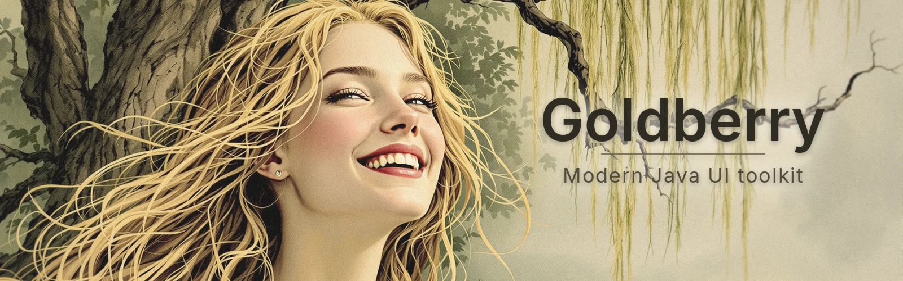

<p align="center">
  
</p>

[](https://github.com/digitalsmile/goldberry/actions/workflows/linux.yml)
[](https://github.com/digitalsmile/goldberry/actions/workflows/windows.yml)
[](https://github.com/digitalsmile/goldberry/actions/workflows/macos.yml)
[](https://github.com/digitalsmile/goldberry/actions/workflows/example.yml)
[](LICENSE)

**A fast and modern UI toolkit for Java.**

Goldberry is a declarative desktop UI toolkit written in pure Java
over a small set of native C libraries bound via the Foreign Function & Memory
API. No JNI, no bundled web engine, no platform widget wrapping.

- **Starts in milliseconds.** CPU rasterization, no GPU context for plain UI,
  GraalVM native-image as a first-class target.
- **Declarative.** Immutable widgets with a pure `build()`, expressed as Java
  records or as KDL markup. Markup and stylesheets hot-reload at runtime.
- **Real layout and real styling.** Flexbox via Yoga, and a genuine CSS subset
  with variables, cascade, and transitions — not a proprietary styling DSL.
- **Cross-platform from the first commit.** Linux (Wayland/X11), Windows and
  macOS are peer platforms behind one SPI.

> **Pre-release.** A window opens, Blend2D rasterizes its frames across worker
> threads, Yoga lays out a tree behind the boundary, HarfBuzz-shaped text takes
> part in that layout, Lucide's icons draw, stylesheets and KDL markup hot-reload,
> pointer, wheel and keyboard input route to a widget tree, and markup wires both
> halves of §9 — an `action` to call and a value to `bind` to. The catalog is
> five primitives and four controls — `button`, a tri-state `checkbox`, and
> `radio` / `radio-group`, which is one Tab stop with arrow keys inside it — all
> drawn to the design system's metrics with rounded corners, a real focus ring,
> the §1.4 type scale in two real weights, CSS transitions on a frame clock and
> golden images — so nine controls are still to come.
> See [Status](book/src/status.md) for what works and what is still open.

## Quick start

Requires a **JDK 25** toolchain. Gradle provisions one if it cannot find one.

```sh
./gradlew build
```

That builds and tests every Java module and, if it is missing or out of date,
the native library `libgoldberry` for this machine. Building the native library
needs CMake ≥ 3.28, Ninja and a C/C++ toolchain.
`./gradlew :natives:checkToolchain` verifies all of it up front, prints the
absolute path and version of each tool it will use, and names the packages to
install if anything is absent.

The tools are searched for on the `PATH` first and then in the usual install
directories, so a Homebrew, MacPorts, `CMake.app` or `pip install --user`
toolchain is found even from a Gradle daemon that an IDE started with a bare
`PATH` (ADR-0040). To point at one somewhere else:

```sh
./gradlew build -Pgoldberry.cmake=/path/to/cmake    # also -Pgoldberry.ninja
```


**The first native build downloads about 330 MB** — Blend2D, AsmJit, Yoga,
HarfBuzz and SDL3, cloned by the superbuild — which typically takes a few
minutes. Compiling them afterwards is comparatively quick, around a minute on a
recent laptop. Git reports its progress as it goes, so a configure step that
looks idle for a long time is a slow connection rather than a stuck build
(ADR-0038).

The clones land in `natives/.deps/<target>`, deliberately outside `build/` so
that `./gradlew clean` does not throw them away. To discard them on purpose:

```sh
./gradlew :natives:cleanNativeDeps
```

For a Java-only build with no native toolchain:

```sh
./gradlew build -Pgoldberry.skipNative=true
```

Tests that need real native code skip when no library is loadable, so this stays
green — it just verifies less.

Released artifacts are built on native runners per platform, so a locally built
library is for development only. To check a library built somewhere else — a CI
artifact, a colleague's build — point the tests at it instead of building one:

```sh
./gradlew :natives:test \
  -Dgoldberry.native.library=/path/to/libgoldberry.so \
  -Dgoldberry.native.required=true
```

Supplying a library is also what tells the build not to build its own. Adding
`goldberry.native.required=true` turns "no library, skip quietly" into a failure,
which is how CI verifies that the artifact it just built actually loads — see
[ADR-0016](book/src/adr/0016-verify-the-artifact-and-never-skip-the-check.md).

## Hello, window

```java
var window = Window.open("Hello", 960, 640);
window.onPaint(frame -> frame.fill(0xFF2E3440));
Goldberry.run();
```

That is the whole API for a window: no backend to name, no event loop to build,
no `switch` over platform events (ADR-0022).

Painting takes **logical** coordinates, and they are not rounded on the way in.
Blend2D's context is scaled once per frame, so a rectangle at `x = 10.5` on a
150% display lands on physical 15.75 and is antialiased across the two pixels it
actually covers — the same code is correct at 100%, 125% and 150%
([ADR-0031](book/src/adr/0031-blend2d-and-the-borrowed-buffer.md)). Colours are
`0xAARRGGBB` and are **not** premultiplied; the rasterizer handles that.

When the backend lends a surface — SDL does — Blend2D draws straight into it,
so the toolkit never copies a frame. SDL still does: on Wayland it has no
window-surface implementation, so the buffer it lends is its own heap memory and
it copies that into a texture on every present. One copy instead of two, not
zero ([ADR-0046](book/src/adr/0046-what-present-actually-does.md)).

Work that is not instant goes off the UI thread and comes back on it:

```java
Goldberry.async(() -> loadTheThing())
         .thenAccept(thing -> window.title(thing.name()));   // on the UI thread
```

## Layout

Flexbox comes from **Yoga**, bound directly rather than reimplemented. Widgets
sit on top of this — most applications never touch it — but it is what the CSS
subset compiles to, and what a `canvas` widget will hand out
([ADR-0029](book/src/adr/0029-yogas-node-api-and-who-owns-a-node.md)):

```java
try (var config = YogaConfig.create();          // CSS's defaults, not Yoga's
     var root = YogaNode.create(config)) {

    config.setPointScaleFactor(window.scale().factor());  // snap to real pixels
    root.setFlexDirection(FlexDirection.ROW);
    root.setPadding(Edge.ALL, StyleLength.points(8));

    var sidebar = YogaNode.create(config);
    sidebar.setWidth(StyleLength.percent(25));
    root.addChild(sidebar);                     // the parent owns it from here

    root.calculateLayout(960, 640);
    var box = sidebar.layout();                 // 236.0x624.0 at (8.0, 8.0)
}
```

Text enters layout as a measured leaf: Yoga knows nothing about glyphs, so a
paragraph reports how tall it came out at the width Yoga proposes. That callback
is a Java method called from C returning a struct **by value**, which is the
fiddliest thing the toolkit asks of FFM and the reason
[ADR-0017](book/src/adr/0017-proving-the-struct-by-value-upcall.md) exists.

```java
node.setMeasureFunction(paragraph.measureFunction());   // runs during calculateLayout
```

`Box.text(...)` wires that up for you — see [Text](#text) below.

The point scale factor is what makes fractional DPI land correctly: at 1× a row
of 101 points splits 51/50, and at 2× it splits 50.5/50.5 — the same tree on a
different pixel grid.

## Text

**HarfBuzz** shapes, **Blend2D** draws, and `Font` is what holds the two
together. Inter, JetBrains Mono and OpenMoji ship inside `goldberry-core`, so
text renders identically on every machine without asking what fonts are
installed ([ADR-0033](book/src/adr/0033-assets-are-fetched-and-compiled-not-committed.md)).

```java
try (var face = FontFace.bundled(BundledFont.UI);     // parsed once
        var title = Font.on(face, 24);                // …and shared by
        var body = Font.on(face, 16)) {               //    every size

    var width = body.widthOf("Goldberry");            // what layout will ask

    window.onPaint(frame ->
            body.draw(frame, 16, 16 + body.ascent(), "Goldberry", 0xFFECEFF4));
}
```

The `y` is the **baseline**, not the top of the line: an `a` sits above it and a
`g` hangs below, so the top of a line is `baseline - ascent()`.

A `FontFace` is the typeface and a `Font` is one size of it. The split matters
because each library keeps its own copy of the file — Inter is a megabyte and a
half — so sharing the face makes a second size cost 4 µs and no extra memory
instead of 680 µs and three more megabytes
([ADR-0044](book/src/adr/0044-one-face-many-sizes.md)). `Font.bundled(UI, 16)`
still works and parses a face of its own, which is the right shape for exactly
one size. **The face must outlive every font over it.**

A `Paragraph` wraps, and that is what lets text take part in layout rather than
being drawn over it. It is shaped **once**; every re-wrap after that is arithmetic
over the glyphs shaping already produced, which is what makes it affordable to
answer Yoga from inside a layout pass
([ADR-0036](book/src/adr/0036-the-paragraph-is-shaped-once-and-wrapped-many-times.md)):

```java
var body = Paragraph.of(font, "…prose that has to fit somewhere…");

Box.of().direction(FlexDirection.COLUMN).children(
        Box.filled(0xFF88C0D0).size(UNDEFINED, StyleLength.points(32)),
        Box.text(body, 0xFFECEFF4),          // as tall as its text wrapped
        Box.filled(0xFF3B4252).grow(1));     // …and this starts below it
```

A box with text is a **measured leaf**: Yoga proposes a width, the paragraph wraps
at it and reports a height, and the flexbox algorithm sizes everything around that
answer. A box may therefore have text or children, not both — Yoga asks a measured
node for its size and never lays its children out.

One thing is worth knowing even from the outside. Shaping happens in the font's
own **design units**, and the size lives on the Blend2D side alone — so a shaped
run is correct at every size, and the font matrix is the only thing that ever
converts. Applying a size on both sides applies it twice, which for Inter at 16
points draws the text 128× too wide and reports no error at all. `Font` exists to
make that unrepresentable
([ADR-0034](book/src/adr/0034-one-size-and-the-design-unit-crossing.md)).

Not yet: bidirectional runs — right-to-left text is refused at construction rather
than wrapped wrongly — fallback between the UI and emoji faces, and style runs
within a paragraph.

## Icons

Lucide's 1544 icons ship in `goldberry-core` as path data in a 24×24 box. They
are **strokes**, not fills — 2px round-capped outlines, most of them not closed —
so an `Icon` carries a stroke width as well as a shape
([ADR-0043](book/src/adr/0043-icons-are-stroked-paths.md)):

```java
try (var icon = Icon.bundled("layout-dashboard", 24)) {   // 24 logical points
    window.onPaint(frame -> icon.draw(frame, 16, 16, 0xFFECEFF4));
}
```

Like a `Font`, an `Icon` belongs to a size: the path is built pre-scaled, so
nothing is transformed at draw time and a 48px icon strokes at 4px rather than 2.
`BundledAssets.iconNames()` lists the set.

An icon is not a `Box` yet — the showcase draws them over its sidebar rather than
laying them out in it — because nothing decides an icon's intrinsic size until
the widget model does
([ADR-0004](book/src/adr/0004-three-tree-retained-declarative-model.md)).

## Widgets

Widgets are immutable records. The element tree behind them persists across
rebuilds, which is what lets `:hover` survive a parent re-describing its child
and what `setState` mutates ([ADR-0052](book/src/adr/0052-state-lives-on-the-element-and-rebuilds-are-deferred.md)).

Every widget exists three ways — a Java record, a KDL node, and a CSS type — and
a test asserts the first two produce equal values
([ADR-0059](book/src/adr/0059-a-control-is-a-record-a-node-and-a-rule.md)):

```java
var ui = new Widgets.Column(
        new Widgets.Text("Delete this file?"),
        new Widgets.Row(
                new Widgets.Spacer(),
                new Button("Cancel", this::dismiss),
                new Button("Delete", this::delete).styled("danger")));
```

```kdl
column {
    text "Delete this file?"
    row {
        spacer
        button press="dismiss" "Cancel"
        button class="danger" press="delete" "Delete"
    }
}
```

Markup **names** an action and cannot be one — `press="delete"` resolves against
an `Actions` registry, which is what keeps a reloaded document wired to the
handlers the old one had:

```java
var actions = Actions.strict()
        .bind("delete", this::delete)
        .bind("dismiss", this::dismiss);

var tree = Controls.inflater(actions).inflateAll(KdlParser.parse(markup));
```

A registry is strict by default: `press="delte"` fails at inflation rather than
producing a button that silently does nothing.

Nothing visual lives in a widget. `:widgets` ships `controls.css` for the
toolkit-base layer, which sets the design system's metrics and reads
`var(--gb-*)` for every colour, so switching a theme restyles controls whose
rules never mention one:

```java
var renderer = new WidgetRenderer(
        List.of(Controls.baseStylesheet(), Theme.NORD_DARK.load(), appStyles), font);
```

Variants are classes — `primary`, `danger`, `ghost` — because that is the one
spelling Java, KDL and CSS can all use. A button is focusable, activates on a
click and on `Space`/`Enter`, and does **not** activate when a press is dragged
off it and released elsewhere.

A button takes a label, an icon, or both, and can be disabled — which refuses
every route to its action, drops it out of the Tab order, and matches
`:disabled`:

```java
new Button("New", plusIcon, this::create, false, attributes)
new Button("Undo", null, this::undo, clicks == 0, attributes)
```

The icon is **borrowed**, not owned: a widget is a value that gets rebuilt every
frame and must not hold something with a `close()`, so the application builds its
icons once and keeps them, exactly as it keeps a `Font`. In markup an icon is
named rather than built, and resolves against a registry for the same reason:

```java
var icons = Icons.strict().bind("plus", plusIcon);
Controls.inflater(actions, icons).inflateAll(KdlParser.parse(markup));
```

### Values: `bind`

The other half of §9's wiring. `action` names something to do; `bind` names a
value to follow, and resolves against a third registry of the same shape:

```java
var status = Property.of("checking…");
var bindings = Bindings.strict().bind("app.status", status);

Controls.inflater(actions, icons, bindings).inflateAll(KdlParser.parse("""
        text bind="app.status" "…"
        """));

status.set("linux-x64, Wayland");   // every bound node redraws
```

A `Property<T>` is a cell with listeners — `get`, `set`, `subscribe` — and
nothing more: no computed values, no dependency graph, no streams. Setting the
value it already holds notifies nobody, which is what makes two properties
mirroring each other settle rather than recurse.

**A `bind` value is a dotted path and nothing else** — `frost`, `prefs.frost`.
`bind="!prefs.frost"` is refused at inflation with the text quoted, rather than
resolving to nothing and leaving a control that never updates
([ADR-0062](book/src/adr/0062-bind-is-a-path-and-nothing-else.md)); negation and
formatting stay in Java, where they are already testable. The argument stays as
the fallback, so a lenient registry — what a preview or a golden image uses —
draws `text bind="user.name" "Name here"` as *Name here*.

The binding lives on the widget and the subscription on its **element**, so a
bound node introduces no wrapper and `panel > text` styles it exactly like an
unbound one. A change marks that element as needing a build, by the same route
`setState` takes, so three changes in one frame cost one build.

**Binding is one-way, and the types enforce it.** What a widget is handed is an
`Observable` — a `Property` with no `set` on it — so markup can read a value and
watch it and cannot write it. What the user did travels back up the way it
already does, as an action:

```kdl
checkbox bind="prefs.frost" change="toggleFrost" "Enable frost"
```

The value flows down, the intent flows up, and the one line that mutates anything
is Java the application wrote. A control is therefore *controlled*: clicking a
checkbox does not move the tick, it raises a change, and the tick moves when the
handler sets the property — so a control that will not move means the state did
not change, which is where the bug is
([ADR-0063](book/src/adr/0063-data-flows-down-events-flow-up.md)).

### `checkbox`

The second control, and the first whose *value* comes from outside it:

```kdl
checkbox bind="prefs.frost" change="toggleFrost" "Frosted sidebar"
```

Binary or tri-state. `MIXED` is a real state — a "select all" over a partial
selection is neither on nor off — and it matches `:indeterminate` rather than
`:checked`, because two pseudo-classes cannot describe three states and folding
mixed into `:checked` makes every rule that meant *the tick is showing* silently
wrong. Toggling never *produces* mixed: clicking a partial selection asks for all
of them.

The click target is the whole control, label included, which matters because a
16px glyph is a small target and the label is usually five times as wide. `Space`
toggles; `Enter` deliberately does not, since it belongs to a dialog's default
action and a checkbox that swallowed it would leave a form with no keyboard route
to submit.

Its glyph is the toolkit's first **part**: `check-indicator` is a CSS type
selector and is **not** registered in the KDL inflater. One `ComputedStyle`
carries one background and one radius, and a checkbox needs two — the 32px
control and the 16px glyph — so the glyph gets a cascade node of its own. It is
not a widget: a `check-indicator` outside a `checkbox` is a square that means
nothing, and what an author wants from a part is to restyle it, which a type
selector is the whole of
([ADR-0065](book/src/adr/0065-a-part-is-styleable-and-not-constructible.md)).

```css
check-indicator:checked { background: var(--gb-accent); color: var(--gb-checkbox-mark-checked) }
```

### `radio` and `radio-group`

The first **composite** — a widget that is a set rather than a control:

```kdl
radio-group bind="prefs.theme" change="pickTheme" {
    radio value="light" "Light"
    radio value="dark"  "Dark"
    radio value="system" "Follow the system"
}
```

"Exactly one of these is on" is a fact about the set, so the **group** holds it:
`children()` rewrites each option with whether its `value` matches, on every
build. Nothing is stored, so there is no path by which two are on at once — and
`selected` is deliberately not an attribute, since a document that could mark one
option selected could mark two. A value no option carries selects **nothing**,
which is exactly right for a model that has not loaded.

A group of six options is **one Tab stop**, with arrow keys moving inside it
(`docs/design-system.md` §7.2). That is `Handles.focusScope()`, and both halves
are the router's rather than the widget's — which node an arrow reaches is a
property of the group's shape, and the radio the focus is on cannot see its
siblings. Arrows are handled after the focused chain declines the key, so a
slider or a text field inside a group keeps its own.

Tab **re-enters at the selected option**, and that entry point is derived from
`:checked` rather than remembered. The distinction is the whole design: a stored
roving position is a second piece of state beside the selection, and the two
disagree the first time the application sets the value itself — Tab would return
you to the option you last looked at rather than the one that is on. Derived,
**the selection is the roving position** and there is nothing to keep in step
([ADR-0073](book/src/adr/0073-a-composite-is-one-tab-stop.md)).

Selection follows focus, the controlled way: an arrow key raises the change and
does not move the tick, so a group whose handler does nothing moves the ring and
stays where it is. A `change` here has to say *which one*, which is the first
action in the toolkit that takes an argument:

```java
var actions = Actions.strict()
        .bind("pickTheme", (String value) -> theme.set(value));
```

A plain `Runnable` still resolves against it, for a handler that reads the model
itself. The glyph is `radio-indicator`, a circle because `border-radius: 8px` on
a 16px box is one, drawn by the same four cubics as every other corner — so no
native symbol was added for it.

### Why the dot inside it is a separate node

The design system asks the check and the dot to *scale* 0.6→1 as they appear, and
that turned out not to be about `transform` at all. A mark is drawn **onto** the
box that carries it, so scaling the indicator scales the 16px ring along with the
tick — the ring grows with the dot, which is not the animation. The unit of
independent movement is a cascade node, so `check-mark` and `radio-dot` are
elements and the stylesheet does the rest:

```css
check-mark, radio-dot        { opacity: 0; transform: scale(0.6) }
radio-indicator:checked radio-dot { opacity: 1; transform: scale(1) }
```

They exist in **every** state, not only when checked. A node that appears along
with the value has no previous style to move from, and a newly built element
deliberately starts no transition — a control appearing is not a control
changing — so a mark that came into existence checked would snap. Unchecked
therefore costs one fully transparent box, which is what the specified animation
costs.

### What the controls are drawn with

`border-radius`, `border`, `outline` and `opacity` reach the box tree, so the
design system's numbers are drawn rather than described. A rounded rectangle is
built from four cubic Béziers through the already-exported `bl_path_cubic_to`
rather than from a new Blend2D symbol — the export list has caught the same class
of bug three times, and a corner that needs no new symbol works on every target
on the first CI run
([ADR-0064](book/src/adr/0064-a-rounded-rectangle-is-four-cubics.md)).

The focus ring is one rule for every control, not one per control:

```css
button:focus-visible,
checkbox:focus-visible { outline: 2px solid var(--gb-focus); outline-offset: 2px }
```

`:focus-visible` and not `:focus`, so a control clicked with a mouse gets no ring.
An outline is drawn outside the border box and takes no space, so a ring cannot
move a control by existing, and it follows whatever radius the control has.

`:hover` and `:active` both reach the **whole ancestor chain**, which is what
lets a control state its own pressed appearance:

```css
checkbox:active check-indicator { background: var(--gb-checkbox-bg-active) }
```

`:active` did not, until `radio` needed it — it was set on the single deepest
element the press landed on, so pressing a checkbox's 16px glyph lit up the glyph
and pressing its label lit up the label, while the checkbox itself matched only
in the sliver of padding between them. A control whose pressed state depends on
which of its own parts you hit does not have one.

`:disabled` is **45% opacity and never a colour remap**, which is one number
instead of eight muted tokens and leaves a disabled `danger` button still reading
as dangerous. Because the remap is gone, a disabled control would otherwise still
lighten under the pointer; CSS would spell the fix `:not(:disabled):hover` and
`:not()` is not in the subset, so the router refuses to *set* `:hover` or
`:active` on a disabled widget — one choke point, every control.

### Typography

The cascade inherits, which is what makes a type scale work at all: `color`,
`font-family`, `font-size`, `font-weight` and `line-height` pass down the element
tree, so a class on a container reaches every label under it. `cursor`
deliberately does **not** — it already inherits through the stack of painted
rectangles, and two mechanisms for one property disagree the first time a box has
no element behind it.

The design system's seven tokens ship as classes, with the numbers in the theme
so a large-text theme moves all of them at once:

```kdl
text class="heading" "Preferences"
text class="caption" "Applied on next launch"
```

**A weight is a face, not an axis.** Inter ships as a variable file *and* as its
SemiBold static instance, because §1.4 specifies exactly two weights and
instancing `wght` at runtime needs symbols in both HarfBuzz and Blend2D — three
new export branches, answered only by CI across four targets. A CSS weight no
file provides resolves to the nearer one that does, the way CSS's own font
matching works, so `font-weight: bold` gets SemiBold rather than nothing
([ADR-0066](book/src/adr/0066-a-weight-is-a-face-and-color-inherits.md)).

A `Fonts` book joins a resolved style to a `Font`, caching faces by family and
weight and fonts by (face, size) — a widget tree is re-rendered every frame, and
a heading at 20px would otherwise re-parse Inter sixty times a second. It is
owned and closed by the application, never global: these hold native memory and
are confined to one thread.

```java
try (var fonts = Fonts.bundled()) {
    var renderer = new WidgetRenderer(stylesheets, fonts);
}
```

### Motion

Transitions are CSS, resolved by the cascade like any other property:

```css
button { transition: background-color var(--gb-motion-fast) ease-enter }
button:active { transition: background-color 0ms }
```

Those two lines are the design system's "press applies in 0ms, release fades
out". No new mechanism was needed — the timing that applies is the one on the
style being moved **to**, so entering `:active` snaps and leaving it eases.

Animated values live in a **per-node overlay applied at paint, and are never
written back into computed style**. That is the whole design rather than an
implementation detail: a cascade that saw the halfway colour as the node's real
one would diff *that* against the target and start again from it, giving a
control that approaches its hover colour and never arrives. Retargeting starts
from the current animated value, so a pointer leaving a button halfway through a
fade returns from where the colour is.

The whitelist is closed — `opacity`, `background-color`, `border-color`,
`color`, `transform` — and `transition: width 200ms` is a **dropped declaration
with a warning naming it**, not a rule that silently never fires: animating a
width would run Yoga on every frame of every transition. Colours interpolate in
OKLCH, which is measurable rather than decorative — Nord's danger red and
success green have a channel spread of 54 at their sRGB midpoint and 109 at
their OKLCH one.

The frame loop stays idle. An application asks for another frame only while
something is moving:

```java
window.onPaint(frame -> {
    render.update(frame, renderer.render(tree));
    render.paint(frame);
    if (renderer.isAnimating()) {
        window.repaint();
    }
});
```

And a **virtual clock** is what makes it testable: `clock.advance(50)` gives
exactly the frame at 50 ms of a 100 ms transition, on every machine and in CI.
A golden image of a mid-animation frame is impossible against a wall clock —
the test would have to sleep, and would then be asserting on whatever the
scheduler gave it
([ADR-0067](book/src/adr/0067-motion-is-an-overlay-on-a-frame-clock.md)).

### Transforms

`transform` and `transform-origin` are CSS's, the 2D subset:

```css
panel.turned   { transform: rotate(20deg) }
panel.grown    { transform: scale(1.4) }
panel.cornered { transform: scale(1.4); transform-origin: left top }
```

Layout runs first and the matrix moves the result, which is CSS's rule and the
reason a transform is cheap enough to animate: a control that scales on hover
moves no sibling and costs no layout pass. The effect reaches the whole subtree,
the way `opacity` does.

The part worth stating is what happens to **input**. A transform the painter
applies and hit testing ignores produces no error and no wrong pixel — the
control is drawn exactly where the stylesheet asked and simply does not respond
where it looks like it should. So the inverse is computed **once, while
painting, from the very matrix handed to Blend2D**, and `HitTest` maps the
pointer backward through it rather than mapping the box's corners forward. Not
re-derived on the input path: two inversions that must agree exactly is how that
silent failure gets in.

```java
// The pointer is over the ink, not over the rectangle Yoga produced.
assertEquals("target", HitTest.at(regions, 120, 120).orElseThrow());
```

**No new native symbol crosses the boundary.** Blend2D's `save`/`restore` are
not on the export list, so there is no push and pop — but
`bl_context_apply_transform_op` was already exported for the display scale, and
`BL_TRANSFORM_OP_ASSIGN` *replaces* the context's matrix. So the stack is
accumulated in Java, each box states its whole matrix, and that is also what
makes it invertible. A computed `transform` is the **function list** rather than
a matrix, because `translate(50%)` is a proportion of a box that has no size
until Yoga has run — and because halfway between `rotate(0)` and `rotate(180deg)`,
interpolated entry by entry, is a box collapsed to a point rather than a right
angle ([ADR-0068](book/src/adr/0068-the-transform-stack-is-java-side.md)).

Still **absent rather than approximated**: **layer promotion**, which is what
would make an animating frame cost a composite instead of a full window repaint,
and is the same mechanism CSS group opacity and damage tracking want. Unlike
`transform`, it does need the native boundary opened — `bl_context_blit_image_d`
and `bl_context_set_global_alpha` — so it is scheduled as its own change. The
**checkbox tick's `scale 0.6→1`** is also still missing its scale half: the mark
is drawn onto `check-indicator`'s box, so it needs a cascade node of its own,
which is a second *part* and a decision in its own right.

## The render tree

Three trees, Flutter-style: immutable **widgets** describe, **elements** persist
and hold state, and **render objects** own the Yoga nodes and are kept between
frames.

Hold one `RenderTree` for the life of a window and hand it each frame's
description:

```java
try (var render = RenderTree.create()) {
    window.onPaint(frame -> {
        render.update(frame, renderer.render(tree));   // reconcile + lay out
        render.paint(frame);
    });
    Goldberry.run();
}
```

A widget still returns an immutable `Box`, and the render tree is **reconciled
against** that description rather than mutated by widgets. Not one widget changed
when this landed. An immutable tree is the ideal thing to diff, it keeps a
widget's job "describe yourself", and it means the retained path can be asserted
to lay out *identically* to a thrown-away one — which is the first test in the
file.

The measurement, on a showcase-shaped tree with seven measured leaves at 960×640:

| layout + walk | median |
|---|---|
| tree rebuilt every frame | **190 µs** |
| retained, nothing changed | **9.1 µs** |
| retained, **a fresh box tree every frame** | **7.2 µs** |

The third row is the one that had to be won. A real application rebuilds its
boxes constantly, and it costs the same as changing nothing — because **Yoga
dirties a node when a style is *set on it*, not when the value differs**. Every
setter is guarded by a comparison against the box already applied; without those
guards a retained tree costs exactly what a thrown-away one costs, plus the
memory management ([ADR-0069](book/src/adr/0069-the-render-tree-is-retained.md)).

Two things stopped being rebuilt: the Yoga measure callbacks — an `Arena` and a
native upcall stub, 11 µs each against 0.3 µs to call through one — and the
shaping behind every paragraph, at 56 µs. `Paints.Context.paragraph` shapes
through a cache, which saves the 56 µs *and* returns the same instance each
frame; the render tree reads that identity to decide the callback it already
bound is still correct. The cache is a precondition for retention, not an
optimisation beside it.

And retention introduced this repository's first keep-state bug, caught by its own
equivalence test: **Yoga does not dirty a node when its measure function is
replaced.** Text is not a style, so a paragraph swapped for longer text reported
the height cached for the old one — six lines of prose laid out as one, with no
error anywhere. One `markDirty` call, and a standing reminder of what keeping
state costs.

### The cascade resolves invalidated nodes

With layout retained, the cascade was the whole frame — every node re-matched
against every selector in every stylesheet, plus a walk to the root per node for
custom properties. A node's resolved style is now cached on its element and
checked by identity against two things:

- **the resolver**, so a theme swap or a hot reload — which builds a new one —
  invalidates every entry at once, with no event anyone has to remember to fire;
- **the inherited style**, so a parent that re-resolved hands its children a
  different instance and they re-resolve without being told. Inheritance
  invalidates itself.

Invalidation is a **subtree**, and that is not caution for its own sake. A
descendant combinator makes a node's own match depend on an ancestor's state:

```css
checkbox:hover check-indicator { border-color: var(--gb-checkbox-border-hover) }
```

Hovering the checkbox restyles the *indicator*, while the checkbox's own style
need not change at all — so the inherited-identity check cannot see it, and only
the subtree walk saves it. That rule is in `controls.css` today.

| frame CPU, everything but rasterization | median |
|---|---|
| before any of this | 354 µs |
| with the paragraph cache | 260 µs |
| with the retained render tree | 148 µs |
| with the invalidation-driven cascade | **3.5 µs** |

Rasterization is untouched by all of it and is now essentially the whole frame —
about 320 µs at 960×640 on one thread, spread over four workers in practice.
Damage tracking and layer promotion are what would move it
([ADR-0070](book/src/adr/0070-the-cascade-resolves-invalidated-nodes.md)).

### Layers, and what a frame uploads

`opacity` is CSS's now. A node that is translucent **and has children** is
rendered into a raster of its own at full strength and composited once:

```css
panel.faded { opacity: 0.5 }
```

That is not the same as fading each box as it is drawn, and the difference shows
exactly where two children overlap — faded separately, the lower one shows
through the upper. Through a layer it does not:

```java
// The overlapping pixel and the non-overlapping one are the same colour.
assertEquals(target.pixel(75, 30), target.pixel(45, 30));
```

A translucent **leaf** keeps the cheap path deliberately: its own background,
border and text can overlap each other too, but by a fraction of a level along an
antialiased edge, and an allocation and a blit for every faded label is a poor
trade. The three golden images with a disabled control at 45% moved when this
landed, and the diff is confined to that control — the correction, reviewed
rather than accepted.

The subtree goes into the layer **untransformed** and at full strength, so its
alpha and matrix are applied to the blit — which means a group that is only
**fading or moving keeps its raster**. A frame of a fade costs 199 µs instead of
554 µs. That distinction needed three flags where there had been one: does the
screen differ (damage), does an *ancestor's* raster differ (yes — it bakes in
this node's finished blit), does *this* raster differ (no). A descendant's
opacity **is** baked in, which is why it could not be fixed by dropping one
property from one comparison. And the
layer's bounds are the subtree's, not the border box: a focus ring, a
transformed child and an overflowing child all reach outside it, and a layer
sized to the box would clip each of them away.

Two symbols were added to the export list for this — `bl_context_blit_image_d`
and `bl_context_set_global_alpha` — the first since it caught its third
local-symbol bug. The offscreen pixels needed none: they are allocated in Java
and wrapped with the constructor that was already exported.

Damage rides on the same retained tree. Each render object remembers where it
was, and a node that changed damages the union of where it **was** and where it
**is** — both, because damaging only the new position leaves the old drawing on
screen:

```java
render.update(frame, renderer.render(tree));
render.paint(frame);
window.damaged(render.damage(frame));   // empty means "upload nothing"
```

And the frame is painted only inside that damage — but only where it is safe to,
which is a promise the backend has to make:

```java
var damage = render.damage(frame);
if (window.canRepaintPartially()) {
    render.paint(frame, damage);      // empty damage draws nothing at all
} else {
    render.paint(frame);              // first frame, resize, or no promise
}
window.damaged(damage);
```

`BackendWindow.retainsFrameContents()` is **false by default**, so a backend that
says nothing gets a full repaint. `Window` checks three things that fail
independently: the promise, the buffer's *identity* — a backend may retain and
still rotate between two — and the size.

| one small box changed, 960×640 | median |
|---|---|
| repaint the whole frame | 367 µs |
| **repaint only the damage** | **117 µs** |

Read that carefully: the damaged area was 0.23% of the window and the saving is
3.1×, not 400×. The clip saves *rasterization*; the tree walk still visits every
box for Blend2D to clip away cheaply. A clipped repaint is asserted
pixel-identical to a full one across a whole frame, because otherwise damage is
a rendering bug with a performance excuse
([ADR-0072](book/src/adr/0072-a-partial-repaint-needs-a-promise.md)).

## Input

Pointer, wheel and keyboard events route through a `PointerRouter`, which holds
what input needs to remember between frames — who is hovered, who is pressed, who
has focus — and holds it against **elements**, because a widget is rebuilt
constantly and could not remember any of it.

Hit testing runs against the **snapshot taken while painting**, not a fresh
layout pass. A pointer event is about what the user can see, and what they can
see is the last frame that was drawn
([ADR-0054](book/src/adr/0054-hit-testing-runs-against-the-painted-frame.md)).

```java
var router = new PointerRouter();
window.pointerRouter(router);

window.onPaint(frame -> {
    render.update(frame, renderer.render(tree));           // one layout pass
    render.paint(frame);
    router.updateRegions(HitTest.capture(render));         // read by both
});
```

Dispatch is capture → target → bubble with `consume()`. A **press captures the
pointer** until the release, so a drag that leaves a widget still reaches it and
`:active` cannot get stuck — which is what makes a slider work
([ADR-0058](book/src/adr/0058-a-press-captures-the-pointer.md)).

Wheel deltas are in **lines**, fractional, positive down and right. SDL exposes
no pixel-precise axis; what a touchpad sends is a fraction of a detent per frame,
and that fraction is preserved. "Natural scrolling" and SDL's away-from-the-user
sign are both undone at the boundary, so a widget never sees either
([ADR-0056](book/src/adr/0056-the-wheel-is-lines-and-the-sign-is-ours.md)):

```java
@Override
public void onPointer(PointerEvent event) {
    if (event.kind() == PointerEvent.Kind.WHEEL) {
        scrollBy(event.deltaY() * lineHeight);
        event.consume();          // and the page behind does not lurch
    }
}
```

That path is driven end to end in CI on all three platforms, under SDL's `dummy`
video driver: a test cannot turn a wheel, so a fabricated `SDL_MouseWheelEvent` is
pushed onto SDL's own queue with `SDL_PushEvent` and comes back out of the
ordinary pump
([ADR-0061](book/src/adr/0061-the-events-a-test-cannot-produce-are-pushed.md)).

Keys and committed text are separate, per §7.1 — one character can take several
keystrokes, and the platform's own compose and IME handling is what produces it
(ADR-0055). Accelerators are per window and fire **after** the focused widget has
declined the key, so a text field keeps its own `Ctrl+A`:

```java
router.shortcut("Ctrl+S", this::save)
      .shortcut("Ctrl+Shift+Z", this::redo);
```

The cursor is a property of the painted rectangle, set from CSS or from code, and
inherits down the stack of rectangles — so `cursor: pointer` on a button covers
the label inside it ([ADR-0057](book/src/adr/0057-the-cursor-rides-on-the-painted-box.md)):

```css
button { cursor: pointer; }
.splitter { cursor: ew-resize; }
```

```java
window.cursor(Cursor.WAIT);       // or decide it yourself
```

A **composite is one Tab stop** — a radio group, and later a tab list, a menu or
a toolbar — with the arrow keys roving inside it. A widget opts in with one
method, and the router does both halves:

```java
@Override
public boolean focusScope() {
    return true;      // Tab enters once; Left/Up/Right/Down/Home/End move within
}
```

Both arrow pairs move, because the group's direction is the stylesheet's
(`flex-direction` on `radio-group`, which `.inline` flips) and input cannot know
which pair the user is looking at. A composite with a real axis — a menu bar,
where `Down` should open a menu — will have to say so, and does not exist yet.

Not yet: custom image cursors (`grab` and `grabbing` fall back to `move`, which
no platform provides), and menu items registering their own accelerators — that
one waits for menus.

## Painting across threads

Blend2D rasterizes a frame by splitting it into horizontal bands, and Goldberry
uses up to four workers on any surface bigger than 400×300
([ADR-0042](book/src/adr/0042-blend2ds-workers-and-how-many.md)). Nothing in an
application changes: `Frame.end()` already ran before the frame was presented,
and that is where the bands are waited for.

On a real 960×640 frame that is 2.86 ms down to 2.15 ms; at 3840×2160 the
benchmark shows 6.0 ms down to 2.3 ms. `-Dgoldberry.paint.threads=0` restores
synchronous painting, and any other number pins the worker count.

Those are two different numbers on purpose. A frame painted in a benchmark loop
costs about a quarter of the same frame painted in a running window, because
`present` leaves the next paint's caches cold — so a figure from
`./gradlew :core:benchmark` compares options against each other, and only a
figure from a live window says what a frame costs
([ADR-0045](book/src/adr/0045-a-frame-is-not-a-benchmark-iteration.md)).

`present` is the larger half of a frame, and most of it is not Goldberry's. At
960×640 it is ~6.4 ms: 43 µs of this repo's code, ~1.05 ms of SDL copying the
frame into a texture, ~0.7 ms of render-and-present, and ~4.8 ms of blocking on
the swapchain ([ADR-0046](book/src/adr/0046-what-present-actually-does.md)).

Most of that block is the loop running ahead of the display. Goldberry asks SDL
to hold each present until vertical blank, which is the whole fix wherever the
GL stack honours it; `-Dgoldberry.backend.vsync=false` turns the request off.
Where it is ignored — a virtualized driver, `llvmpipe`, a deep swapchain — the
loop paces itself to the refresh rate it reads off the window's current display,
re-reading it whenever the window changes monitor and taking the fastest display
when several windows are open. Paced, present falls from 5.51 ms to 1.20 ms,
paint follows it down from 2.25 ms to 1.61 ms, and the UI thread spends 165 ms of
each second in the frame path instead of 862 — a fifth of the work, showing the
user the same frames, because the ~50 fps that vanished were never scanned out
([ADR-0047](book/src/adr/0047-a-frame-nobody-sees-costs-full-price.md)).

A display that will not report a rate leaves the loop unpaced rather than
guessing — capping a 144 Hz panel at an assumed 60 is worse than painting too
many frames. `-Dgoldberry.frame.rate=N` overrides, and `0` measures the
unthrottled loop.

### Resizing, where the platform takes the thread

Windows and macOS run a **modal loop** while a window is being dragged by its
edge: the platform keeps pumping events and does not return from the pump until
the drag ends, so a frame loop built around `SDL_WaitEventTimeout` does not
iterate and the window shows stale content for the length of the gesture. Wayland
and X11 have no such loop, which is why this is invisible on the platform the
toolkit is developed on.

SDL calls an **event watch** from inside whatever pump is running, so that is
where Goldberry draws: a resize arriving during a drag is translated, dispatched
and painted before the callback returns, and the copy the queue delivers when the
drag ends is coalesced away rather than laid out twice
([ADR-0060](book/src/adr/0060-a-resize-draws-from-inside-sdls-event-watch.md)).
Nothing in an application changes, and a `libgoldberry` built before the two
symbols were exported loses live resize rather than the ability to open a window.

## Run the showcase

`:example` is an ordinary subproject that runs on the module path, which is what
catches an unexported package or a wrong `--enable-native-access` (ADR-0023).

```sh
./gradlew :natives:cmakeBuild     # once, to build libgoldberry
./gradlew run
```

A window opens. It is a widget tree — a bar, a sidebar, wrapped prose, a theme
radio group and a row of buttons — styled by the cascade and driven by the input
router, so hovering, clicking, `Tab`, the arrow keys, `Space` and `Ctrl+T` all do
what they should. `-Pgoldberry.example.frames=3` paints three frames and exits,
which is what CI runs under Xvfb.

To drive it **without touching the real compositor**:

```sh
./gradlew run -Pgoldberry.example.frames=3 -Pgoldberry.backend.videoDriver=dummy
```

Worth knowing rather than discovering: `SDL_VIDEODRIVER=dummy` in the environment
does **not** reliably reach the application, because a Gradle `JavaExec` fork
inherits the daemon's environment rather than the shell's. Use the property. It
matters more than tidiness — GNOME Shell 46 segfaults in its own
`wl_client_destroy` path when this client disconnects, so an accidental real run
costs a desktop session (see [Status](book/src/status.md)).

### A self-contained image

For handing to someone with no JDK, no Gradle and nothing to remember
([ADR-0048](book/src/adr/0048-the-showcase-ships-as-a-runtime-image.md)):

```sh
./gradlew :example:showcaseImage
./example/build/jlink/goldberry-showcase-linux-x64/bin/showcase
```

That is a trimmed JDK from jlink, the application modules, `libgoldberry` and a
launcher — about 31 MB, and it runs from wherever it is unpacked. The directory
is named for the host target, so it is `goldberry-showcase-macos-aarch64` on a
Mac and `…-windows-x64\bin\showcase.bat` on Windows.

CI builds the same image on all three platforms and attaches it to the run: open
the **Showcase image** workflow, pick a run, and the artifacts are
`goldberry-showcase-linux-x64.tar.gz`, `-macos-aarch64.tar.gz` and
`-windows-x64.zip`. Unpack and run `bin/showcase`. (A tarball on the two Unix
platforms rather than a zip, because the zip format `upload-artifact` writes does
not carry the executable bit — an image whose `bin/java` cannot be run is not an
image.)

**On macOS**, AppKit has to be driven from the process's first thread, so any
Goldberry application needs `-XstartOnFirstThread`. `./gradlew run` passes it for
you; an application of your own has to pass it itself, exactly as it would for
LWJGL or SWT. Without it `SDL_Init` fails with "No available video device", which
says nothing about threads — see [ADR-0039](book/src/adr/0039-macos-needs-the-first-thread.md).

## Logging

Goldberry logs through **SLF4J** and binds no implementation. Add one and the
toolkit's diagnostics appear:

```groovy
runtimeOnly 'ch.qos.logback:logback-classic:1.5.18'
```

Add nothing and you get silence — including from SLF4J itself, which otherwise
prints a "no providers were found" warning to stderr (ADR-0023).

At `TRACE`, Goldberry reports a start-up timeline and per-frame timings — which is
how to find out where a slow start or a slow frame went (ADR-0028):

```text
start-up timeline (866.6ms to here):
     533.8ms    +533.8ms  runtime starting
     559.6ms     +25.8ms  libgoldberry mapped (1.9ms)
     722.6ms    +162.9ms  SDL video subsystem up (99.2ms)
     866.6ms    +117.1ms  first frame presented
```

## Documentation

| Where | What |
|---|---|
| [`docs/ARCHITECTURE.md`](docs/ARCHITECTURE.md) | The design: what the system is, layer by layer |
| [`book/`](book/src/introduction.md) | Why each significant choice was made, one decision at a time |
| [`book/src/status.md`](book/src/status.md) | Module layout, milestones, and open questions |

The book is [mdBook](https://rust-lang.github.io/mdBook/):

```sh
mdbook serve book
```

## License

Goldberry is licensed under the [Apache License 2.0](LICENSE).

It bundles third-party software and assets under their own licenses, disclosed in
[THIRD-PARTY-NOTICES.md](THIRD-PARTY-NOTICES.md) and [`licenses/`](licenses/), and
shipped inside every jar under `META-INF/`. Notably, the native libraries are
statically linked into `libgoldberry`, and the bundled OpenMoji emoji font is a
modified, share-alike (CC BY-SA 4.0) derivative — see
[ADR-0015](book/src/adr/0015-licensing-and-third-party-disclosure.md).

```sh
./gradlew checkLicenses
```
