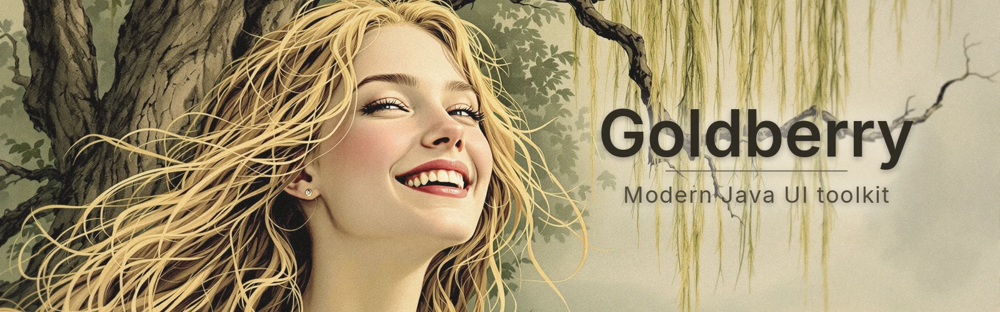

<p align="center">
  
</p>

[](https://github.com/digitalsmile/goldberry/actions/workflows/snapshot.yml)
[](https://github.com/digitalsmile/goldberry/actions/workflows/showcase.yml)
[](https://github.com/digitalsmile/goldberry/actions/workflows/release.yml)
[](LICENSE)

**A fast and modern UI toolkit for Java.**

Website: **[goldberry.dev](https://goldberry.dev)** · Documentation: **[goldberry.dev/docs](https://goldberry.dev/docs/)**

Goldberry is a declarative desktop UI toolkit written in pure Java over a small
set of native C libraries bound through the Foreign Function & Memory API. No
JNI, no bundled web engine, no platform widget wrapping.

- **Starts in milliseconds.** CPU rasterization, GraalVM native-image as a
  first-class target, and the GPU only when `goldberry-gpu` is on the module
  path.
- **Declarative.** Immutable widgets with a pure `build()`, written as Java
  records or as KDL markup. Markup and stylesheets hot-reload at runtime.
- **Real layout and real styling.** Flexbox via Yoga, and a genuine CSS subset
  with variables, cascade and transitions.
- **Cross-platform.** Linux (Wayland/X11), Windows and macOS are peer platforms
  behind one SPI.

> **2026.2 is the first release.** It is on Maven Central, and every push to
> `master` publishes a `-SNAPSHOT` of the next line. There is no screen-reader support on any platform
> ([ADR-0440](book/src/adr/0440-the-accessibility-bridge-is-on-hold-and-the-semantics-tree-stays.md)).
> [Status](book/src/status.md) says what is built, and [TODO](book/src/TODO.md)
> what is not yet.

## Quick start

Requires **JDK 25**. Add the BOM for the version, the umbrella artifact for the
toolkit, and one natives jar per platform you run on —
[Installing](book/src/getting-started/installing.md) has the Maven form, the
optional modules and the snapshots of `master`:

```groovy
dependencies {
    implementation platform('dev.goldberry:goldberry-bom:2026.2')
    implementation 'dev.goldberry:goldberry'
    runtimeOnly 'dev.goldberry:goldberry-natives::linux-x64'   // linux-aarch64, macos-aarch64, windows-x64
}
```

A window is three lines:

```java
var window = Window.open("Hello", 960, 640);
window.onPaint(frame -> frame.fill(0xFF2E3440));
Goldberry.run();
```

[Your first Java application](book/src/getting-started/first-java-application.md)
goes on from there to a widget tree, a KDL document and a stylesheet.

## Build from source

```sh
./gradlew build                                # every module, and libgoldberry for this machine
./gradlew build -Pgoldberry.skipNative=true    # Java only; tests that need the library skip
./gradlew run                                  # the showcase
```

The native build needs CMake 3.28 or newer, Ninja and a C/C++ toolchain;
`./gradlew :natives:checkToolchain` names what is missing.
[Building from source](book/src/contributing/building.md) has every build
property, and [Tests and gates](book/src/contributing/testing.md) the CI lanes.

## Documentation

| Where | What |
|---|---|
| [goldberry.dev/docs](https://goldberry.dev/docs/), from [`book/`](book/src/introduction.md) | The guide: overview, getting started, layout, components, performance, developer guide |
| [`docs/ARCHITECTURE.md`](docs/ARCHITECTURE.md) | The design, layer by layer |
| [`book/src/adr/`](book/src/adr/README.md) | The decision log: why each significant choice was made |
| [`book/src/status.md`](book/src/status.md) | What is built, milestone by milestone |
| [`book/src/TODO.md`](book/src/TODO.md) | What is not, and why |

The book is [mdBook](https://rust-lang.github.io/mdBook/): `mdbook serve book`.

## License

[Apache License 2.0](LICENSE). Third-party software and assets are disclosed in
[THIRD-PARTY-NOTICES.md](THIRD-PARTY-NOTICES.md) and [`licenses/`](licenses/),
and shipped inside every jar under `META-INF/`
([ADR-0015](book/src/adr/0015-licensing-and-third-party-disclosure.md)).
