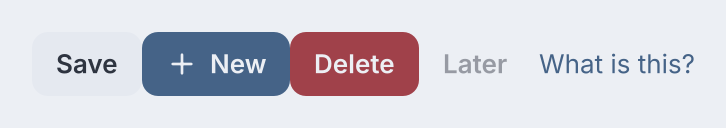
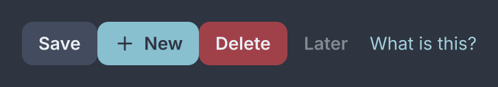
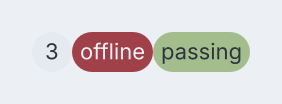
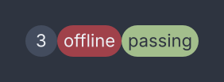
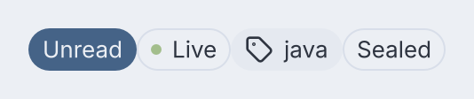
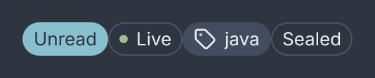
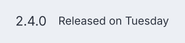
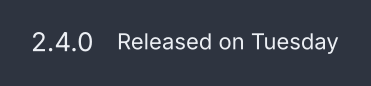

# Buttons, badges and chips

<p class="gb-lede">Three stadium-shaped widgets: one you press, one you read, and one you choose. And a fourth with no shape at all, which makes anything pressable.</p>

By the end of this chapter you can wire a button to an action, pick its variant
with a class, float it in a window corner, show a count that follows a value,
build a row of filter chips, and make a picture or a row pressable without a
button's box around it.

## `button`

A `button` is a label, an icon, or both, with one action behind it.

<div class="gb-shot"><p>The five variants. Each is a class, not a constructor argument.</p></div>

<div class="gb-tabs">

```kdl
row {
  button press="app.save" "Save"
  button class="primary" icon="plus" press="app.create" "New"
  button class="danger" press="app.delete" "Delete"
  button class="ghost" disabled=#true "Later"
  button class="link" press="app.help" "What is this?"
}
```

```java
import dev.goldberry.widgets.controls.button.Button;

new Row(
        new Button("Save", actions::save),
        new Button("New", actions::create).withIcon(plus).styled("primary"),
        new Button("Delete", actions::delete).styled("danger"),
        new Button("Later").styled("ghost").disabled(true),
        new Button("What is this?", actions::help).styled("link")
);
```

</div>

The icon is borrowed. A widget is a value rebuilt every frame, so it must not
own something with a `close()`. The application builds its icons once in
`start` and keeps them. In markup `icon=` names an icon in the `Icons`
registry, and a button with an icon and no label is refused when the registry
does not supply that name, because it has nothing to fall back on.

### Attributes

| Attribute | Type | Default | What it does |
|---|---|---|---|
| argument | string | `""` | the label; a button needs a label or an icon |
| `icon` | icon name | none | the icon before the label |
| `press` | action name | none | what activating it runs |
| `disabled` | boolean | `#false` | refuses every route to the action, leaves the Tab order, matches `:disabled` |
| `float` | boolean | `#false` | lifts the button out of layout into the window's overlay layer |
| `corner` | `top-start`, `top-end`, `bottom-start`, `bottom-end` | `bottom-end` | which corner a floated button sits in; an unknown name falls back to the default |
| `name` | string | none | the accessible name; an icon-only button needs one, and the label wins where there is one |
| `class`, `id`, `tooltip`, `context-menu` | | | as on every widget |

A disabled button lays out, paints and hit-tests. It does not act, so a click
on it lands nowhere rather than on whatever is behind it.

`float=#true` wraps the button in a `Floated` widget that keeps it at
`--gb-window-margin` from two window edges. It is placement, not appearance, so
it composes with every variant and shape. In Java the wrapper is
`new Floated(button, Corner.BOTTOM_END)`.

### Styling

- CSS type `button`.
- No parts. The label and the icon are child boxes the stylesheet does not address.
- Pseudo-classes: `:hover`, `:active`, `:focus-visible`, `:disabled`.
- Variant classes: `primary`, `danger`, `ghost`, `link`, and `outlined`, which composes with `primary` and `danger`.
- Shape classes: `square` for radius 0, `circle` for a full radius on a box as wide as it is tall. An icon-only button is a `circle` unless it says `square`.
- Placement class: `float`, which the attribute sets.

The metrics are height 32, padding 12, gap 6, radius 8, in `body-strong`.
Compact density makes the height 28. `button.link` has 4 px of padding, the
regular weight and the ink `--gb-button-link-text`. It hovers with the ghost
wash and never underlines.

Disabled is 45% opacity on the whole control and never a colour remap, so a
disabled danger button looks dangerous. The fade is applied once, by the
outermost disabled node.

### Keyboard

| Key | Does |
|---|---|
| `Tab` | reaches it, unless disabled |
| `Space`, `Enter` | activate it, once per press; a held key does not repeat |

A button activates on a click and not on a release. A press dragged off the
button and let go is a cancelled click. A key with a modifier held is not
consumed.

## `badge`

A `badge` is a count or a status: text in a stadium that reports and takes
nothing back.

<div class="gb-shot"><p>A count, a danger badge and a success badge bound to a value.</p></div>

<div class="gb-tabs">

```kdl
row {
  badge "3"
  badge class="danger" "offline"
  badge class="success" bind="build.state" "passing"
}
```

```java
import dev.goldberry.widgets.controls.badge.Badge;

new Row(
        new Badge("3"),
        new Badge("offline").styled("danger"),
        Badge.of("passing", Models.observable(build, "build.state")).styled("success")
);
```

</div>

A count is the archetypal bound value. The argument stays as the fallback until
the binding answers, as a `text`'s does.

### Attributes

| Attribute | Type | Default | What it does |
|---|---|---|---|
| argument | string | `""` | what the badge says, or the fallback when bound |
| `bind` | path | none | the value to show, as `String.valueOf` of whatever it holds |
| `class`, `id`, `tooltip`, `context-menu`, `name` | | | as on every widget |

### Styling

- CSS type `badge`.
- No parts.
- No pseudo-classes. A badge is not focusable, has no hover and no transition.
- Variant classes: `accent`, `danger`, `warning`, `success`, `info`. The bare badge takes the neutral surface.

Height 20, minimum width 20, padding 4, full radius, in `caption`. The minimum
width equals the height so a one-digit badge is a circle. Each filled variant
pins its own foreground token, because white on the warning hue is 1.35:1.

### Keyboard

None.

## `chip`

A `chip` is a badge you can press: a filter that is on or off, a tag you can
take off, a token in a recipient row.

<div class="gb-shot"><p>A selected chip, an outlined one with a dot, one with an icon and a dismiss, and a disabled one.</p></div>

<div class="gb-tabs">

```kdl
row {
  chip bind="filter.unread" press="filter.toggle-unread" "Unread"
  chip class="outlined success" dot=#true "Live"
  chip icon="tag" dismiss="tags.drop-java" "java"
  chip class="outlined" disabled=#true "Sealed"
}
```

```java
import dev.goldberry.widgets.controls.chip.Chip;

new Row(
        new Chip("Unread", false, actions::toggleUnread).bound(Models.observable(filter, "filter.unread")),
        new Chip("Live").withDot(true).styled("outlined", "success"),
        new Chip("java").withIcon(tag).onDismiss(() -> actions.drop("java")),
        new Chip("Sealed").styled("outlined").disabled(true)
);
```

</div>

A chip selects nothing itself. Pressing raises `press` and the application
decides. The bound value, or the written `selected`, is what draws the
`:checked` state. That is the controlled loop every control runs. Dismissing
raises `dismiss` and removes nothing, because the list a row of chips shows is
the application's.

> [!IMPORTANT]
> The dot and the icon are one slot. A chip asked for both is refused where
> it is built, because they are the same status at two resolutions.

### Attributes

| Attribute | Type | Default | What it does |
|---|---|---|---|
| argument | string | required | the word; an empty label is refused |
| `icon` | icon name | none | a leading icon |
| `dot` | boolean | `#false` | a 6 px status dot before the word |
| `dot-colour`, `dot-color` | CSS colour | none | the dot's colour as data; writing one turns the dot on |
| `selected` | boolean | `#false` | the written state, mirrored to `:checked` when nothing is bound |
| `bind` | path | none | a boolean the chip follows; wins over `selected` |
| `press` | action name | none | what choosing it runs |
| `dismiss` | action name | none | what the × runs; a chip with none has no × |
| `disabled` | boolean | `#false` | drawn and hit-tested, neither pressable nor dismissable |
| `class`, `id`, `tooltip`, `context-menu`, `name` | | | as on every widget |

The dot's colour is a value and not a class, because a project's hue lives in a
row of a database and a stylesheet cannot have a rule per project.
`withDot(0xFFBF616A)` is the Java spelling, and `0` means the stylesheet
decides.

### Styling

- CSS type `chip`.
- Parts: `chip-dot`, `chip-label`, `chip-dismiss`.
- Pseudo-classes: `:hover`, `:active`, `:checked`, `:focus-visible`.
- Variant classes: `outlined`, `danger`, `warning`, `success`, `info`. An outlined chip that is chosen is filled.

Height 24, padding 8, full radius, gap 6, in `body`. The dismiss mark is 12
square. A filled chip's dot takes the foreground its fill guarantees contrast
against, and the hue itself only on an outlined chip.

A disabled chip has no opacity rule of its own in `controls.css`. It stops
responding and is left out of the Tab order, but it is drawn as an enabled one
is.

### Keyboard

| Key | Does |
|---|---|
| `Tab` | reaches it, when it has a `press` or a `dismiss` and is not disabled |
| `Space`, `Enter` | press it |
| `Delete`, `Backspace` | dismiss it, when it has a `dismiss` |

Both delete keys, because a chip is commonly the last thing before a text
field, where `Backspace` is what a hand reaches for.

## `pressable`

Anything, made into something you press: a button's behaviour with none of a
button's box.

<div class="gb-shot"><p>A row made pressable, with no box of its own.</p></div>

<div class="gb-tabs">

```kdl
pressable name="Open release 2.4" press="app.open-release" class="release-row" {
  row {
    text "2.4.0"
    text class="caption" "Released on Tuesday"
  }
}
```

```java
import dev.goldberry.widgets.controls.pressable.Pressable;

new Pressable("Open release 2.4", () -> open(release),
        new Row(new Text("2.4.0"), new Text("Released on Tuesday").styled("caption")))
    .styled("release-row");
```

</div>

A picture in a timeline that opens a viewer, a release row, a card on a board:
each already has a look, and a `button` around it would draw a second. A
`pressable` draws nothing of its own and behaves exactly as a button does. It
is a Tab stop, a click activates it, `Space` and `Enter` activate it, and
`:hover`, `:active` and `:focus-visible` match it from anywhere inside it.
`disabled` takes it out of the Tab order and refuses activation, for
everything inside it too. Behind a modal dialog it is out of reach, like the
rest of the application.

A press that something inside it handles belongs to that: a `button` in a
pressable row is pressed on its own and the row hears nothing. A key that
bubbles up from something focused inside it is left alone, so `Enter` in a
field does not also press the row the field is in.

A reader announces it as a button, so it must be named. Its content is a
picture or a row of texts, not a label, so the name cannot be worked out from
it the way a `button`'s is, and a pressable with no `name` is refused.

### Attributes

| Attribute | Type | Default | What it does |
|---|---|---|---|
| `name` | string | required | What a reader announces it as. A pressable without one is refused |
| `press` | action name | none | What activating it does |
| `disabled` | boolean | `#false` | Refuses activation, leaves the Tab order and matches `:disabled` |
| `id`, `class` | string | | The usual |

Its children are its content, laid out in a column.

### Styling

- CSS type `pressable`, and no parts.
- Pseudo-classes: `:hover`, `:active`, `:focus-visible`, `:disabled`.

The stylesheet gives it the pointer cursor, the focus ring at a 4 px radius
and the 45 % disabled fade, and nothing else: no padding, no surface, no hover
wash. An application that wants a wash writes one on its own class:

```css
.release-row:hover { background: var(--gb-overlay-hover); }
```

### Keyboard

| Key | Does |
|---|---|
| `Tab` | reaches it, unless disabled |
| `Space`, `Enter` | activate it, once per press; a held key does not repeat |
