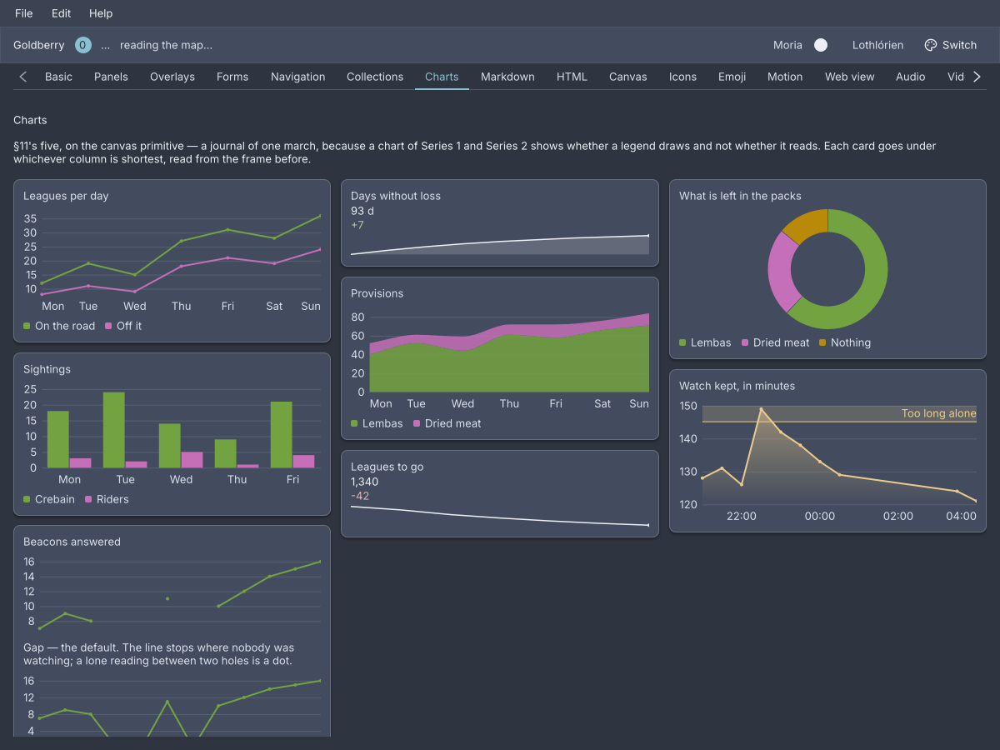

# Charts

<p class="gb-lede">Five dashboard charts drawn on the canvas primitive: a line, grouped bars, a stacked area, a donut and a sparkline, in a palette the theme owns.</p>

By the end of this chapter you can put a chart in a window from markup or Java,
give it series, a time axis, a limit and a fill, and read it from the keyboard.
The five widgets live in `goldberry`'s own catalogue. There is no chart engine
behind them, so a chart takes the theme, the text stack and hit testing like
any other widget.

<div class="gb-shot">

<p>The showcase's Charts screen. Every card is one of the five widgets below.</p>
</div>

## What the five share

**The palette is the theme's.** A series takes a colour by its position, slot 1
to slot 8, read from `--gb-chart-1` to `--gb-chart-8`. The order was searched
over every permutation so that adjacent series stay apart under colour-vision
deficiency, and a ninth series is drawn in slot 8 again rather than in a
generated hue
([ADR-0194](https://github.com/DigitalSmile/goldberry/blob/master/book/src/adr/0194-a-series-colour-is-derived-from-nord-not-taken-from-it.md)).
There is no colour argument. An application that wants one series in one colour
writes a rule, and the plot and its legend swatch both follow it
([ADR-0195](https://github.com/DigitalSmile/goldberry/blob/master/book/src/adr/0195-a-painter-reads-the-theme-through-a-custom-property.md)):

```css
#revenue { --gb-chart-1: #b48ead; }
```

**Data is a `Series`.** `Series.of("Downloads", 12, 19, 15)` is a name and
values in order. A hole is `Double.NaN`, and a `null` in a list is read as one.
What the values are plotted against is the chart's: the point index by default,
labelled by `categories`, or one `Instant` per point.

**Markup holds small static data.** A `series` node with `point` children is
for a sample or a fixture. Data from a model is Java, through the record.

**A legend appears for two or more series.** Clicking an entry shows that
series alone, and clicking it again puts them all back
([ADR-0198](https://github.com/DigitalSmile/goldberry/blob/master/book/src/adr/0198-a-charts-readout-is-painted-and-its-legend-is-a-control.md)).

**Hovering draws a crosshair** at the nearest point, a marker on each series and
a readout of what they read. The same crosshair can be shared across several
charts through a `CrosshairGroup`
([ADR-0206](https://github.com/DigitalSmile/goldberry/blob/master/book/src/adr/0206-a-crosshair-may-be-shared-and-a-bound-may-be-soft.md)).

**Long series are reduced** to about one point per pixel before drawing, with
the largest-triangle-three-buckets algorithm, so a spike survives where drawing
every point would lose it.

**A chart with no data says so.** It keeps its box and shows a message, so a
wall of loading cards does not reflow when the data lands
([ADR-0200](https://github.com/DigitalSmile/goldberry/blob/master/book/src/adr/0200-a-chart-with-no-data-says-so.md)).

## `line-chart`

A trend with axes: one line per series, a legend, a crosshair and a readout.

```kdl
line-chart id="downloads" {
    series name="Downloads" {
        point "0.1" 1200
        point "0.2" 3400
        point "0.3" 2900
    }
    series name="Installs" {
        point "0.1" 800
        point "0.2" 2100
        point "0.3" 2400
    }
}
```

```java
import dev.goldberry.widgets.data.Series;
import dev.goldberry.widgets.data.linechart.LineChart;

new LineChart(
        List.of(Series.of("Downloads", 1200, 3400, 2900), Series.of("Installs", 800, 2100, 2400)),
        List.of("0.1", "0.2", "0.3"),
        Attributes.NONE.id("downloads")
);
```

The knobs are withers, and each returns a `LineChart`:

```java
chart.fill(Fill.GRADIENT)                                   // a fade under the line, ADR-0207
     .curve(Curve.SMOOTH)                                   // monotone, cannot overshoot, ADR-0204
     .times(instants, ZoneOffset.UTC)                       // the x is when, not which, ADR-0203
     .threshold(Threshold.above(145, Threshold.Level.WARNING).labelled("Too long"))
     .nulls(NullPolicy.ZERO)                                // GAP is the default, ADR-0201
     .softAxis(99, 100)                                     // or .axis(0, 100) for a hard range
     .logY()                                                // a non-positive reading becomes a hole
     .markers(Markers.ALWAYS)                               // AUTO by default
     .crosshair(group)                                      // a CrosshairGroup the application holds
     .loading();                                            // or .failed("The query timed out")
```

`Fill` is `NONE`, `SOLID` or `GRADIENT`. `Curve` is `LINEAR`, `SMOOTH` or
`STEP`. `NullPolicy` is `GAP`, `CONNECT` or `ZERO`. `Markers` is `AUTO`,
`ALWAYS` or `NEVER`. A `Threshold` is `at`, `above`, `below` or `band`, in one
of four semantic levels, `INFO`, `SUCCESS`, `WARNING` or `DANGER`, and never a
series colour
([ADR-0202](https://github.com/DigitalSmile/goldberry/blob/master/book/src/adr/0202-a-limit-is-not-a-series.md)).

### Attributes

| Attribute | Type | Default | What it does |
|---|---|---|---|
| `id` | string | none | The chart's id, for a rule that recolours one chart |
| `class` | string | none | Classes on the chart's box |
| `series` children | nodes | none | One `series` per line. The categories come from the first series' point labels |

Everything else is Java. A `line-chart` node takes no fill, curve, time axis or
threshold in markup.

### Styling

The CSS type is `line-chart`, a column of the plot and the legend. Its parts are
`chart-plot`, `chart-legend`, `chart-legend-entry`, `chart-legend-swatch` and
`chart-message`. An entry carries `.interactive` when a click isolates its
series and `.muted` while its series is hidden. The message carries `.failed`
for a failure. `chart-plot:focus-visible` draws the focus ring. The series
colours are `--gb-chart-1` to `--gb-chart-8`. The plot has no background of its
own, so a chart sits on whatever surface it was given.

### Keyboard

`Tab` reaches the plot. `Left` and `Right` walk the crosshair, `Home` and `End`
jump to the ends, and `Escape` lets go
([ADR-0199](https://github.com/DigitalSmile/goldberry/blob/master/book/src/adr/0199-a-chart-answers-the-keyboard-and-a-step-is-relative.md)).

### Read more

- [ADR-0198: A chart's readout is painted and its legend is a control](https://github.com/DigitalSmile/goldberry/blob/master/book/src/adr/0198-a-charts-readout-is-painted-and-its-legend-is-a-control.md)
- [ADR-0201: A hole is not a zero](https://github.com/DigitalSmile/goldberry/blob/master/book/src/adr/0201-a-hole-is-not-a-zero.md)
- [ADR-0203: A time axis is time, not a relabelled index](https://github.com/DigitalSmile/goldberry/blob/master/book/src/adr/0203-a-time-axis-is-time-not-a-relabelled-index.md)
- [ADR-0204: A smooth line cannot overshoot](https://github.com/DigitalSmile/goldberry/blob/master/book/src/adr/0204-a-smooth-line-cannot-overshoot.md)
- [ADR-0205: A log axis has no room for zero](https://github.com/DigitalSmile/goldberry/blob/master/book/src/adr/0205-a-log-axis-has-no-room-for-zero.md)
- [ADR-0207: A fill may be a ramp](https://github.com/DigitalSmile/goldberry/blob/master/book/src/adr/0207-a-fill-may-be-a-ramp.md)

### `series`

One line of data, written inline: a name and its `point` children.

```kdl
line-chart {
    series name="Uptime" {
        point "Mon" 99.95
        point "Tue" 99.91
    }
}
```

```java
new ChartSeries("Uptime", List.of(99.95, 99.91), List.of("Mon", "Tue")).toSeries(0);
```

A `series` node is a widget that draws nothing, so that the inflater can hand it
to its chart. Its parent reads it and never lays it out.

| Attribute | Type | Default | What it does |
|---|---|---|---|
| `name` | string | `series N` | What the legend calls it, N being its position from one |
| `point` children | nodes | none | The values, in order |

The CSS type is `series`, sized to zero.

### `point`

One reading of a `series`: a label, then a number.

```kdl
bar-chart {
    series name="Riders" {
        point "Mon" 3
        point 2
    }
}
```

The number is required, and a `point` with none is skipped. The label is
optional. A series whose labels are all blank gives the chart no x labels.

| Argument | Type | Default | What it does |
|---|---|---|---|
| label | string | `""` | The x label, read from the first series only |
| value | number | required | The reading |

## `bar-chart`

Magnitude by category: one group of bars per point, grouped and never stacked.

```kdl
bar-chart id="sightings" {
    series name="Crebain" {
        point "Mon" 18
        point "Tue" 24
        point "Wed" 14
    }
    series name="Riders" {
        point "Mon" 3
        point "Tue" 2
        point "Wed" 5
    }
}
```

```java
new BarChart(
        List.of(Series.of("Crebain", 18, 24, 14), Series.of("Riders", 3, 2, 5)),
        List.of("Mon", "Tue", "Wed"),
        Attributes.NONE.id("sightings")
);
```

The y axis includes zero and cannot be told otherwise, because a bar encodes its
value as a length. A negative value hangs below the zero line. `markers`,
`logY`, `curve` and `times` compile and draw the same pixels, and there is no
`fill`: a bar is a solid rectangle. `softAxis`, `axis`, `threshold`, `nulls`,
`crosshair`, `loading` and `failed` work as on a line chart.

### Attributes

| Attribute | Type | Default | What it does |
|---|---|---|---|
| `id` | string | none | The chart's id |
| `class` | string | none | Classes on the chart's box |
| `series` children | nodes | none | One `series` per bar in a group |

### Styling

The CSS type is `bar-chart`, with the same parts, pseudo-classes and tokens as
`line-chart`. Hovering highlights the band under the pointer.

### Keyboard

As `line-chart`: `Left`, `Right`, `Home`, `End` and `Escape` on the focused plot.

### Read more

- [ADR-0200: A chart with no data says so](https://github.com/DigitalSmile/goldberry/blob/master/book/src/adr/0200-a-chart-with-no-data-says-so.md)
- [ADR-0202: A limit is not a series](https://github.com/DigitalSmile/goldberry/blob/master/book/src/adr/0202-a-limit-is-not-a-series.md)
- [ADR-0206: A crosshair may be shared and a bound may be soft](https://github.com/DigitalSmile/goldberry/blob/master/book/src/adr/0206-a-crosshair-may-be-shared-and-a-bound-may-be-soft.md)

## `area-chart`

A total and what it is made of: the series stacked into bands that add up.

```kdl
area-chart id="provisions" {
    series name="Lembas" {
        point "Mon" 40
        point "Tue" 52
        point "Wed" 44
    }
    series name="Dried meat" {
        point "Mon" 12
        point "Tue" 9
        point "Wed" 15
    }
}
```

```java
new AreaChart(
        List.of(Series.of("Lembas", 40, 52, 44), Series.of("Dried meat", 12, 9, 15)),
        List.of("Mon", "Tue", "Wed"),
        Attributes.NONE.id("provisions")
).curve(Curve.SMOOTH)
    .fill(Fill.GRADIENT);
```

Use a `line-chart` when the series are separate quantities and an `area-chart`
when they are parts of one. The y axis includes zero. A `curve` is applied to
both edges of a band, so the fill stays the difference its numbers say. `fill`
is `SOLID` by default. `GRADIENT` fades each band within its own extent, and
`NONE` is read as `SOLID`, because a band with no fill is not a band. `markers`
and `logY` are ignored.

### Attributes

| Attribute | Type | Default | What it does |
|---|---|---|---|
| `id` | string | none | The chart's id |
| `class` | string | none | Classes on the chart's box |
| `series` children | nodes | none | One `series` per band, bottom first |

### Styling

The CSS type is `area-chart`, with the same parts, pseudo-classes and tokens as
`line-chart`.

### Keyboard

As `line-chart`.

### Read more

- [ADR-0204: A smooth line cannot overshoot](https://github.com/DigitalSmile/goldberry/blob/master/book/src/adr/0204-a-smooth-line-cannot-overshoot.md)
- [ADR-0207: A fill may be a ramp](https://github.com/DigitalSmile/goldberry/blob/master/book/src/adr/0207-a-fill-may-be-a-ramp.md)

## `donut-chart`

Part to whole: three to eight slices of one ring, with a legend that is always
shown.

```kdl
donut-chart id="packs" {
    series name="Lembas" {
        point 62
    }
    series name="Dried meat" {
        point 24
    }
    series name="Nothing" {
        point 14
    }
}
```

```java
new DonutChart(
        List.of(Series.of("Lembas", 62), Series.of("Dried meat", 24), Series.of("Nothing", 14)),
        Attributes.NONE.id("packs")
);
```

One number per slice: the first value of each series. A donut of two slices is
refused when it is built, because two parts are a ratio and `progress` reads
better. A donut of nine is refused too, because the palette has eight
distinguishable hues and the arcs are too narrow to compare. A donut has no
axes, no crosshair and no isolation. Hovering shows a slice's share in the hole.
`loading()` and `failed(message)` are its only knobs.

### Attributes

| Attribute | Type | Default | What it does |
|---|---|---|---|
| `id` | string | none | The chart's id |
| `class` | string | none | Classes on the chart's box |
| `series` children | nodes | none | One `series` per slice, three to eight of them |

### Styling

The CSS type is `donut-chart`, a column of `donut-plot` and `chart-legend`. The
legend's entries are a key, not controls, so they carry no `.interactive`.
`donut-plot:focus-visible` draws the focus ring.

### Keyboard

`Left` and `Right` walk the ring, wrapping at the ends, `Home` and `End` jump
to the first and last slice, and `Escape` lets go.

### Read more

- [ADR-0194: A series colour is derived from Nord, not taken from it](https://github.com/DigitalSmile/goldberry/blob/master/book/src/adr/0194-a-series-colour-is-derived-from-nord-not-taken-from-it.md)
- [ADR-0199: A chart answers the keyboard and a step is relative](https://github.com/DigitalSmile/goldberry/blob/master/book/src/adr/0199-a-chart-answers-the-keyboard-and-a-step-is-relative.md)

## `sparkline`

A trend with no axes, no legend and no readout: the shape of a change beside a
number.

```kdl
sparkline id="safe" fill=#true marker=#true 61 68 74 79 83 86 89 91 93
```

```java
new Sparkline(List.of(61.0, 68.0, 74.0, 79.0, 83.0, 86.0, 89.0, 91.0, 93.0)).fill(true).marker(true);

new Statistic("Days without loss", "93", "d", "+7", Statistic.Direction.UP,
        new Sparkline(SAFE, true, true, Attributes.NONE), Attributes.NONE);
```

The values are the node's arguments, which is the one chart shape small enough
to write inline. The line is scaled to the data's own minimum and maximum, not
to zero, because its job is the shape. A flat series is centred. Fewer than two
values draws nothing. A sparkline is one series, so it has no palette slot: it
is drawn in the `color` it inherits, which is how one inside a `statistic` takes
the delta's hue. A `statistic` takes its sparkline in Java only: its markup node
reads no child.

### Attributes

| Attribute | Type | Default | What it does |
|---|---|---|---|
| arguments | numbers | none | The values, in order. Anything that is not a number is skipped |
| `fill` | boolean | `#false` | A faint fill beneath the line |
| `marker` | boolean | `#false` | A dot on the last point |
| `id` | string | none | The sparkline's id |
| `class` | string | none | Classes on its box |

### Styling

The CSS type is `sparkline`. It takes `color` for the line, the fill and the
marker, and `width` and `height` from the stylesheet. The stroke is 1.5 px and
is not a CSS property.

### Keyboard

None. A sparkline is not focusable.

### Read more

- [ADR-0164: Elevation is an edge and a closed section is absent](https://github.com/DigitalSmile/goldberry/blob/master/book/src/adr/0164-elevation-is-an-edge-and-a-closed-section-is-absent.md)
- [ADR-0194: A series colour is derived from Nord, not taken from it](https://github.com/DigitalSmile/goldberry/blob/master/book/src/adr/0194-a-series-colour-is-derived-from-nord-not-taken-from-it.md)

## What is not a chart here

The scope is dashboard-grade and five widgets, and `docs/charts.md` in the
repository says what that rules out.

- **No dual y-axis.** Two measures at different scales are two charts, or one
  indexed to a common base.
- **No colour per series.** The palette is assigned by position. A rule on the
  chart's id is the override.
- **No query layer, no auto-refresh, no time-range picker.** A chart takes a
  `Series` and redraws because the model changed.
- **No histogram, heatmap, scatter, candlestick, pan or zoom.** Those are
  science-grade and wait for a `goldberry-plot` module that does not exist.
- **No sixth widget.** When a request fits none of the five, the answer is a
  [`canvas`](drawing.md#canvas), a [`table`](collections.md#table), or a
  different module.
