# Choices

<p class="gb-lede">A tick, a switch, one of several, and one or more from a list.</p>

By the end of this chapter you can bind a checkbox or a switch to a boolean,
offer a choice as radios, a segmented bar or a dropdown, and let a user pick
several values from one `select`.

Every control here is controlled. Clicking a checkbox does not move the tick.
It raises `change`, the application sets the value, and the tick moves when the
bound value does. A control that will not move means the state did not change,
which is where the bug is.

## `checkbox`

A `checkbox` is a tick with a label, in two states or three.

<div class="gb-shot">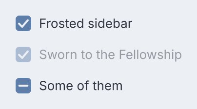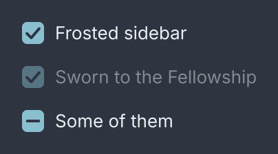<p>Checked, checked and disabled, and indeterminate.</p></div>

<div class="gb-tabs">

```kdl
column {
  checkbox bind="prefs.frost" change="prefs.toggle-frost" "Frosted sidebar"
  checkbox checked=#true disabled=#true "Sworn to the Fellowship"
  checkbox indeterminate=#true "Some of them"
}
```

```java
import dev.goldberry.widgets.controls.checkbox.Checkbox;

new Column(
        Checkbox.of("Frosted sidebar", Models.observable(prefs, "prefs.frost"), actions::toggleFrost),
        new Checkbox("Sworn to the Fellowship", Checkbox.Value.CHECKED).disabled(true),
        new Checkbox("Some of them", Checkbox.Value.MIXED)
);
```

</div>

`MIXED` is a real state. A select-all over a partial selection is neither on
nor off, so it matches `:indeterminate` rather than `:checked`. Toggling never
produces it: clicking a mixed box asks for all of them. Only the application
can put a box there.

The bound value may be a `Boolean` or a `Checkbox.Value`. Anything else leaves
the written state standing.

### Attributes

| Attribute | Type | Default | What it does |
|---|---|---|---|
| argument | string | `""` | the label, which is part of the click target |
| `checked` | boolean | `#false` | the written state |
| `indeterminate` | boolean | `#false` | the mixed state; wins over `checked` |
| `bind` | path | none | the value to follow; wins over the written state |
| `change` | action name | none | raised on every toggle; it says *that*, not *what* |
| `disabled` | boolean | `#false` | refuses the toggle and leaves the Tab order |
| `class`, `id`, `tooltip`, `context-menu`, `name` | | | as on every widget |

### Styling

- CSS type `checkbox`.
- Parts: `check-indicator`, the 16 px glyph, and `check-mark`, the tick inside it.
- Pseudo-classes: `:checked` and `:indeterminate` on the control and on `check-indicator`; `:hover`, `:active`, `:focus-visible`, `:disabled`.

```css
check-indicator:checked { background: var(--gb-accent) }
```

The glyph is a part, which is a CSS type that is not a node a document can
write. The mark exists in every state at `opacity: 0` so that it can scale in
when checked. Every control and part declares `flex-shrink: 0`. The label does
not, so a cramped row ellipses the text and never squashes the glyph.

The hit target is at least 32 square and the label gap is 8.

### Keyboard

| Key | Does |
|---|---|
| `Tab` | reaches it, unless disabled |
| `Space` | toggles it |

`Enter` deliberately does nothing. It belongs to a dialog's default action, and
a checkbox that swallowed it would leave a form with no keyboard route to
submit.

## `toggle`

A `toggle` is a switch: a pill with a disc that slides, and the one control
that acts on a release.

<div class="gb-shot">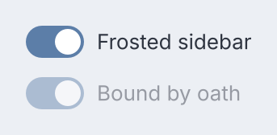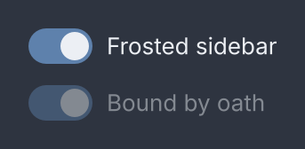<p>Bound, and on but disabled.</p></div>

<div class="gb-tabs">

```kdl
column {
  toggle bind="prefs.frost" change="prefs.set-frost" "Frosted sidebar"
  toggle on=#true disabled=#true "Bound by oath"
}
```

```java
import dev.goldberry.widgets.controls.toggle.Toggle;

new Column(
        Toggle.of("Frosted sidebar", Models.observable(prefs, "prefs.frost"), actions::setFrost),
        new Toggle("Bound by oath", true).disabled(true)
);
```

</div>

`change` carries the state asked for, as a boolean, not "the other one". A drag
of 8 px or more asks for the direction dragged, so dragging right on a switch
that is already on asks for on. A shorter drag is a click and flips it. The
8 is half of the thumb's 16 px travel.

### Attributes

| Attribute | Type | Default | What it does |
|---|---|---|---|
| argument | string | `""` | the label |
| `on` | boolean | `#false` | the written state |
| `bind` | path | none | a boolean to follow; wins over `on` |
| `change` | action name | none | told the state asked for, as `"true"` or `"false"` |
| `disabled` | boolean | `#false` | refuses the gesture and leaves the Tab order |
| `class`, `id`, `tooltip`, `context-menu`, `name` | | | as on every widget |

In Java the handler is a `Consumer<Boolean>`. From markup the action receives
the string, so an `@Action` method takes a `boolean`.

### Styling

- CSS type `toggle`.
- Parts: `toggle-track`, the 36 by 20 pill, and `toggle-thumb`, the 16 px disc.
- Pseudo-classes: `:checked` on the control and on `toggle-track`; `:hover`, `:active`, `:focus-visible`, `:disabled`.

```css
toggle-track:checked toggle-thumb { transform: translate(16px) }
```

Where the thumb travels to is the stylesheet's decision. The track's padding is
2 because `2 + 16 + 16 + 2 = 36` is what makes the travel 16.

### Keyboard

| Key | Does |
|---|---|
| `Tab` | reaches it, unless disabled |
| `Space` | flips it |

## `radio`

A `radio` is one option in a group. It carries a value and a label, and the
group decides whether it is on.

<div class="gb-shot">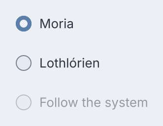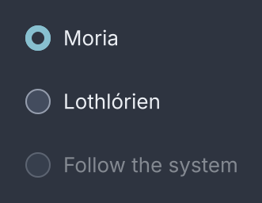<p>A group with one selected and one disabled.</p></div>

<div class="gb-tabs">

```kdl
radio-group value="dark" {
  radio value="dark" "Moria"
  radio value="light" "Lothlórien"
  radio value="system" disabled=#true "Follow the system"
}
```

```java
import dev.goldberry.widgets.controls.radio.Radio;
import dev.goldberry.widgets.controls.radio.RadioGroup;

new RadioGroup("dark",
        new Radio("dark", "Moria"),
        new Radio("light", "Lothlórien"),
        new Radio("system", "Follow the system").disabled(true));
```

</div>

`selected` is deliberately not an attribute. A document that could mark one
option selected could mark two, so the group rewrites each option with whether
its value matches on every build.

### Attributes

| Attribute | Type | Default | What it does |
|---|---|---|---|
| `value` | string | required | what the group reports and matches on; an empty one is refused |
| argument | string | `""` | the label |
| `disabled` | boolean | `#false` | this option only; a disabled group fades once, not per option |
| `class`, `id`, `tooltip`, `context-menu`, `name` | | | as on every widget |

The option's key is its value, so a group whose options are filtered or
reordered keeps each option's element and the focus on it.

### Styling

- CSS type `radio`.
- Parts: `radio-indicator`, a 16 px ring, and `radio-dot` inside it.
- Pseudo-classes: `:checked` on the control and on `radio-indicator`; `:hover`, `:active`, `:focus-visible`, `:disabled`.

### Keyboard

| Key | Does |
|---|---|
| `Space` | selects it |

The arrows are the group's. See below.

## `radio-group`

A `radio-group` holds the fact that exactly one of its options is on.

<div class="gb-shot">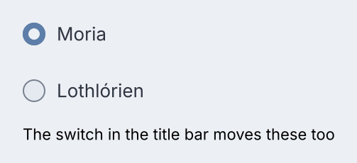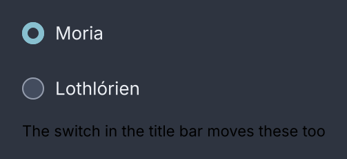<p>A group bound to a value, with a caption as a third child.</p></div>

<div class="gb-tabs">

```kdl
radio-group bind="prefs.theme" change="prefs.pick-theme" {
  radio value="dark" "Moria"
  radio value="light" "Lothlórien"
  text class="caption" "The switch in the title bar moves these too"
}
```

```java
RadioGroup.of(Models.observable(prefs, "prefs.theme"), actions::pickTheme,
        new Radio("dark", "Moria"),
        new Radio("light", "Lothlórien"));
```

</div>

A value no option carries selects nothing, which is right for a model that has
not loaded. A child that is not a `radio`, a caption or a separator, is left
exactly where it was written.

`change` has to say which one, so it is an action that takes an argument. In
Java the handler is a `Consumer<String>`. From markup, an `@Action` method with
one `String` parameter receives the value, and a plain `Runnable` also resolves
for a handler that reads the model itself.

### Attributes

| Attribute | Type | Default | What it does |
|---|---|---|---|
| `value` | string | none | the written selection |
| `bind` | path | none | the value to follow; wins over `value` |
| `change` | action name | none | told the value of the option asked for |
| `disabled` | boolean | `#false` | the whole group, out of the Tab order |
| `class`, `id`, `tooltip`, `context-menu`, `name` | | | as on every widget |

The children are the options.

### Styling

- CSS type `radio-group`. It is a column in `controls.css`; the class `inline` makes it a row.
- No parts of its own. The options are `radio` nodes.
- Pseudo-classes: `:disabled`.

The widget names the semantics and the stylesheet names the axis, which is why
the direction is a class and not an attribute.

### Keyboard

| Key | Does |
|---|---|
| `Tab` | enters the group at the selected option, or leaves it |
| `Left`, `Up` | move to the previous option and select it |
| `Right`, `Down` | move to the next option and select it |
| `Space` | selects the focused option |

The group is one Tab stop and the arrows rove inside it. The entry point is
derived from `:checked` rather than remembered, so the selection is the roving
position and the two cannot disagree. Selection follows focus the controlled
way: an arrow raises `change` and does not move the dot.

## `segmented`

A `segmented` control is a radio group drawn as one bar, with the arrows on its
own axis.

<div class="gb-shot">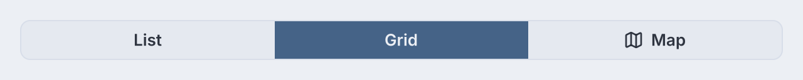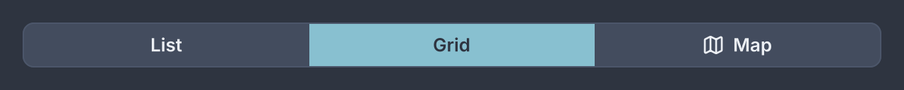<p>Three options, the bound one filled.</p></div>

<div class="gb-tabs">

```kdl
segmented bind="view.mode" change="view.set-mode" {
  option value="list" "List"
  option value="grid" "Grid"
  option value="map" icon="map" "Map"
}
```

```java
import dev.goldberry.widgets.controls.segmented.Segmented;
import dev.goldberry.widgets.controls.option.Option;

Segmented.of(Models.observable(view, "view.mode"), actions::setMode,
        new Option("list", "List"),
        new Option("grid", "Grid"),
        new Option("map", "Map").withIcon(map));
```

</div>

An icon-only segment is `option value="map" icon="map" name="Map"`. In a
document that is only as real as its icon registry: with no icon bound to
`map`, the option has neither a label nor an icon and is refused.

It shares `radio-group`'s model exactly: one Tab stop, exactly one selected,
`change` reports the value. It is a separate widget because the two are not
substitutable in a layout. A bar belongs in a toolbar and a group belongs in a
form.

### Attributes

| Attribute | Type | Default | What it does |
|---|---|---|---|
| `value` | string | none | the written selection |
| `bind` | path | none | the value to follow; wins over `value` |
| `change` | action name | none | told the value of the segment asked for |
| `disabled` | boolean | `#false` | the whole bar |
| `class`, `id`, `tooltip`, `context-menu`, `name` | | | as on every widget |

The children are `option` nodes.

### Styling

- CSS type `segmented`.
- Parts: `segmented-track`, `segmented-indicator`, which travels under the selected segment and matches `:checked`, and `segmented-divider`, which takes the class `beside-selection` on the two hairlines that fade out.
- The segments are `option` nodes with `:checked`, `:hover`, `:active`, `:focus-visible` and `:disabled`.
- Pseudo-classes on the bar: `:disabled`.

Height 32, segment padding 12, radius 8 on the outer corners and 0 between,
in `body-strong`. Segments are equal, each exactly `1/n` of the bar, so the
indicator travels by a percentage and the bar takes the width it is given. A
label that does not fit its segment is cut with an ellipsis.

### Keyboard

| Key | Does |
|---|---|
| `Tab` | enters the bar at the selected segment |
| `Left`, `Right` | move and select |
| `Space` | selects the focused segment |

`Up` and `Down` stay with whatever is above and below, because a bar has an
axis of its own.

## `select`

A `select` is a closed control and a list that opens in a window of its own,
so it is never clipped by the card it sits in.

<div class="gb-shot">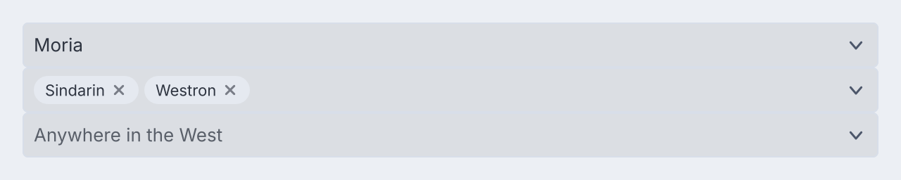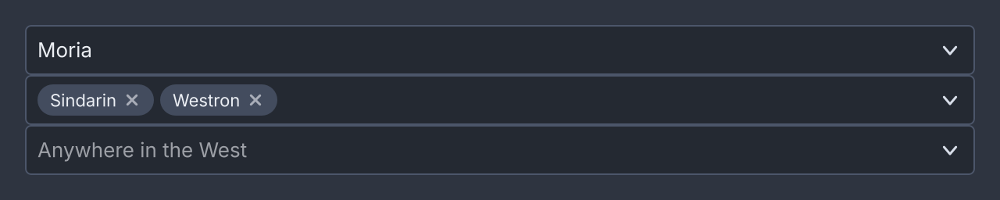<p>Single, multiple as chips, and an autocomplete with a placeholder.</p></div>

<div class="gb-tabs">

```kdl
column {
  select bind="prefs.theme" change="prefs.pick-theme" placeholder="Choose a light" {
    option value="dark" "Moria"
    option value="light" "Lothlórien"
  }
  select multiple=#true bind="prefs.tongues" change="prefs.toggle-tongue" {
    option value="sindarin" "Sindarin"
    option value="quenya" "Quenya"
    option value="westron" "Westron"
  }
  select autocomplete=#true free=#true query="places.search" options="places.matches" \
         bind="places.chosen" change="places.choose" placeholder="Anywhere in the West"
}
```

```java
import dev.goldberry.widgets.controls.select.Select;

Select.of(Models.observable(prefs, "prefs.theme"), actions::pickTheme,
        new Option("dark", "Moria"),
        new Option("light", "Lothlórien"))
    .placeholder("Choose a light");

Select.of(Models.observable(prefs, "prefs.tongues"), actions::toggleTongue, tongues)
    .multiple(true);

new Select(place, actions::choose, matches.toArray(Option[]::new))
    .autocomplete(actions::search)
    .free(true);
```

</div>

The closed control shows the selected option's label, or the placeholder. It is
as wide as its widest option, so it does not change width as the value does.

**`multiple=#true`** makes the selection a set. The bound value is a
`Collection`, each chosen value is drawn as a chip inside the closed control
with a ×, and `change` is a toggle: asking for a value the set already holds
takes it out. The list stays open while values are picked.

**`autocomplete=#true`** puts a real `text-input` in the closed control. Typing
raises `query` with the text, the application answers by supplying new
options, and the list narrows. The filtering is the application's, so a
remote-backed combobox is the same widget with a slower model. A free-typed
value is refused unless `free=#true`. In markup, `options=` names a bound list
of `Option` values that replaces the written ones each time it changes.

**A tree** is Java only. `select.tree(roots)` takes a list of `TreeNode` and
opens a `tree` instead of a flat list, leaf-only by default. A tree's model is
nodes with suppliers under them, which a document has no way to write.

### Attributes

| Attribute | Type | Default | What it does |
|---|---|---|---|
| `value` | string | none | the written selection |
| `bind` | path | none | the value to follow; a `Collection` when `multiple` |
| `change` | action name | none | told the value chosen, or toggled when `multiple` |
| `placeholder` | string | `""` | shown when nothing is selected |
| `multiple` | boolean | `#false` | the selection is a set drawn as chips |
| `autocomplete` | boolean | `#false` | the closed control is a field you type in |
| `free` | boolean | `#false` | a typed value that matches no option is accepted |
| `query` | action name | none | told the typed text, when `autocomplete` |
| `options` | path | none | a bound `List<Option>` that replaces the written options |
| `disabled` | boolean | `#false` | the whole control |
| `class`, `id`, `tooltip`, `context-menu`, `name` | | | as on every widget |

The children are `option` nodes. Anything else is left where it was written.

### Styling

- CSS type `select`.
- Parts: `select-value`, which takes the class `placeholder` when standing in for a value; `select-chevron`; `select-chips` and `select-chip` with `select-chip-label` and `select-chip-remove`, when `multiple`; `select-list`, the popup, holding `option` rows; and `select text-input`, the field, when `autocomplete`.
- Pseudo-classes: `:hover`, `:focus-visible`, `:disabled`.
- Classes: `open` while the list is up, and `multiple`.

The closed control is a well like `text-input`, height 32, padding 8, radius
4, in `body`. In the list a row is a list row's height and its label is
`body`, the chosen row takes `--gb-selection`, and the row the keyboard is on
takes `:focus-visible`.

### Keyboard

| Key | Does |
|---|---|
| `Tab` | reaches the closed control |
| `Space` | opens the list, unless `autocomplete`, where it types a space |
| `Down`, `Up`, `Alt+Down` | open the list |
| `Down`, `Up` in the list | move the focus between rows |
| `Enter` | chooses the focused row |
| `Esc` | closes the list; with `autocomplete`, restores the last committed value |

Arrows move and `Enter` chooses, which is the opposite of a segmented bar's
roving selection. The shared `option` record carries which of the two it is in.
Typing on the closed control is typeahead over the labels.

### `option`

An `option` is one choice, in a `segmented` bar or a `select` list. It carries
a value and a label, an icon, or both.

<div class="gb-shot">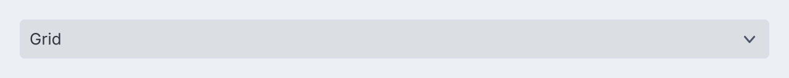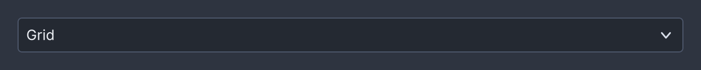<p>The chosen option, drawn with its icon.</p></div>

<div class="gb-tabs">

```kdl
select value="grid" {
  option value="list" "List"
  option value="grid" icon="grid" "Grid"
  option value="map" disabled=#true "Map"
}
```

```java
new Select("grid", actions::setMode,
        new Option("list", "List"),
        new Option("grid", "Grid").withIcon(grid),
        new Option("map", "Map").disabled(true));
```

</div>

Whether it is selected and what selecting it does are its container's, set on
every build. `new Option("list")` uses the value as the label.

#### Attributes

| Attribute | Type | Default | What it does |
|---|---|---|---|
| `value` | string | required | what the container reports and matches on |
| argument | string | `""` | the label; an option needs a label or an icon |
| `icon` | icon name | none | an icon before the label |
| `disabled` | boolean | `#false` | this option only |
| `name` | string | none | the accessible name an icon-only option needs |
| `class`, `id`, `tooltip`, `context-menu` | | | as on every widget |

#### Styling

- CSS type `option`.
- No parts.
- Pseudo-classes: `:checked`, `:hover`, `:active`, `:focus-visible`, `:disabled`.

A label that does not fit is cut with an ellipsis rather than wrapped.

#### Keyboard

`Space` selects it in a bar. `Space` or `Enter` chooses it in a list. The
arrows are the container's.
