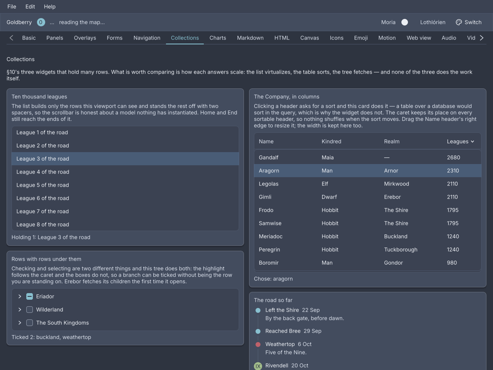
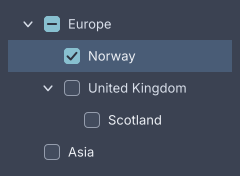

# Collections

<p class="gb-lede">A list, a table and a tree: three widgets over a model the application owns, that select by id, report what the user chose, and never edit the data.</p>

<div class="gb-shot"><p>The Collections screen of the showcase, Nord dark.</p></div>

Each of the three takes the application's own type and a few functions that
describe it: how to identify an item, how to draw it, what to call it. The
widget holds no copy of the data. Selection is a set of ids the application
holds and hands back in, and every change arrives as the whole new set
([ADR-0063](../adr/0063-data-flows-down-events-flow-up.md)).

> [!IMPORTANT]
> A list, a table or a tree is built in Java. Markup can **place** one the
> model holds, with `bind=`, but cannot describe one: an item factory is code
> ([ADR-0367](../adr/0367-a-document-places-a-list-it-cannot-describe.md)).
> The `kdl` samples below show the placing. The Java beside them is the widget.

## `list`

A vertical list of rows, one per item, with a selection model and a keyboard.

```kdl
list bind="app.road" id="road" class="sidebar"
```

```java
@Bind("app.road") private ListView<String> road =
        ListView.of(Leagues.ROAD)
                .virtualized()
                .selection(Selection.MULTIPLE)
                .selected(chosen, this::choose);
```

`ListView.of(List<String>)` is the short form: the string is the id, the label
and the type-ahead text. The general constructor takes the application's type
and two functions:

```java
new ListView<>(walkers, Walker::id, w -> new Text(w.name()))
        .text(Walker::name)
        .selected(picked, this::pick);
```

`identity` names an item, and that name is what selection carries. `factory`
builds the row's content, and any widget will do. `text` is optional and
powers type-to-select.

**Rows are virtualized by row height.** `virtualized()` reads
`--gb-list-row-height` from the cascade, so a compact density gets the right
pitch. `virtualized(double)` names one. The list then builds only the rows a
viewport can see, plus four either side, with a spacer above and below sized
from the rest, so the showcase scrolls ten thousand rows
([ADR-0213](../adr/0213-a-virtual-list-is-two-spacers-and-a-window.md)). A
list that is not virtualized builds every row.

> [!WARNING]
> A virtualized list's `list-row` height must be the pitch it was told. When a
> stylesheet makes them differ by more than half a pixel the list logs it once
> and the scroll range is wrong
> ([ADR-0257](../adr/0257-a-diagnostic-is-asked-for-not-logged.md)).

**Attributes**

| Attribute | Type | Default | What it does |
|---|---|---|---|
| `bind` | path | none | The `ListView` a model holds. Nothing bound draws nothing. |
| `id`, `class` | string | | Laid over the widget's own id and classes. |

Nothing else is read, and children are ignored.

**Java**

| Method | What it does |
|---|---|
| `ListView.of(List<String>)` | A list of strings, each its own id and label. |
| `new ListView<>(items, identity, factory)` | The general form. |
| `selection(Selection)` | `NONE`, `SINGLE` or `MULTIPLE`. Single is the default. |
| `selected(Set<String>, Consumer<Set<String>>)` | The current selection and where to report the next. |
| `selected(String, Consumer<String>)` | The same for a single selection. |
| `text(Function<T, String>)` | What type-to-select matches. |
| `virtualized()`, `virtualized(double)` | Build only the visible window. |
| `itemMenu(Function<T, String>)` | A context-menu name per item. |

In `MULTIPLE`, a plain press replaces the selection, `Ctrl` toggles the row,
and `Shift` selects from the last plain press through to the row. What is
reported is the whole set, in the order it was chosen.

**Styling**

The CSS type is `list`. Each row is a `list-row`, and the virtual spacers are
`list-spacer`. A row matches `:hover` and `:focus-visible`, and carries the
class `selected` rather than a pseudo-class. The row height is
`--gb-list-row-height`, 32px, 26px at compact density.

**Keyboard**

| Key | Does |
|---|---|
| `Up`, `Down` | move focus between rows, without selecting |
| `Enter` | selects the focused row. `Ctrl+Enter` toggles, `Shift+Enter` ranges |
| `Home`, `End` | the first and last item, widening the virtual window to reach them |
| letters | type-to-select, when `text` is set. One second between letters, repeat a letter to cycle |

A right-click selects the row it is over before the context menu opens, unless
it is already selected
([ADR-0224](../adr/0224-a-right-click-selects-what-it-is-over.md)).

**Read more**

- [ADR-0212: A list owns the models a tree borrowed](../adr/0212-a-list-owns-the-models-a-tree-borrowed.md)
- [ADR-0213: A virtual list is two spacers and a window](../adr/0213-a-virtual-list-is-two-spacers-and-a-window.md)
- [ADR-0254: A build may ask the cascade for a number](../adr/0254-a-build-may-ask-the-cascade-for-a-number.md)
- [ADR-0367: A document places a list it cannot describe](../adr/0367-a-document-places-a-list-it-cannot-describe.md)

## `table`

A list with columns: one row per item, one cell per column, and a header that
sorts by asking.

```kdl
table bind="app.company" id="company"
```

```java
new Table<>(sorted, Walker::id, List.of(
        Column.<Walker>of("name", "Name", Walker::name).sortable(true).resizable(true),
        Column.<Walker>of("realm", "Realm", Walker::realm).sortable(true).weight(2),
        Column.<Walker>of("leagues", "Leagues", w -> String.valueOf(w.leagues()))
                .sortable(true)
                .fixed(96)
))
    .sorted(sort, this::sortBy)
    .selection(Selection.MULTIPLE)
    .selected(picked, this::pick)
    .id("company");
```

A `Column` has a key, a header, a cell function and a width. `Column.of`
draws text, `Column.widget` draws any widget. `weight(double)` shares the
remaining width, `fixed(double)` takes pixels.

**Sorting is reported, not performed.** A press on a sortable header calls
`onSort` with the `Sort` the table would like next: the column, ascending, or
the same column flipped. The application sorts its items and rebuilds, and the
caret appears on the column `sort` names
([ADR-0214](../adr/0214-a-table-is-a-list-with-columns.md)).

```java
private void sortBy(Sort next) {
    setState(() -> sort = next);   // and sorted() orders the items by it
}
```

A `resizable` column has a grip after its header. Dragging it asks `onResize`
for a new width, and the application decides what the column becomes
([ADR-0361](../adr/0361-a-column-is-resized-by-asking.md)). The header stays
at the top while the rows scroll
([ADR-0360](../adr/0360-an-affix-stays-inside-its-container.md)).

**Attributes**

| Attribute | Type | Default | What it does |
|---|---|---|---|
| `bind` | path | none | The `Table` a model holds. Nothing bound draws nothing. |
| `id`, `class` | string | | Laid over the widget's own. |

A `column` child in markup is the layout widget, not a column definition, and
is discarded.

**Java**

| Method | What it does |
|---|---|
| `new Table<>(items, identity, columns)` | The table. |
| `sorted(Sort, Consumer<Sort>)` | The current sort and where to report the next. `null` is model order. |
| `resized(BiConsumer<String, Double>)` | Where a grip reports a column key and a width. |
| `selection`, `selected` | As `list`. |
| `virtualized(double)` | Build only the visible rows, at this pitch. |

`Sort.by(column)` is ascending. `Sort.next(current, column)` is what the header
asks for.

**Styling**

The CSS type is `table`. The header is a `table-head` of `table-header` cells,
each holding a `table-label` and, on the sorted column, a `sort-caret`; a
`table-rule` runs under it, and a `table-grip` sits after a resizable header.
Rows are the list's `list-row`, each a `table-cells` of `table-cell`. A header
carries the classes `sortable`, `sorted` and `ascending` or `descending`, and
matches `:hover` and `:focus-visible`. The header height is
`--gb-table-header-height`, 36px, 30px at compact density.

**Keyboard**

Rows take what `list` takes: `Up`, `Down`, `Enter`, `Home`, `End`. A sortable
header is a Tab stop, and `Enter` or `Space` on it asks for the next sort. A
table has no type-to-select.

**Read more**

- [ADR-0214: A table is a list with columns](../adr/0214-a-table-is-a-list-with-columns.md)
- [ADR-0360: An affix stays inside its container](../adr/0360-an-affix-stays-inside-its-container.md)
- [ADR-0361: A column is resized by asking](../adr/0361-a-column-is-resized-by-asking.md)

## `tree`

A list that remembers what is open: nodes with children, a chevron on those
that have or may have some, and the list's selection models.

```kdl
tree bind="app.lands" id="lands"
```

```java
List<TreeNode> lands = List.of(
        TreeNode.of("eriador", "Eriador",
                TreeNode.leaf("shire", "The Shire"),
                TreeNode.leaf("bree", "Bree")),
        TreeNode.lazy("erebor", "Erebor",
                () -> List.of(TreeNode.leaf("dale", "Dale")))
);

new Tree(lands, selected, this::select)
        .checkable(Checkable.CASCADE)
        .checked(checked, this::check)
        .id("lands");
```

<div class="gb-shot"><p><code>Checkable.CASCADE</code>: a parent's box shows what its children say.</p></div>

**The model is a `TreeNode`.** It has an id, a label and either a list of
children or a supplier of them. `TreeNode.leaf` has none, `TreeNode.of` has
them now, and `TreeNode.lazy` fetches them the first time the node opens. The
tree keeps which ids are open and what a supplier returned, so a rebuild with
the same ids keeps the same shape
([ADR-0184](../adr/0184-a-tree-is-a-list-that-remembers-what-is-open.md)).

**Checking and selecting are two different things.** Selection is the list's,
a set of ids reported whole. `checkable(Checkable)` adds a checkbox per node:
`LEAF` on leaves only, `ANY` on every node, `CASCADE` where a parent's box
shows its children's state and checking it checks them all. The checked set
is reported through `checked(Set, Consumer)` and never touches selection
([ADR-0210](../adr/0210-a-tree-checks-and-selects-two-different-things.md)).

**Attributes**

| Attribute | Type | Default | What it does |
|---|---|---|---|
| `bind` | path | none | The `Tree` a model holds. Nothing bound draws nothing. |
| `id`, `class` | string | | Laid over the widget's own. |

There is no `checkable=` or `node` child in markup. Those are the model's.

**Java**

| Method | What it does |
|---|---|
| `new Tree(roots, selected, onSelect)` | Single selection of leaves only. |
| `anyNode(true)` | Lets a parent be selected too. |
| `selection(Selection)`, `selected(Set)`, `onSelect(Consumer)` | The list's models. |
| `checkable(Checkable)` | `NONE`, `LEAF`, `ANY` or `CASCADE`. |
| `checked(Set<String>, Consumer<Set<String>>)` | The checked ids and where to report the next set. |

A tree is not virtualized: every visible row is built.

**Styling**

The CSS type is `tree`. Each row is a `tree-row` holding a `tree-indent`, a
`tree-chevron`, a `tree-check` when the tree is checkable, and a `tree-label`.
A row carries the classes `expanded`, `selected` and `group`, the last on a
row that cannot be selected, and matches `:hover` and `:focus-visible`. The
indent is 20px per level and the row height is `--gb-list-row-height`.

**Keyboard**

| Key | Does |
|---|---|
| `Up`, `Down` | move focus between visible rows |
| `Right` | opens a closed node, or moves to the first child of an open one |
| `Left` | closes an open node, or moves to the parent |
| `Enter` | selects, with `Ctrl` and `Shift` as the list has them |
| `Space` | toggles the row's checkbox |
| `Home`, `End` | the first and last visible row |
| `*` | opens every sibling of the focused row |
| letters | type-to-select over the visible rows |

The keyboard is the subject of
[ADR-0209](../adr/0209-a-tree-finishes-its-keyboard.md). A click on the
chevron opens or closes without selecting. A click on a parent that cannot be
selected opens it.

**Read more**

- [ADR-0184: A tree is a list that remembers what is open](../adr/0184-a-tree-is-a-list-that-remembers-what-is-open.md)
- [ADR-0209: A tree finishes its keyboard](../adr/0209-a-tree-finishes-its-keyboard.md)
- [ADR-0210: A tree checks and selects two different things](../adr/0210-a-tree-checks-and-selects-two-different-things.md)
