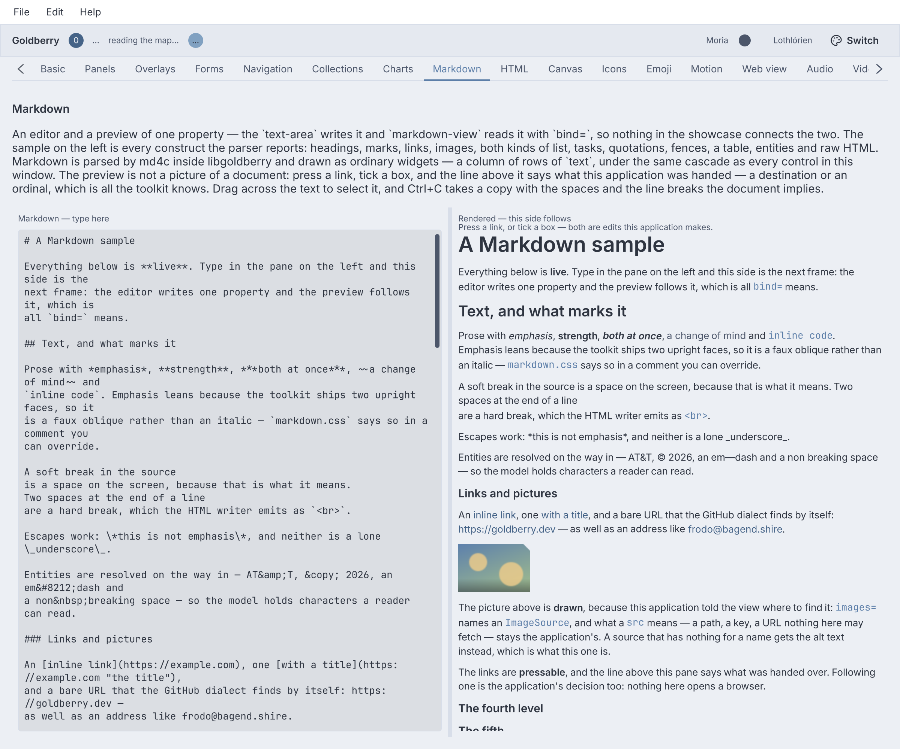
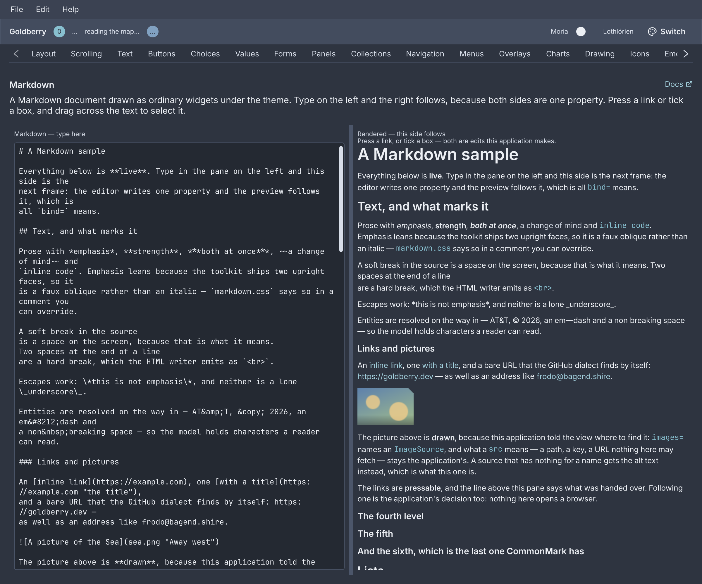
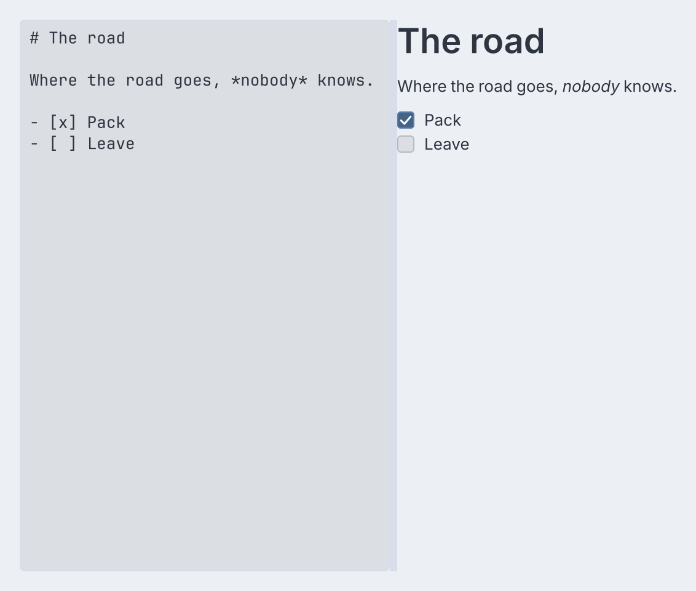
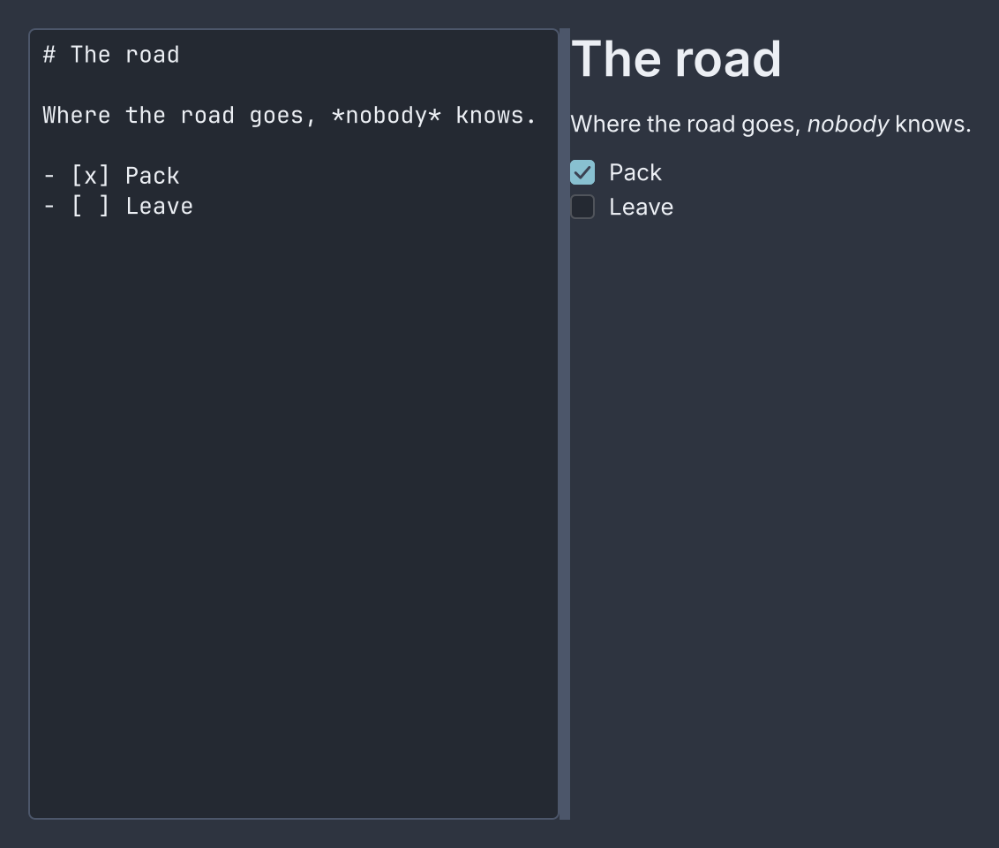
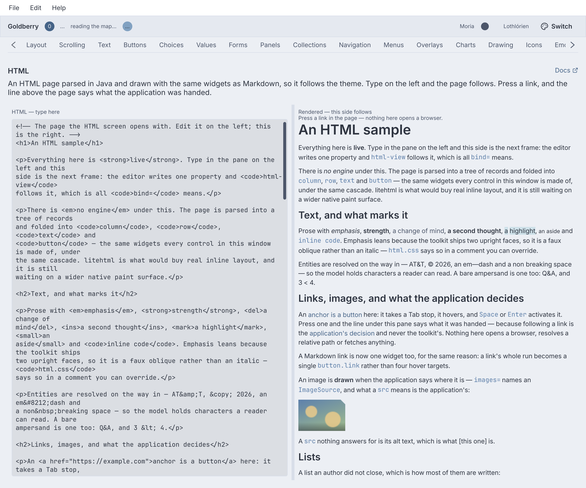
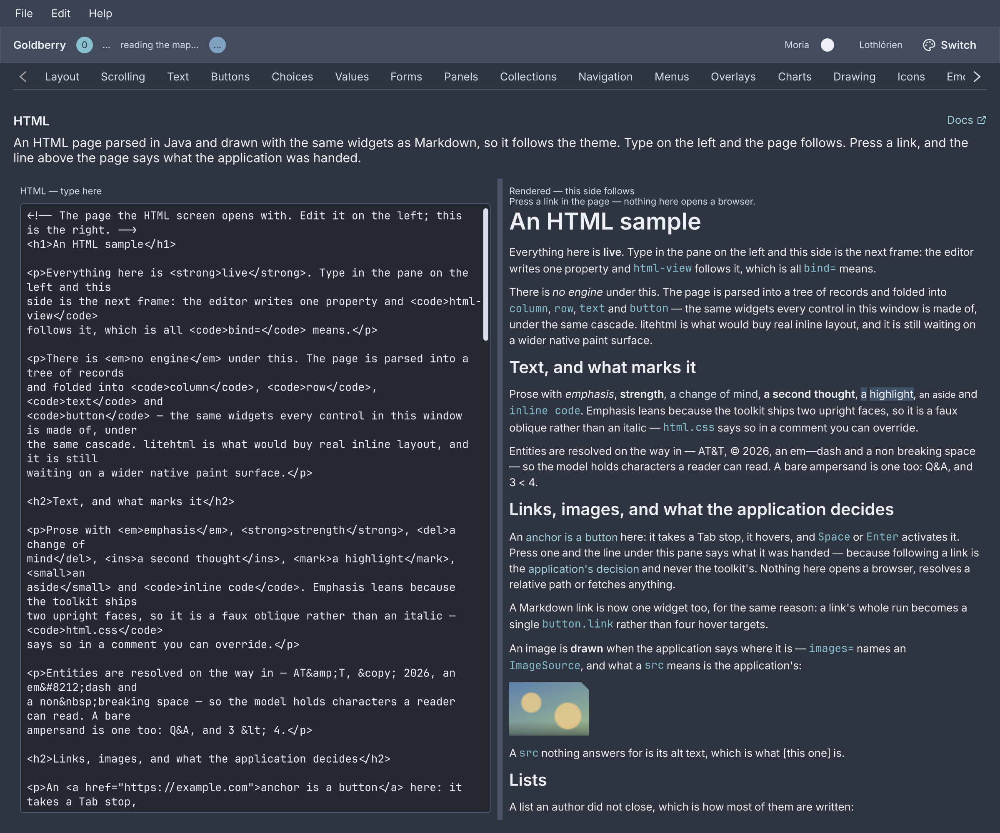
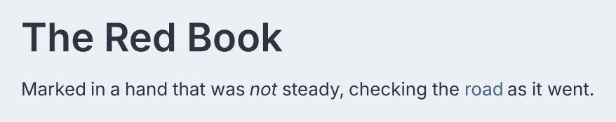
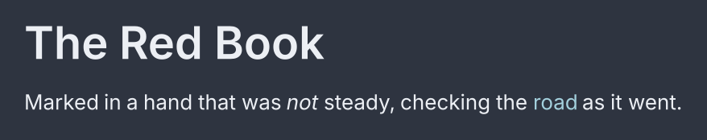

# Markdown, HTML and the web

<p class="gb-lede">A Markdown note and an HTML page render as ordinary widgets under the ordinary cascade, and a web page is a window the desktop's own engine draws where the window system allows one.</p>

By the end of this chapter you can show a document that follows a property,
answer its links and task boxes, let a reader select and copy from it, and
decide whether a real web page can be offered on the machine you are on.

The two views are in the `goldberry-html` module. Add it beside the toolkit and
add its stylesheets beside the controls' own, or a document renders as unstyled
words:

```java
var sheets = new ArrayList<>(Controls.stylesheets(theme));
sheets.add(MarkdownStyles.stylesheet());
sheets.add(HtmlStyles.stylesheet());
```

Nothing in the core knows the module exists. Its catalogue announces the two
node names, and the inflater finds them when the module is on the module path.

<div class="gb-shot">

<p>The showcase's Markdown screen. The editor writes one property and the view reads it.</p>
</div>

## `markdown-view`

A rendered Markdown document: GitHub's dialect by default, parsed by md4c and
folded into `column`, `row` and `text`.

<div class="gb-shot"><p>The source and the document it renders, side by side.</p></div>

<div class="gb-tabs">

```kdl
split-pane position=0.5 first-min=240 second-min=240 {
    text-area class="mono" bind="note.source" change="note.set-source" fill=#true
    scroll {
        markdown-view bind="note.source" link="app.open" wikilink="app.open-page" images="app.assets" task="note.toggle-task"
    }
}
```

```java
import dev.goldberry.markdown.Markdown;
import dev.goldberry.markdown.view.MarkdownView;

var view = MarkdownView.following(model.source())
        .onLink(app::open)
        .onWikiLink(app::openPage)
        .images(assets)
        .onTask(index -> model.setSource(Markdown.toggleTask(model.source(), index)));
```

</div>

A live preview is a binding. The editor writes `note.source` through its action
and the view reads the same property with `bind=`. Nothing watches the editor
or schedules a render: a keystroke marks the view for rebuild and the next frame
is the parsed document. A block whose source did not change keeps the widget it
had, so a keystroke on a 50 kB note costs about 2 ms of build.

Markup may also carry the document as the node's argument. `syntax` picks the
dialect, and a view with a document and a binding shows the document until the
property answers.

```kdl
markdown-view "A *little* document." syntax="commonmark"
```

In Java a `Document` is a value: `Markdown.parse(text)` or
`Markdown.parse(text, MarkdownSyntax.commonMark())` returns a sealed tree an
application can walk for an outline before handing it to
`MarkdownView.of(document)`. `MarkdownView.of(text)` parses for the caller who
wants a preview and nothing else. `MarkdownHtml.of(document)` writes the same
tree out as an HTML fragment, so a preview and the bytes a server hands out
cannot drift.

### Links, images and tasks

A rendered document is read, and the application answers.
A link is a `button.link`, a Tab stop that hands its `href` to `link=` and does
nothing else: no browser opens and no path resolves. A `[[wiki link]]` hands its
target to `wikilink=`, and a view with no handler draws it inert. An image is
its alt text until an `ImageSource` the application supplies turns the `src`
into pixels. A task box reports its ordinal to `task=`, and
`Markdown.toggleTask(source, index)` flips that one character of the source.
The ordinal crosses as the string a document would have written.

### Selection

Drag across the document, double-click a word, triple-click a block, `Ctrl+A`
and `Ctrl+C`. What lands on the clipboard has the space between words and the
newline between blocks that the document implies.
Nothing to switch on. A drag repaints rather than rebuilds.

### Attributes

| Attribute | Type | Default | What it does |
|---|---|---|---|
| argument | string | `""` | The Markdown source, shown until `bind` answers |
| `bind` | binding | none | A property whose text is parsed on every build |
| `syntax` | `github`, `commonmark` | `github` | The dialect. Anything else is refused |
| `link` | valued action | none | Handed a link's `href` |
| `wikilink` | valued action | none | Handed a wiki link's target |
| `images` | named `ImageSource` | none | Where an image's `src` becomes pixels |
| `task` | valued action | none | Handed a task box's ordinal, from zero |
| `id` | string | none | The view's id, on the column it builds |
| `class` | string | none | Classes on that column |

Children are refused, and there is no `src=` to read a file with.

### Styling

`markdown-view` composes and has no box of its own. It builds a `column` with
the class `markdown`, and `markdown.css` hangs every rule off a class: `md-h1`
to `md-h6`, `md-prose`, `md-line`, `md-lines`, `md-token`, `md-word`, `md-em`,
`md-strong`, `md-struck`, `md-underline`, `md-code`, `md-code-block`,
`md-code-line`, `md-code-language`, `md-link`, `md-wikilink`, `md-list`,
`md-item`, `md-item-body`, `md-marker`, `md-quote`, `md-quote-body`, `md-table`,
`md-row`, `md-cell`, `md-rule` and `md-raw`. A link is a `button` with the class
`link`. The sheet is in the toolkit's base layer, so an application's rule wins
without `!important`.

### Keyboard

`Tab` reaches each link, and `Space` or `Enter` presses it. `Ctrl+A` selects the
document and `Ctrl+C` copies the selection.

### What it does not do

Emphasis is a faux oblique, a skew rather than an italic face. A line of mixed
faces is a row of words rather than one shaped run, so there is no
justification and no hyphenation. The view is not scrollable, because `scroll`
exists and the choice of where the scrollbar goes is the application's.

<div class="gb-shot"><p>The HTML screen of the showcase: the source and the page it renders.</p></div>

## `html-view`

A rendered HTML document: parsed in Java into a model of records and folded
into the same widgets the Markdown view uses.

<div class="gb-shot"><p>A heading, emphasis and a link.</p></div>

<div class="gb-tabs">

```kdl
scroll {
    html-view bind="doc.source" link="doc.open" images="app.assets"
}
```

```java
import dev.goldberry.html.Html;
import dev.goldberry.html.view.HtmlView;

var document = Html.parse(help.body());
var view = HtmlView.of(document).onLink(app::navigate).images(assets);
var links = document.find("a");
```

</div>

`HtmlView.following(model.source())` is the Java spelling of `bind=`, and
`HtmlView.of(text)` parses for a caller who wants a page and nothing else. The
document may also be the node's argument:

```kdl
html-view "<p>A <em>little</em> page with <a href=\"/help\">a link</a>.</p>" link="doc.open"
```

An anchor becomes a `button.link` that hands its `href` to `link=`. It is a Tab
stop, it hovers and it takes `Space` and `Enter`, so a help page is navigable
from the keyboard. Whether the link may be followed is the application's: no
browser opens, no relative path resolves and nothing is fetched. Selection and
copy work as in the Markdown view.

### Attributes

| Attribute | Type | Default | What it does |
|---|---|---|---|
| argument | string | `""` | The HTML source, shown until `bind` answers |
| `bind` | binding | none | A property whose text is parsed on every build |
| `link` | valued action | none | Handed an anchor's `href` |
| `images` | named `ImageSource` | none | Where an `` becomes pixels. Without one an image is its alt text |
| `id` | string | none | The view's id, on the column it builds |
| `class` | string | none | Classes on that column |

Children are refused, and there is no `src=`.

### Styling

`html-view` builds a `column` with the class `html`. Every element contributes
the class `html-<tag>`, so `html.css` reads like a browser's default sheet and a
tag nobody anticipated is already styleable. A page's own `class="callout"`
arrives as `html-callout`. The structural classes are `html-block`, `html-prose`,
`html-line`, `html-lines`, `html-token`, `html-word`, `html-list`, `html-item`,
`html-item-body`, `html-marker`, `html-table`, `html-row`, `html-cell`,
`html-caption`, `html-quote`, `html-quote-body`, `html-pre`, `html-code-line`,
`html-rule` and `html-term`. Headings are `html-h1` to `html-h6`.

### Keyboard

As `markdown-view`: `Tab` to each link, `Space` or `Enter` to press it,
`Ctrl+A` and `Ctrl+C` for the selection.

### What it does not do

There is no engine behind it. No scripting, no network, no navigation and no
forms. A `<style>` block is kept in the model and applied by nothing, because
the cascade a page is under is the application's stylesheets, which is what
makes it follow the theme. Real inline layout, one shaped run across mixed
faces, is what an engine would buy, and the view does not have it.

## The web view

A real web page inside the window, drawn by the desktop's own engine into a
child window placed over the widget's box. Java only: there is no markup name,
because a page is a platform handle a document cannot describe.

```java
import dev.goldberry.widgets.core.web.WebView;
import dev.goldberry.widgets.shell.web.WebPage;

new WebView(WebPage.of("https://goldberry.dev")).withAttributes(Attributes.NONE.id("page"));
```

A `WebPage` is a value: `WebPage.of(url)`, `WebPage.ofHtml(html)` or
`WebPage.blank()`, with `title`, `sized`, `debug` for the engine's inspector,
and `on(name, callback)` for a function the page's own script can call. The
widget follows the page it is handed, so navigating is rebuilding with another
page. A callback's return value resolves the page's promise and an exception
rejects it.

```java
var page = WebPage.ofHtml(DEMO)
        .on("goldberrySays", arguments -> "\"Java heard you\"");
```

`WebViews.open(host, page)` opens a page in a window of its own instead, and
returns empty where no page can be opened.

### Ask before offering one

The engine is WebKitGTK, WebView2 or WKWebView, driven through a separate
optional library so that GTK and WebKit are never load-time dependencies of the
toolkit. Most machines cannot open a page, so an application asks first:

```java
if (Goldberry.capabilities().contains(Capability.WEB_VIEW)) {
    return new WebView(WebPage.of(HANDBOOK));
}
return new Button("Open the handbook", () -> Desktop.browse(HANDBOOK));
```

`WebViews.isAvailable()` is the same question.

| Platform | What the page is | Status |
|---|---|---|
| X11, and XWayland | A GTK window reparented into this one | Works |
| macOS | A `WKWebView`, a subview of the window's content view | Works |
| Windows | A WebView2 child window | Written, unverified |
| Wayland | Nothing | Refused, and says why |

### Wayland refuses it

Embedding means putting the engine's window inside the application's. Wayland
does not allow a client to reparent a foreign surface, and no protocol proposes
it. On a Wayland session the widget opens nothing and paints a message saying
why, rather than dropping a loose window on the desktop.
An application that wants a page there can ask SDL for the X11 driver with
`-Dgoldberry.backend.videoDriver=x11`, which runs the window under XWayland.

### What a page cannot share the screen with

The page is a window above the frame, not a raster in it. Nothing painted can
cover it: a `popover`, a `tooltip` or a `toast` that overlaps the page is
invisible where they meet. A `scroll` does not clip it. `opacity`, `transform`
and the frost material do not reach it. No golden image contains one. A `dialog`
is the exception: while a modal is up the widget parks its page off the side of
the window and brings it back when the dialog closes. A page is also opened
parked and shown only once it reports itself loaded, with a `spinner` in its box
until then.

Input is the page's. The window system delivers clicks and keys to the engine
directly, and on macOS the backend drops key events while a page holds the
keyboard. Under X11 a window keeps presenting through the GPU with a page in it.
A page is taken down on WebKit's thread, and its context outlives the
application's exit.

### Signing in through a page

Two things a sign-in needs from a page cannot come from the page's own script.
The engine hands them over instead:

- **Where it is going.** `onNavigate(Predicate<URI>)` is asked before every
  navigation, a server's redirect included. False cancels it, and the page
  stays on the document it had. An OAuth redirect to a custom scheme comes back
  this way, with no loopback server.
- **Its cookies, HttpOnly ones included.** `cookies(URI)` reads the engine's
  jar for a URL. The answer is a `CompletionStage<List<HttpCookie>>` that
  completes on the UI thread.

```java
private final WebViewController signIn = new WebViewController();

new WebView(WebPage.of(GRAFANA + "/login"))
        .onNavigate(uri -> {
            if ("myapp".equals(uri.getScheme())) {
                finish(uri.getQuery());
                return false;
            }
            if (uri.getPath().equals("/")) {
                signIn.cookies(URI.create(GRAFANA)).thenAccept(this::keepSession);
            }
            return true;
        })
        .controller(signIn)
        .withAttributes(Attributes.NONE.id("sign-in"));
```

A page opened with `WebViews.open` takes `WebPage.onNavigate` the same way and
answers `cookies(URI)` itself. The predicate runs inside the engine's decision,
so it must answer at once, and one that throws lets the navigation go ahead.
The widget asks the predicate of the page value it has **now**, so a rebuild
with a new lambda needs no reload. A `WebViewController` is inert until its page
has opened, and asking it then gives a stage that has already failed.

| Platform | Cookies from | Navigations asked about |
|---|---|---|
| Linux | WebKitGTK's cookie manager | Every frame's: WebKitGTK does not say which frame |
| macOS | `WKHTTPCookieStore`, matched to the URL by the toolkit | The main frame's; written, unverified |
| Windows | WebView2's cookie manager | The main frame's (`NavigationStarting`); written, unverified |

On Linux and macOS every page in the process shares one cookie jar, so a
session signed in to in one page can be read from any other.

### Styling

The widget builds a `column` with the class `web-view`, a `stack` with the
class `web-stage`, and a `canvas` with the class `web-surface` that carries the
id and sizes the page. All three default to `flex-grow: 1`, so a page fills the
box it is given. The page's own document is not in the toolkit's tree, so no
stylesheet or theme reaches it. An application that wants a page to follow the
desktop's light or dark setting reads `Host.systemTheme()` and writes the CSS.

### Keyboard

The page's own. The toolkit forwards nothing.
