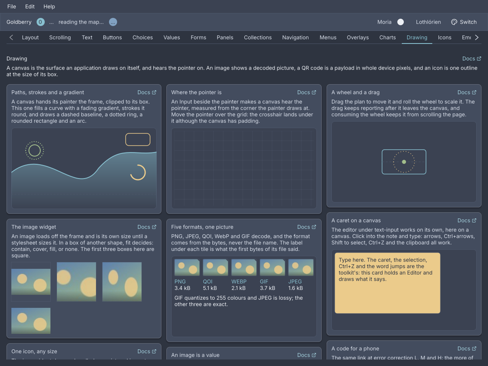
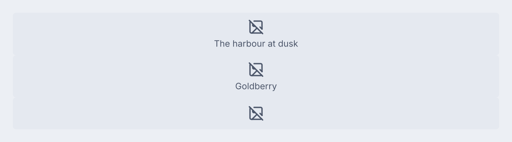
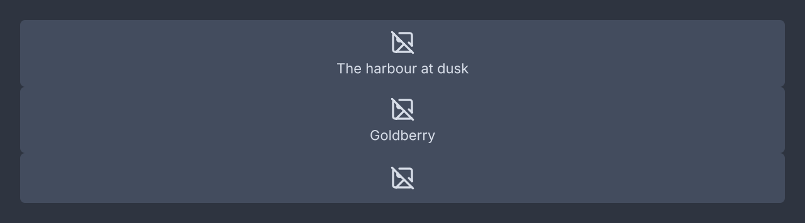
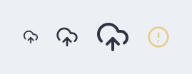
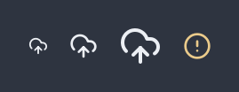

# Canvas, images and QR codes

<p class="gb-lede">A canvas is the surface an application draws on itself, an image shows a decoded picture, a QR code is a payload drawn as modules of whole device pixels, and an icon is one outline at whatever size its box is.</p>

By the end of this chapter you can draw with paths, strokes, gradients and
images on a `canvas`, hear the pointer and the keyboard on it, place a picture
with one of four fit modes, put a scannable code in a dialog, and size an icon
from the stylesheet.

<div class="gb-shot">

<p>The showcase's Drawing screen. The drawings are a <code>canvas</code> each, the four photographs are <code>image</code> widgets, and each card links back to its section here.</p>
</div>

## `canvas`

An immediate-mode drawing surface: a box whose painter is handed the frame,
translated to the box's content corner and clipped to it.

<div class="gb-tabs">

```kdl
canvas id="plot" class="chart"
```

```java
import dev.goldberry.widgets.core.canvas.Canvas;

new Canvas((frame, size) -> {
    frame.fillRect(0, 0, size.width(), size.height() / 2, 0xFF88C0D0);
}, Attributes.NONE.id("plot").classes("chart"));
```

</div>

Markup names no painter. A `canvas` node inflates to a styled, sized surface
that draws nothing, because a painter is code and a document names things
rather than building them. The painter is Java.

### The painter

A `Painter` is `paint(Frame frame, LogicalSize size)`. The frame's origin is the
canvas's top-left and the clip is its content box, so a painter cannot escape
its bounds. The toolkit brackets the call in `save` and `restore`, so a painter
may set a clip or a transform and leave it set
([ADR-0193](https://github.com/DigitalSmile/goldberry/blob/master/book/src/adr/0193-a-canvas-is-a-second-clip-depth.md)). It runs on the UI
thread inside the frame, so it must not block and must not keep the frame.

```java
var hill = Path.builder()
        .moveTo(0, height)
        .lineTo(0, height * 0.55)
        .cubicTo(width * 0.25, height * 0.2, width * 0.45, height * 0.9, width * 0.6, height * 0.5)
        .lineTo(width, height)
        .close()
        .build();
frame.fillPath(hill, Gradient.fade(0, height * 0.2, 0, height, CssColor.fade(ink, 0.55)));
frame.strokePath(Path.circle(cx, cy, 14), Stroke.round(2), accent);
frame.strokePath(Path.line(0, y, width, y), Stroke.of(1).dashed(4, 4), muted);
frame.drawImage(logo, 16, 16);
```

`Frame` fills and strokes a `Path`, with a colour or a `Gradient`, draws an
`Image` at its natural size or scaled and faded, clips with `clipTo`, and
transforms with `transform`, `concat` and `resetTransform`. `Path` has a builder
with `moveTo`, `lineTo`, `quadTo`, `cubicTo`, `arcTo`, `close` and `append`,
and factories `line`, `polyline`, `rect`, `roundRect`, `ellipse`, `circle` and
`arc`. A path is a value, so `path.rotated(radians, cx, cy)`,
`translated`, `scaled` and `transformed(affine)` make a turned copy, and
`frame.concat` composes a transform onto the one the canvas already has
([ADR-0390](https://github.com/DigitalSmile/goldberry/blob/master/book/src/adr/0390-a-turned-shape-is-a-path-and-the-frame-can-compose.md)).
A `Stroke` is `of(width)` or `round(width)`, with `cap`, `join`, `dashed(on, off)`
and `dash(Dash)`. A dash is the toolkit's own arithmetic
([ADR-0278](https://github.com/DigitalSmile/goldberry/blob/master/book/src/adr/0278-a-dash-is-goldberrys-arithmetic-and-not-the-rasterizers.md)).

A three-parameter painter is a `StyledPainter` and is handed a `CanvasStyle`:
the node's resolved `font` and `ink`, this frame's `nowMillis`, and
`reducedMotion`. So `canvas { color: var(--gb-text) }` reaches the drawing
([ADR-0288](https://github.com/DigitalSmile/goldberry/blob/master/book/src/adr/0288-a-painter-is-told-what-the-cascade-resolved.md)).

```java
new Canvas((frame, size, style) -> {
    Paragraph.of(style.font(), "Revenue").paint(frame, 0, 0, size.width(), style.ink());
});
```

A canvas is painted once and left there. `animating` asks for the next frame
for as long as a predicate over the same `CanvasStyle` says so
([ADR-0348](https://github.com/DigitalSmile/goldberry/blob/master/book/src/adr/0348-a-canvas-asks-for-its-next-frame-with-what-it-was-painted-with.md)):

```java
new Canvas(floor::paint).animating(style -> style.nowMillis() - mounted < SETTLE_MILLIS);
```

### Input

An `Input` beside the painter makes the canvas hear the pointer and the keyboard.
The events are the toolkit's own `PointerEvent` and `KeyEvent`, and
`event.content()` is measured from the corner the painter draws at
([ADR-0281](https://github.com/DigitalSmile/goldberry/blob/master/book/src/adr/0281-a-canvas-hears-what-it-draws-on.md)).

```java
new Canvas(board::paint, new Input() {
    @Override
    public void onPointer(PointerEvent event) {
        var at = event.content();
        switch (event.kind()) {
            case PRESSED -> board.beginDrag(at.x(), at.y());
            case MOVED -> board.dragTo(at.x(), at.y());
            case WHEEL -> board.zoom(event.deltaY(), at.x(), at.y());
            default -> { }
        }
    }
});
```

A drag that leaves the canvas keeps reporting, because the router captures the
pointer on press. `event.consume()` keeps a wheel from scrolling the pane the
canvas sits in. `onKey`, `onText` and `onPreedit` arrive when the canvas has
focus, and `wantsText()` turns the platform's input method on for a canvas that
holds an `Editor`. `accessibleName()` names the figure for a reader.

### Attributes

| Attribute | Type | Default | What it does |
|---|---|---|---|
| `id` | string | none | The canvas's id |
| `class` | string | none | Classes on its box |

### Styling

The CSS type is `canvas`. It is a box first: `background`, `border`,
`border-radius`, `padding`, `width`, `height` and every layout property are the
stylesheet's, and the painter draws inside the padding. A canvas has no size of
its own, so one in a `row` with nothing to size it is zero wide. `cursor` works
as on any box. Its role is `figure`.

### Keyboard

A canvas is focusable exactly when it has an `Input` whose `focusable()` is
true. Keys reach `onKey`. A canvas with no input is not a Tab stop.

### Read more

- [ADR-0193: A canvas is a second clip depth](https://github.com/DigitalSmile/goldberry/blob/master/book/src/adr/0193-a-canvas-is-a-second-clip-depth.md)
- [ADR-0277: A path is a value and the rasterizer's is package-private](https://github.com/DigitalSmile/goldberry/blob/master/book/src/adr/0277-a-path-is-a-value-and-the-rasterizers-is-package-private.md)
- [ADR-0281: A canvas hears what it draws on](https://github.com/DigitalSmile/goldberry/blob/master/book/src/adr/0281-a-canvas-hears-what-it-draws-on.md)
- [ADR-0288: A painter is told what the cascade resolved](https://github.com/DigitalSmile/goldberry/blob/master/book/src/adr/0288-a-painter-is-told-what-the-cascade-resolved.md)
- [ADR-0348: A canvas asks for its next frame with what it was painted with](https://github.com/DigitalSmile/goldberry/blob/master/book/src/adr/0348-a-canvas-asks-for-its-next-frame-with-what-it-was-painted-with.md)
- [ADR-0390: A turned shape is a path and the frame can compose](https://github.com/DigitalSmile/goldberry/blob/master/book/src/adr/0390-a-turned-shape-is-a-path-and-the-frame-can-compose.md)

## `image`

A picture, loaded off the frame on a virtual thread and drawn at its natural
size until a stylesheet says otherwise.

<div class="gb-shot"><p>With no image source bound, each image is its alt text.</p></div>

<div class="gb-tabs">

```kdl
column {
    image src="photos/harbour.jpg" alt="The harbour at dusk" fit="cover"
    image srcset="classpath:logo.png 1x, classpath:logo@2x.png 2x" alt="Goldberry"
    image src="classpath:divider.png" decorative=#true
}
```

```java
import dev.goldberry.widgets.core.image.ImageView;
import dev.goldberry.widgets.core.image.ImageSource;
import dev.goldberry.widgets.core.image.Fit;

new ImageView(ImageSource.file(path), "The harbour at dusk").fit(Fit.COVER);
new ImageView(ImageSource.resource(App.class, "logo.png"), "Goldberry").variant(2, ImageSource.resource(App.class, "logo@2x.png"));
ImageView.decorative(ImageSource.resource(App.class, "divider.png"));
```

</div>

An `ImageSource` is a `file(path)`, a `resource(anchor, name)`, `bytes(data)`,
an `Image` already decoded with `of(image)`, or `supplied(key, supplier)` for a
thumbnail generator or an HTTP fetch run on a virtual thread. The shared loader
decodes each source once per process, so ten thumbnails of one file decode
once. While the pixels are on their way the box carries `.loading`. When they
cannot be decoded it carries `.error` and shows Lucide's `image-off` with the
alt text
([ADR-0358](https://github.com/DigitalSmile/goldberry/blob/master/book/src/adr/0358-an-image-loads-off-the-frame-and-is-its-own-size.md)).

The record is `ImageView`. The Java name differs from the markup name because
`Image` is the decoded value in `dev.goldberry.image`, which an application
holds, pastes and encodes without a widget
([ADR-0283](https://github.com/DigitalSmile/goldberry/blob/master/book/src/adr/0283-an-image-is-a-value-and-the-decoder-is-the-one-thing-blend2d-allocates.md)).
The format comes from the bytes: PNG, JPEG, QOI, WebP and GIF decode, and an
animated GIF decodes to its first frame
([ADR-0329](https://github.com/DigitalSmile/goldberry/blob/master/book/src/adr/0329-two-more-codecs-one-fetched-and-one-written.md)).

> [!IMPORTANT]
> An image needs `alt` text or `decorative=#true`, and is refused when it has
> neither. A picture a reader is told is a figure and nothing more is worse than
> one they are not told about.

### Fit modes

| `fit` | What is drawn |
|---|---|
| `contain` | The whole image, as large as fits, letterboxed. The default |
| `cover` | The box filled, the image cropped to the box's shape |
| `fill` | The box filled, the image stretched to its shape |
| `none` | The image at its natural size, centred, cropped if larger |

The image is always centred. `cover` crops rather than clips, so it needs no
`overflow: hidden` and cannot paint over a neighbour.

### Attributes

| Attribute | Type | Default | What it does |
|---|---|---|---|
| `src` | string | none | One path. `classpath:` names a resource on the application's class loader. Exactly one of `src` and `srcset` is required |
| `srcset` | string | none | Several paths with scales: `logo.png 1x, logo@2x.png 2x` |
| `alt` | string | `""` | What the picture shows, for a reader. Required unless decorative |
| `decorative` | boolean | `#false` | The picture shows nothing a reader needs, and leaves the semantics |
| `fit` | `contain`, `cover`, `fill`, `none` | `contain` | How the picture fills a box of another shape. A misspelt value is refused |
| `id` | string | none | The image's id |
| `class` | string | none | Classes on its box |

### Styling

The CSS type is `image`. With no `width` and `height` the box is the picture's
natural size, one image pixel per device pixel, and `max-width` shrinks it in
proportion. With one of them the other follows the picture's shape. With both,
`fit` decides. The classes `loading` and `error` are added while a load stands
there, and `image-alt` is the part that shows the alt text on failure.

### Keyboard

None. An image is not focusable.

### Read more

- [ADR-0283: An image is a value](https://github.com/DigitalSmile/goldberry/blob/master/book/src/adr/0283-an-image-is-a-value-and-the-decoder-is-the-one-thing-blend2d-allocates.md)
- [ADR-0329: Two more codecs, one fetched and one written](https://github.com/DigitalSmile/goldberry/blob/master/book/src/adr/0329-two-more-codecs-one-fetched-and-one-written.md)
- [ADR-0358: An image loads off the frame and is its own size](https://github.com/DigitalSmile/goldberry/blob/master/book/src/adr/0358-an-image-loads-off-the-frame-and-is-its-own-size.md)
- [ADR-0385: WebP is written and animated](https://github.com/DigitalSmile/goldberry/blob/master/book/src/adr/0385-webp-is-written-and-animated.md)

An SVG does not decode. It is routed to a `goldberry-vector` module that does
not exist, and shows the error state.

## `qr-code`

A QR code for a payload, drawn in modules of whole device pixels so a phone
camera reads it at any scale.

<div class="gb-shot"><p>A code at error-correction level M.</p></div>

<div class="gb-tabs">

```kdl
qr-code value="https://goldberry.dev" level="M" quiet-zone=4 name="Scan to open goldberry.dev"
```

```java
import dev.goldberry.widgets.core.qrcode.QrCode;
import dev.goldberry.image.qr.Level;

new QrCode("https://goldberry.dev").level(Level.H).withAttributes(Attributes.NONE.name("Scan to open goldberry.dev"));
new QrCode(link, Level.L, 4, Attributes.NONE.id("qr-low"));
```

</div>

The encoder is the toolkit's own, in `dev.goldberry.image.qr` beside the image
codecs, and `QrEncoder.encode(payload, level)` returns the same `QrMatrix` with
no widget
([ADR-0494](https://github.com/DigitalSmile/goldberry/blob/master/book/src/adr/0494-the-qr-encoder-is-an-image-format.md)). The widget
divides its box into a whole number of device pixels per module and turns the
remainder into margin, so what changes between 100 % and 200 % is how many
pixels a module is, never whether its edge lands on one. A box too small for one
pixel per module draws nothing. A payload no version holds is refused when the
widget is built. Rebuilding with the same payload does not re-encode.

The payload is not part of the accessible name, because a sign-in token is a
credential. Give the widget a `name` that says what the code is for.

### Attributes

| Attribute | Type | Default | What it does |
|---|---|---|---|
| `value` | string | `""` | The payload, encoded as UTF-8 |
| `level` | `L`, `M`, `Q`, `H` | `M` | How much of the code may be destroyed and still read. Anything else falls back to `M` |
| `quiet-zone` | number | `4` | The light margin around the code, in modules. Four is the standard's |
| `name` | string | none | What a reader is told the code is |
| `id` | string | none | The code's id |
| `class` | string | none | Classes on its box |

### Styling

The CSS type is `qr-code`. The default sheet makes it 160 by 160 with
`flex-shrink: 0`, and an application sets `width` and `height` like anything
else. The ink is `--gb-qr-ink` and the paper is `--gb-qr-paper`, and both are
the same near-black on white in the dark theme as in the light one, because many
scanners will not read an inverted code. The quiet zone is painted in the paper
colour.

### Keyboard

None. A code is a figure.

### Read more

- [ADR-0391: A QR code is a specification and a grid of squares](https://github.com/DigitalSmile/goldberry/blob/master/book/src/adr/0391-a-qr-code-is-a-specification-and-a-grid-of-squares.md)
- [ADR-0494: The QR encoder is an image format](https://github.com/DigitalSmile/goldberry/blob/master/book/src/adr/0494-the-qr-encoder-is-an-image-format.md)

## `icon`

One icon on its own, as big as the stylesheet makes its box and in the box's
colour.

<div class="gb-shot"><p>One icon at three sizes the stylesheet chose, and one coloured.</p></div>

<div class="gb-tabs">

```kdl
row class="icon-sizes" {
  icon "cloud-upload" class="small"
  icon "cloud-upload"
  icon "cloud-upload" class="large"
  icon "circle-alert" class="warn" name="Not signed in"
}
```

```java
import dev.goldberry.widgets.core.icon.IconView;

new IconView("cloud-upload").styled("small");
new IconView(Icon.bundled("circle-alert", 24)).withAttributes(Attributes.NONE.classes("warn").name("Not signed in"));
```

</div>

```css
icon.small { width: 11px; height: 11px; }
icon.large { width: 24px; height: 24px; }
icon.warn { color: var(--gb-warning); }
```

Inside a `button` an icon is drawn at the size it was built at. Here the box
decides: `width` and `height`, 16 by default, and the outline is scaled to the
smaller of the two and centred along the other. Lucide is drawn on a 24-unit
grid with a 2-unit stroke and the stroke scales with it, so an 11 px icon is
the same drawing as a 24 px one, thinner. `width: 1em; height: 1em` sizes an
icon to the text beside it. Nothing native is held, so a document reloaded on
every keystroke builds nothing that has to be closed
([ADR-0532](https://github.com/DigitalSmile/goldberry/blob/master/book/src/adr/0532-an-icon-is-the-size-of-its-box.md)).

The argument is looked up in the application's `Icons` registry first, so
`icon "home"` draws whatever the application registered as `home`, and then in
the bundled set. A name that neither has is an empty box of the same size with
the class `missing`, rather than an error. A stylesheet may draw a fallback on
it:

```css
icon.missing { background: currentColor; border-radius: 9999px; width: 6px; height: 6px; }
```

In Java, `Icon.find(name, size)` is the same lookup for a name that comes from
outside the program. It returns an `Optional<Icon>`, where `Icon.bundled`
throws.

### Attributes

| Attribute | Type | Default | What it does |
|---|---|---|---|
| argument | string | none | The icon's name: a registered one, or a bundled Lucide name |
| `name` | string | none | What a reader is told. Without one the icon is decorative |
| `id`, `class` | string | | The usual |

### Styling

The CSS type is `icon`, with the class `missing` when the name found nothing.
The default sheet makes it 16 by 16 with `flex-shrink: 0`. The stroke is the
box's `color`, which it inherits like text.

### Keyboard

None. A named icon is a figure, and an unnamed one is decoration.

### Read more

- [ADR-0532: An icon is the size of its box](https://github.com/DigitalSmile/goldberry/blob/master/book/src/adr/0532-an-icon-is-the-size-of-its-box.md)
