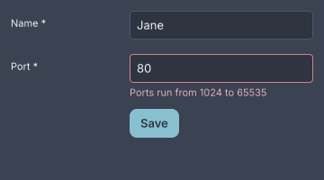
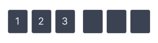

# Fields and forms

<p class="gb-lede">A field owns its caret and tells the model, and a form is found by its fields.</p>

By the end of this chapter you can put a text field on screen, bind it, filter
what it accepts, wrap it in a labelled `field` with a validator, submit a
`form` from a button, and take a date, a time, a colour or a one-time code.

<div class="gb-shot"><p>A <code>form.horizontal</code> with one invalid <code>field</code>. The message is in the field's own column, under the control.</p></div>

## How a field talks to the model

A field holds its own text, caret, selection and undo stack. None of those are
things a model can hold, so `bind=` is the initial text and an override, and
`change=` reports each new value. The field ignores the echo of its own
keystroke rather than resetting the caret on every letter
([ADR-0167](../adr/0167-a-field-owns-its-caret-and-the-model-is-told.md)).

An input method composes inline. The composition is drawn underlined at the
caret with its converting clause highlighted, held beside the value rather than
in it, so `change=` fires once for the accepted candidate and not once per
keystroke. A `password` refuses to compose, because a candidate window is a
second, unmasked window showing what is being typed. Committed text still
arrives ([ADR-0292](../adr/0292-a-field-composes-and-a-password-does-not.md)).

Right-to-left editing is not built. A paragraph approximates bidirectional
text rather than refusing it
([ADR-0218](../adr/0218-a-paragraph-approximates-bidi-rather-than-refusing-it.md)).

## `text-input`

A `text-input` is a single line of text in a well.

```kdl
column {
  text-input bind="app.name" change="app.set-name" placeholder="Your name" max-length=40
  text-input bind="app.port" change="app.set-port" filter="digits" max-length=5
  text-input password=#true placeholder="The word that opens the doors"
  text-input value="Copied from the Red Book" read-only=#true
  text-input value="Speak, friend" disabled=#true
}
```

```java
import dev.goldberry.widgets.form.textinput.TextInput;
import dev.goldberry.widgets.form.textinput.TextFilter;

new Column(
        TextInput.of(Models.observable(app, "app.name"), actions::setName)
            .placeholder("Your name")
            .maxLength(40),
        TextInput.of(Models.observable(app, "app.port"), actions::setPort)
            .filter(TextFilter.DIGITS)
            .maxLength(5),
        new TextInput().password(true).placeholder("The word that opens the doors"),
        new TextInput("Copied from the Red Book", null).readOnly(true),
        new TextInput("Speak, friend", null).disabled(true)
);
```

A filter rejects and never corrects: a keystroke or a paste the filter refuses
leaves the field as it was. A paste past `max-length` is clipped, not refused.
A read-only field has a caret and a selection and takes no edit. A disabled one
is out of the Tab order.

Suggestions under a field are `TextInput.suggesting(options)` in Java. The
field reports what was typed through `change`, is rebuilt with a list, and
reports a chosen suggestion through the same `change`. In markup,
`suggestions=` names a bound `List<Option>` the answer lands in
([ADR-0367](../adr/0367-a-document-places-a-list-it-cannot-describe.md)).

### Attributes

| Attribute | Type | Default | What it does |
|---|---|---|---|
| `value` | string | `""` | the written text |
| `bind` | path | none | the text to follow; the initial value and an override |
| `change` | action name | none | told the whole value after every edit |
| `placeholder` | string | `""` | shown while empty, in `--gb-text-placeholder` |
| `max-length` | integer | unlimited | characters; `0` or less means no limit |
| `password` | boolean | `#false` | masks the text, refuses copy and cut, composes nothing |
| `read-only` | boolean | `#false` | a caret and a selection, no edits |
| `filter` | `none`, `digits`, `integer`, `alnum` | `none` | what the field accepts; an unknown name is logged and the field accepts anything |
| `suggestions` | path | none | a bound `List<Option>` shown under the field |
| `disabled` | boolean | `#false` | out of the Tab order |
| `class`, `id`, `tooltip`, `context-menu`, `name` | | | as on every widget |

`alphanumeric` is accepted as a spelling of `alnum`.

### Styling

- CSS type `text-input`.
- Parts: `text-value`, which takes the class `placeholder` while empty; `text-caret`; `text-selection`; `text-composition`, the rule under an open composition.
- Pseudo-classes: `:hover`, `:focus-visible`, `:disabled`. Inside a `field`, `field:invalid text-input` draws the danger border.

Height 32, padding 8, radius 4, in `body`. The fill is `--gb-surface-sunken`,
an alpha, so a field is one step below the page, a panel or a card alike
([ADR-0168](../adr/0168-a-field-is-a-well-and-a-drag-is-a-selection.md)). The
caret and the selection are one line tall, and the caret is
`--gb-caret-width` wide
([ADR-0253](../adr/0253-a-caret-is-as-wide-as-the-theme-says.md)).
`text-align` places the value in the field and the caret with it
([ADR-0324](../adr/0324-a-field-draws-the-text-its-stylesheet-resolved.md)).

### Keyboard

One key map serves `text-input`, `text-area` and the canvas `Editor`
([ADR-0376](../adr/0376-one-key-map-three-editors.md)).

| Key | Does |
|---|---|
| `Left`, `Right` | move the caret |
| `Ctrl+Left`, `Ctrl+Right` | move by word; in a `password`, to the start or the end |
| `Home`, `End` | the start and the end of the line |
| `Shift` with any of these | extends the selection |
| `Ctrl+A` | selects all |
| `Backspace`, `Delete` | delete one character; with `Ctrl`, a word |
| `Ctrl+Z`, `Ctrl+Shift+Z`, `Ctrl+Y` | undo and redo; a typing run is one step |
| `Ctrl+X`, `Ctrl+C`, `Ctrl+V` | cut, copy and paste; a `password` refuses the first two |
| `Tab` | moves focus; the field does not consume it |

The accelerators are on the platform's modifier, so they are `Cmd` on macOS
and `Ctrl` elsewhere. Word movement stays on `Ctrl` everywhere.

A click places the caret and a drag is a selection. Where the platform has a
primary selection, a finished selection is published and a middle click pastes
it at the pointer ([ADR-0504](../adr/0504-a-selection-is-published-where-the-platform-has-a-primary-selection.md)).

### Read more

- [ADR-0167: a field owns its caret and the model is told](../adr/0167-a-field-owns-its-caret-and-the-model-is-told.md)
- [ADR-0168: a field is a well and a drag is a selection](../adr/0168-a-field-is-a-well-and-a-drag-is-a-selection.md)
- [ADR-0292: a field composes and a password does not](../adr/0292-a-field-composes-and-a-password-does-not.md)
- [ADR-0376: one key map, three editors](../adr/0376-one-key-map-three-editors.md)
- [ADR-0412: a field shows its beginning](../adr/0412-a-field-shows-its-beginning.md)
- [ADR-0504: a selection is published where the platform has a primary selection](../adr/0504-a-selection-is-published-where-the-platform-has-a-primary-selection.md)

## `text-area`

A `text-area` is `text-input` with a second dimension: soft wrap, a height that
grows between two row counts, and a scrollbar past the second.

```kdl
column {
  text-area bind="app.bio" change="app.set-bio" rows=3 max-rows=6 placeholder="A few lines"
  text-area class="mono" gutter=#true rows=8 max-rows=8 bind="app.notes" change="app.set-notes"
  text-area fill=#true bind="doc.source" change="doc.set-source"
}
```

```java
import dev.goldberry.widgets.form.textarea.TextArea;

new Column(
        TextArea.of(Models.observable(app, "app.bio"), actions::setBio)
            .rows(3, 6)
            .placeholder("A few lines"),
        TextArea.of(Models.observable(app, "app.notes"), actions::setNotes)
            .rows(8, 8)
            .gutter(true)
            .styled("mono"),
        TextArea.of(Models.observable(doc, "doc.source"), actions::setSource)
            .fill(true)
            .onEdit(actions::remember)
            .edit(pending)
);
```

**`gutter=#true`** numbers the lines you typed, at the positions the wrap put
them. A paragraph that soft-wraps into three lines takes one number and three
lines' height, which is why a column of numbers built beside the control does
not work ([ADR-0331](../adr/0331-a-gutter-numbers-hard-lines-at-soft-positions.md)).

**`fill=#true`** makes it an editor rather than a field: it takes the height
its container gives it and scrolls inside that.

**`onEdit` and `edit`** are Java only and are the seam a shortcut needs.
`change=` says what the text is now and nothing about where. `onEdit` is told
a `TextEdit` of text, anchor and caret after every change, caret moves
included, and `edit(TextEdit)` offers an edit the application computed, caret
and all ([ADR-0332](../adr/0332-an-editor-is-handed-the-caret.md)). A
`TextEdit` is not a value a document can write.

### Attributes

| Attribute | Type | Default | What it does |
|---|---|---|---|
| `value` | string | `""` | the written text |
| `bind` | path | none | the text to follow |
| `change` | action name | none | told the whole value after every edit |
| `placeholder` | string | `""` | shown while empty |
| `rows` | integer | `3` | the height to start at, in lines; at least 1 |
| `max-rows` | integer | `10`, or `rows` if larger | the height to grow to before scrolling |
| `max-length` | integer | unlimited | characters |
| `fill` | boolean | `#false` | take the container's height and scroll inside it |
| `gutter` | boolean | `#false` | number the hard lines down the left edge |
| `read-only` | boolean | `#false` | a caret and a selection, no edits |
| `disabled` | boolean | `#false` | out of the Tab order |
| `class`, `id`, `tooltip`, `context-menu`, `name` | | | as on every widget |

### Styling

- CSS type `text-area`.
- Parts: `text-input`'s four, one highlight and one composition rule per visual line, and `text-area-gutter`, the strip of numbers.
- Pseudo-classes: `:hover`, `:focus-visible`, `:disabled`.

Minimum height 64, padding 8, radius 4. The gutter's ink is
`--gb-gutter-color` and its room is `--gb-gutter-gap`, and the column is
measured in whatever font the node resolved, which is why the showcase gives a
gutter `class="mono"`. Past `max-rows` it draws `scroll`'s overlay bar over its
own offset ([ADR-0362](../adr/0362-a-text-area-draws-scrolls-bar.md)).

The height is the widget's and not the stylesheet's, because it is a function
of how many lines the text wrapped into.

### Keyboard

`text-input`'s map, and:

| Key | Does |
|---|---|
| `Enter` | breaks a line |
| `Up`, `Down` | move a line, keeping the column |
| `Home`, `End` | the start and the end of the visual line |
| `Ctrl+Home`, `Ctrl+End` | the start and the end of the text |
| wheel | three lines of this control's own text per notch |

### Read more

- [ADR-0171: a column is an x, and a width arrives late](../adr/0171-a-column-is-an-x-and-a-width-arrives-late.md)
- [ADR-0331: a gutter numbers hard lines at soft positions](../adr/0331-a-gutter-numbers-hard-lines-at-soft-positions.md)
- [ADR-0332: an editor is handed the caret](../adr/0332-an-editor-is-handed-the-caret.md)
- [ADR-0362: a text-area draws scroll's bar](../adr/0362-a-text-area-draws-scrolls-bar.md)
- [ADR-0388: a note is shaped a line at a time](../adr/0388-a-note-is-shaped-a-line-at-a-time.md)

## `field`

A `field` is a label, a control, and a message slot under it, with a validator
over the control's value.

```kdl
form class="horizontal" {
  field label="Name" required=#true {
    text-input bind="signup.name" change="signup.set-name" placeholder="Meriadoc Brandybuck"
  }
  field label="Port" required=#true validator="signup.port-rule" {
    text-input bind="signup.port" change="signup.set-port" filter="digits" max-length=5
  }
  field class="actions" {
    button class="primary" press="signup.submit" "Enlist"
  }
}
```

```java
import dev.goldberry.widgets.form.field.Field;
import dev.goldberry.widgets.form.form.Form;
import dev.goldberry.widgets.form.Validator;

new Form(
        new Field("Name",
                TextInput.of(Models.observable(signup, "signup.name"), actions::setName))
            .required(true),
        new Field("Port",
                TextInput.of(Models.observable(signup, "signup.port"), actions::setPort)
                    .filter(TextFilter.DIGITS))
            .required(true)
            .validate(Validator.parsing(Integer::parseInt, "A port is a number")),
        new Field("", new Button("Enlist", actions::submit).styled("primary"))
            .styled("actions")
).styled("horizontal");
```

### The validation model

A field is silent until you leave it once, and live from then on. It says
nothing while the user is still in it, however wrong the value is. Once it has
complained, it re-checks on every change so the message goes the instant the
value is fixed. Submitting is the third moment, and the only one that makes an
unvisited field speak
([ADR-0169](../adr/0169-a-field-is-silent-until-you-leave-it.md)).

A validator returns a message, not a boolean, because a field that goes red
without saying why is one somebody has to guess at. `required=#true` is
`Validator.required("This field is required")` in front of whatever
`validator=` names, and `and` reports the first failure because the message
slot is one line. `Validator.of(predicate, message)`, `minLength`, `matching`
and `parsing` are the built-in rules.

The field reads its value from the control's own `bind=`. It walks its
children one level, so a hint under the control is not what gets validated.

A click on the label focuses the control
([ADR-0170](../adr/0170-a-document-names-an-object-and-a-label-hands-focus-down.md)).

### Attributes

| Attribute | Type | Default | What it does |
|---|---|---|---|
| `label` | string | `""` | the label beside or above the control |
| `required` | boolean | `#false` | an asterisk on the label and a rule that refuses blank |
| `validator` | object name | none | a `Validator<String>` the application registered under this name |
| `class`, `id`, `tooltip`, `context-menu`, `name` | | | as on every widget |

The children are the controls. A `validator=` name resolves in the `Named`
registry, the fourth registry beside actions, icons and bindings. An
application builds one with `Named.strict().bind("signup.port-rule", rule)`
and hands it to `Widgets.inflater(named, icons, models…)`.

### Styling

- CSS type `field`.
- Parts: `field-label`, which takes the class `required`; `field-body`, the column holding the control and the message; `field-message`, in `--gb-danger-text`.
- Pseudo-classes: `:invalid`, which `field:invalid text-input` and `field:invalid select` use for the danger border.
- Classes: `horizontal` puts the label in a column beside the body; `vertical` takes it back inside a `form.horizontal`; `actions` is a field with no label whose body lines up with the controls.

Stacked is the default. The label column's width is `--gb-field-label-width`,
one token, so an application moves every form at once. A field is two boxes
because the subset has no grid: a label beside a body is a row, and a message
under a control is a column
([ADR-0169](../adr/0169-a-field-is-silent-until-you-leave-it.md)).

### Keyboard

None of its own. The controls inside it have theirs.

### Read more

- [ADR-0169: a field is silent until you leave it](../adr/0169-a-field-is-silent-until-you-leave-it.md)
- [ADR-0170: a document names an object, and a label hands focus down](../adr/0170-a-document-names-an-object-and-a-label-hands-focus-down.md)
- [ADR-0229: a hue has a rank for words as well as for lines](../adr/0229-a-hue-has-a-rank-for-words-as-well-as-for-lines.md)

## `form`

A `form` finds the fields in its subtree and gates a submission on their
validity.

```kdl
form controller="signup.form" submit="signup.enlist" {
  field label="Name" required=#true { text-input placeholder="Peregrin Took" }
  field label="Port" { text-input placeholder="8080" filter="digits" }
}
```

```java
import dev.goldberry.widgets.form.form.FormController;

var controller = new FormController();

new Form(
        new Field("Name", new TextInput().placeholder("Peregrin Took")).required(true),
        new Field("Port", new TextInput().placeholder("8080").filter(TextFilter.DIGITS))
).controller(controller)
    .onSubmit(actions::enlist);

controller.submit();      // validates every field, runs onSubmit when all pass
controller.isValid();
controller.errors();      // every field's message, in order
controller.reset();       // clears every message
```

A `FormController` is what submits, because a Save button is usually outside
the form. `submit()` makes every field check, returns whether all passed, and
runs `submit=` when they did. `submit` carries nothing: `bind=` reads from the
application's model, so an event carrying the bound values would hand an
application its own data back
([ADR-0169](../adr/0169-a-field-is-silent-until-you-leave-it.md)).

The fields are anywhere in the subtree: inside rows, inside cards, inside a
`collapse`.

### Attributes

| Attribute | Type | Default | What it does |
|---|---|---|---|
| `controller` | object name | none | a `FormController` the application registered under this name |
| `submit` | action name | none | run when a submission passes |
| `class`, `id`, `tooltip`, `context-menu`, `name` | | | as on every widget |

### Styling

- CSS type `form`.
- No parts.
- No pseudo-classes.
- Classes: `horizontal` gives every field in it a label column; `form.horizontal field.vertical` takes one field back.

### Keyboard

None. `Enter` in a field does not submit. A button's action calls
`FormController.submit()`.

### Read more

- [ADR-0169: a field is silent until you leave it](../adr/0169-a-field-is-silent-until-you-leave-it.md)
- [ADR-0170: a document names an object, and a label hands focus down](../adr/0170-a-document-names-an-object-and-a-label-hands-focus-down.md)

## `code-input`

A `code-input` is the one-time-code field: a row of single-character boxes
over one string.

<div class="gb-shot"><p>A <code>code-input</code> of six. The wider gap at the midpoint exists only when the length is even.</p></div>

```kdl
column {
  code-input length=6 type="digits" bind="app.code" change="app.set-code" complete="app.code-complete"
  code-input length=6 mask=#true
  code-input length=5 type="alnum"
}
```

```java
import dev.goldberry.widgets.form.codeinput.CodeInput;
import dev.goldberry.widgets.form.codeinput.CodeType;

new Column(
        CodeInput.of(Models.observable(app, "app.code"), actions::setCode)
            .length(6)
            .onComplete(actions::codeComplete),
        new CodeInput(6, null).mask(true),
        new CodeInput(5, null).type(CodeType.ALNUM)
);
```

The value is a string and the boxes are a drawing. There is no caret and no
per-box array: the active box is the first empty one, derived on every frame.
Typing appends, a paste of `123 456` drops the spaces and fills every box at
once, and `complete` fires on the edit that filled the last box
([ADR-0273](../adr/0273-a-code-is-a-string-and-the-boxes-are-a-drawing.md)).
A character the type refuses is dropped rather than rejecting the whole paste.

### Attributes

| Attribute | Type | Default | What it does |
|---|---|---|---|
| `value` | string | `""` | the written code |
| `bind` | path | none | the code to follow |
| `change` | action name | none | told the whole code after every edit |
| `complete` | action name | none | told the code when the last box fills |
| `length` | integer | `6` | the number of boxes; less than 1 falls back to 6 |
| `type` | `digits`, `alnum` | `digits` | what a box accepts; an unknown name is logged and digits are taken |
| `mask` | boolean | `#false` | draws a dot in a filled box |
| `disabled` | boolean | `#false` | out of the Tab order |
| `class`, `id`, `tooltip`, `context-menu`, `name` | | | as on every widget |

### Styling

- CSS type `code-input`.
- Parts: `code-group`, one per half when the length is even; `code-box`, which takes the classes `filled` and `active`.
- Pseudo-classes: `:focus-visible`, `:hover`, `:disabled`. `code-input:focus-visible code-box.active` is the ring.

Box 40 by 48, gap 8, radius 4, in `title` and centred. The group gap is 16 at
the midpoint of an even length. The ring moves between boxes instantly and
nothing travels.

### Keyboard

| Key | Does |
|---|---|
| typing | fills the active box and moves on |
| `Backspace`, `Delete` | clear the box before the ring |
| `Esc` | clears the code |
| `Ctrl+V` | pastes, dropping what the type refuses |

Arrow keys do nothing, because there is one insertion point. Copy and cut are
not built, because a masked code must not have a way out.

### Read more

- [ADR-0273: a code is a string and the boxes are a drawing](../adr/0273-a-code-is-a-string-and-the-boxes-are-a-drawing.md)

## `date-picker`

A `date-picker` is a `text-input` that parses, with a calendar in a popover.
The typed field is the source of truth.

```kdl
date-picker bind="trip.date" change="trip.set-date" month="2026-09" \
            min="2026-09-01" max="2026-12-31" today="2026-09-18" \
            placeholder="When are you leaving?"
```

```java
import java.time.LocalDate;
import java.time.YearMonth;
import dev.goldberry.widgets.form.datepicker.DatePicker;

DatePicker.of(Models.observable(trip, "trip.date"), actions::setDate, YearMonth.of(2026, 9))
    .between(LocalDate.of(2026, 9, 1), LocalDate.of(2026, 12, 31))
    .today(LocalDate.of(2026, 9, 18))
    .placeholder("When are you leaving?");
```

The grid writes text into the field exactly as a user would, so a value takes
one path and is parsed in one place. A date outside `min` and `max`, or one the
`disabledDates` predicate refuses, cannot be pressed in the grid and is left in
the field unparsed rather than deleted. Parsing and formatting use the
locale's short form, `DateFormat.of(locale)`, and the toolkit invents no date
syntax of its own
([ADR-0274](../adr/0274-a-calendar-is-told-what-day-it-is.md)).

The month is an argument and `today` may be null. Nothing in the catalogue
reads the machine's clock, so a picker that opened on "this month" would be
deciding what month it is. In Java, `onChange` receives a `DateSelection`,
`range(true)` selects a pair, and the bound value may be a `LocalDate`, a
`DateSelection` or text. From markup, `change` carries the formatted text.

### Attributes

| Attribute | Type | Default | What it does |
|---|---|---|---|
| `value` | string | `""` | the written text |
| `bind` | path | none | the value to follow |
| `change` | action name | none | told the formatted date |
| `placeholder` | string | `""` | shown while empty |
| `range` | boolean | `#false` | select a pair and report it as one value |
| `month` | ISO year-month | `min`'s month, else 1970-01 | the month the grid opens on; a malformed one is logged and ignored |
| `today` | ISO date | none | the day marked as today |
| `min`, `max` | ISO date | none | the reachable range, in the field and in the grid |
| `disabled` | boolean | `#false` | out of the Tab order |
| `class`, `id`, `tooltip`, `context-menu`, `name` | | | as on every widget |

`disabledDates`, `format` and `locale` are Java only.

### Styling

- CSS type `date-picker`.
- Parts: `date-picker text-input`, the field; `picker-toggle`, the chevron; `picker-panel`, the popover, holding a `calendar`.
- Pseudo-classes: `:checked` while the panel is open, so `date-picker:checked picker-toggle` turns the chevron; `:disabled`.

Popup radius 12, padding 8, day cell 32 square with a full radius on the
selected day.

### Keyboard

| Key | Does |
|---|---|
| typing | edits the field, which is the value |
| `Alt+Down` | opens the grid |
| `Esc` | closes the grid and reverts |
| `Left`, `Right` | a day |
| `Up`, `Down` | a week |
| `PgUp`, `PgDn` | a month; with `Shift`, a year |
| `Home`, `End` | the start and the end of the week |
| `Enter`, `Space` | choose the day |

### Read more

- [ADR-0274: a calendar is told what day it is](../adr/0274-a-calendar-is-told-what-day-it-is.md)
- [ADR-0170: a document names an object, and a label hands focus down](../adr/0170-a-document-names-an-object-and-a-label-hands-focus-down.md)
- [ADR-0203: a time axis is time, not a relabelled index](../adr/0203-a-time-axis-is-time-not-a-relabelled-index.md)

## `time-picker`

A `time-picker` is the same control as the date picker with wheels in the
popover instead of a grid.

```kdl
time-picker bind="trip.time" change="trip.set-time" min="06:00" max="22:00" \
            precision="minutes" placeholder="Boarding time"
```

```java
import java.time.LocalTime;
import dev.goldberry.widgets.form.timepicker.TimePicker;
import dev.goldberry.widgets.form.timepicker.TimePrecision;

TimePicker.of(Models.observable(trip, "trip.time"), actions::setTime)
    .between(LocalTime.of(6, 0), LocalTime.of(22, 0))
    .precision(TimePrecision.MINUTES)
    .placeholder("Boarding time");
```

Each column is a wheel: five rows centred on the value, wrapping at both ends,
so `58 59 00 01 02` says what comes next. The wheels report on every turn,
because there is no unchosen state for an hour
([ADR-0275](../adr/0275-a-wheel-is-a-column-that-wraps.md)). `precision=` is
which columns the picker has, and the default format follows it. In Java,
`onChange` receives a `LocalTime`, or null when the field is cleared. From
markup, `change` carries the formatted text.

A range that wraps past midnight is refused. It is two ranges, and the
`disabledTimes` predicate is how to say so.

### Attributes

| Attribute | Type | Default | What it does |
|---|---|---|---|
| `value` | string | `""` | the written text |
| `bind` | path | none | the value to follow |
| `change` | action name | none | told the formatted time |
| `placeholder` | string | `""` | shown while empty |
| `precision` | `hours`, `minutes`, `seconds` | `minutes` | which wheels the picker has; an unknown name is logged and minutes are taken |
| `fallback` | ISO time | `00:00` | where the wheels open when the field is empty |
| `min`, `max` | ISO time | none | the reachable range |
| `disabled` | boolean | `#false` | out of the Tab order |
| `class`, `id`, `tooltip`, `context-menu`, `name` | | | as on every widget |

`disabledTimes` and `format` are Java only.

### Styling

- CSS type `time-picker`.
- Parts: `time-picker text-input`; `picker-toggle`; `picker-panel`; `time-columns`; `time-column`; `time-cell`, which takes the classes `selected` and `roving`.
- Pseudo-classes: `:checked` while the panel is open; `:disabled`.

Column width 48, cell height 32 with radius 4, five rows a column with the
middle one filled with `--gb-accent`, gap 4 between columns.

### Keyboard

| Key | Does |
|---|---|
| typing | edits the field, which is the value |
| `Alt+Down` | opens the wheels |
| `Esc` | closes them and reverts |
| `Up`, `Down` | turn the wheel the focus is on |
| `Left`, `Right` | choose which wheel |
| `Home`, `End` | the first and the last wheel |
| `Enter`, `Space` | commit |

The arrows split by axis where a calendar's do not.

### Read more

- [ADR-0275: a wheel is a column that wraps](../adr/0275-a-wheel-is-a-column-that-wraps.md)
- [ADR-0274: a calendar is told what day it is](../adr/0274-a-calendar-is-told-what-day-it-is.md)

## `color-picker`

A `color-picker` is a swatch that opens a board: a saturation and value plane,
a hue ramp, an optional alpha ramp, a hex field and preset swatches. The hex
field is the source of truth.

```kdl
row {
  color-picker bind="paint.colour" change="paint.set-colour"
  color-picker alpha=#true value="#bf616a80"
}
```

```java
import dev.goldberry.widgets.form.colorpicker.ColorPicker;

new Row(
        ColorPicker.of(Models.observable(paint, "paint.colour"), actions::setColour)
            .presets(List.of(0xFFBF616A, 0xFFA3BE8C, 0xFF81A1C1)),
        new ColorPicker("#bf616a80", null).alpha(true)
);
```

The plane, the ramps and the presets all write hex into the field, so a value
takes one path and is parsed in one place. The plane is HSV, because a
saturation and value plane is HSV, and a colour with no saturation keeps its
hue beside the hex so the hue ramp does not swing to red at the left edge
([ADR-0276](../adr/0276-a-plane-is-hsv-and-the-hex-is-the-value.md)).

`alpha` is off by default and refuses in both directions: a picker with no
way to change alpha must not report one, so a translucent value is gated to
opaque. In Java, `onChange` receives the colour as `0xAARRGGBB` and the bound
value may be an `Integer` or hex text. From markup, `change` carries the hex.

### Attributes

| Attribute | Type | Default | What it does |
|---|---|---|---|
| `value` | hex string | `""` | the written colour |
| `bind` | path | none | the value to follow |
| `change` | action name | none | told the hex |
| `alpha` | boolean | `#false` | shows the alpha ramp and allows translucent values |
| `disabled` | boolean | `#false` | out of the Tab order |
| `class`, `id`, `tooltip`, `context-menu`, `name` | | | as on every widget |

`presets` is Java only: a `List<Integer>` of `0xAARRGGBB`.

### Styling

- CSS type `color-picker`.
- Parts: `color-swatch`, the closed control, and `color-swatch.preset` in the board; `color-board`; `color-plane`; `color-ramp`; `color-presets`.
- Pseudo-classes: `:focus-visible` on `color-swatch` and `color-plane`; `:disabled`.

Swatch 24 with radius 4, plane 200 by 160, ramps 12 tall, preset swatch 20
with gap 4. Everything in the board is painted rather than styled, because the
subset has no gradient.

### Keyboard

| Key | Does |
|---|---|
| `Space`, `Enter` on the swatch | opens the board |
| arrows on the plane | move the cursor one step |
| `Shift` and arrows | ten steps |
| `Space`, `Enter` on a preset | picks it |

### Read more

- [ADR-0276: a plane is HSV and the hex is the value](../adr/0276-a-plane-is-hsv-and-the-hex-is-the-value.md)
