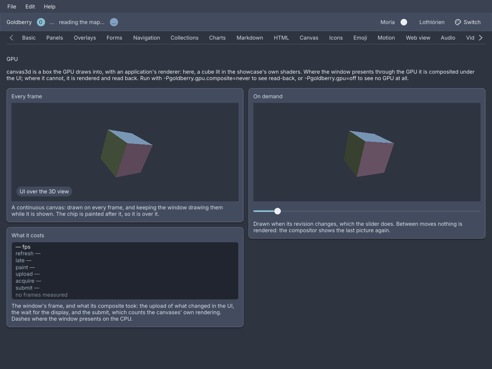

# The GPU canvas

<p class="gb-lede">A <code>canvas3d</code> is a box the GPU draws into with an application's own renderer, and <code>goldberry-gpu</code> on the module path is what makes a window present through the GPU at all.</p>

By the end of this chapter you can put a 3D view in a window, write the renderer
it draws with, decide whether it is drawn every frame or on demand, and read
from the log and from `Window.presentation()` whether a window went through the
GPU.

<div class="gb-shot">

<p>The showcase's GPU screen. The left cube spins on every frame, the right one turns when the slider moves.</p>
</div>

## What the module does to a window

The UI is painted by Blend2D on the CPU whatever the window presents through.
`goldberry-gpu` changes the last step. Put it on the module path and every
window presents its frame through SDL_GPU: the frame's damage is uploaded to a
texture and drawn onto the window's swapchain, on Metal, Vulkan or Direct3D 12.
Where that cannot be done, with no device, a refused claim or a popup, the
window presents on the CPU exactly as it did before
([ADR-0480](../adr/0480-windows-present-through-the-gpu-by-default-and-on-the-cpu-where-it-cannot.md)).
The window says which, once per change:

```text
[GPU] "Goldberry — showcase on Linux / amd64" presents through the GPU (vulkan)
```

`Window.presentation()` answers the same thing in code, as a `Presentation.Gpu`
with the driver's name or a `Presentation.Cpu` with the reason, and
`Window.onPresentationChange(handler)` hears each change
([ADR-0492](../adr/0492-a-window-says-whether-it-presents-through-the-gpu.md)).

Two system properties set the policy:

| Property | Values | What it does |
|---|---|---|
| `goldberry.gpu` | `auto`, `off` | `off` never touches the GPU. Every window stays on the CPU and a `canvas3d` shows a notice instead of a picture |
| `goldberry.gpu.composite` | `always`, `auto`, `never` | `always` composites every window from its first frame. `auto` composites a window only while it shows GPU layers. `never` composites none and reads every layer back |

What the GPU path adds is **GPU layers**: opaque rectangles in the frame's paint
order that the GPU fills and the UI is composited over. A window that cannot
composite reads a layer back into its frame instead, so the same tree draws
the same picture both ways
([ADR-0481](../adr/0481-gpu-layers-are-placed-in-paint-order-and-shown-through-a-hole-or-read-back.md)).
`canvas3d` is one layer. A `video-view` is the other, when `goldberry-media` and
`goldberry-gpu` are both present
([ADR-0484](../adr/0484-video-view-shows-its-pictures-through-a-gpu-layer-when-gpu-is-present.md)).

## `canvas3d`

A 3D view: a leaf sized by its stylesheet, whose picture an application's
`Canvas3dRenderer` draws on the window's device.

```kdl,ignore
canvas3d renderer="cube" continuous=#true depth="d16"
```

```java
import dev.goldberry.gpu.view.Canvas3d;

new Canvas3d(Cube.spinning()).continuous(true).depth(Canvas3d.Depth.D16);
new Canvas3d(viewer).revision(revision).withAttributes(Attributes.NONE.id("model"));
```

In markup the renderer is a named object the application registered, resolved
by `renderer=`. A node with no renderer to resolve against does not inflate, so
the sample above is a fragment.

**When it is drawn.** A `continuous` canvas is drawn on every frame and keeps the
window drawing frames while it is shown: a spinning model, a game. Otherwise it
is drawn once, then again when its size changes and when its `revision` does. A
model viewer that redraws when its camera moves rebuilds the widget with the
next revision, and between those the last picture is shown again and nothing is
rendered.

**Where there is no GPU.** With `goldberry.gpu=off`, with no device, or inside
an `opacity` group, the box is filled with `--gb-canvas3d-unavailable` and a
notice says why
([ADR-0482](../adr/0482-canvas3d-is-a-gpu-layer-an-application-renders-into.md)).

### The renderer

```java
public interface Canvas3dRenderer {
    void init(GpuDevice device);
    default void resize(PhysicalSize size) {}
    void render(GpuFrame frame, Canvas3dTarget target);
    void dispose();
}
```

`init` is called once, before the first render, with the window's device.
`resize` follows it and runs again whenever the canvas's size in physical pixels
changes. `render` runs for each frame the canvas is drawn. `dispose` runs when
the canvas leaves the tree, or before `init` on a new device. Every call is on
the UI thread, which is the device's. The canvas keeps the renderer while it is
mounted and makes a new layer when the widget is rebuilt with another renderer
or depth.

The showcase's cube is a renderer written as an application writes one:

```java
public final class Cube implements Canvas3dRenderer {

    @Override
    public void init(GpuDevice device) {
        vertex = device.createShader(ShaderCode.load(ShaderStage.VERTEX, "cube.vert", 0, 1, Cube::resource));
        fragment = device.createShader(ShaderCode.load(ShaderStage.FRAGMENT, "cube.frag", 0, 0, Cube::resource));
        pipeline = device.createPipeline(PipelineSpec.builder(vertex, fragment, TextureFormat.B8G8R8A8_UNORM)
                .vertexBuffer(...)
                .build());
        mesh = device.createBuffer(BufferUsage.VERTEX, STRIDE * VERTICES);
    }

    @Override
    public void render(GpuFrame frame, Canvas3dTarget target) {
        frame.renderPass(target.colour(), Load.clear(0, 0, 0, 1), target.clearDepth(), pass -> {
            pass.bindPipeline(pipeline);
            pass.bindVertexBuffer(0, mesh);
            pass.pushVertexUniforms(0, transform(target.aspect(), target.seconds()));
            pass.draw(VERTICES);
        });
    }

    @Override
    public void dispose() {
        pipeline.close();
        mesh.close();
    }
}
```

`GpuDevice` makes textures, buffers, samplers, shaders and pipelines from
records, and `beginFrame()` starts a `GpuFrame`. A frame is a command buffer
recorded pass by pass: `copyPass` uploads into buffers and textures, and
`renderPass` draws into a target, with a `Load` for what happens first and an
optional `DepthTarget`. A pass is open only while its body runs. The toolkit
submits the canvas's frame, and a frame closed without `submit` is discarded.
A `RenderPass` binds a pipeline, vertex and index buffers and fragment samplers,
pushes uniforms, and calls `draw` or `drawIndexed`. Misuse the API can see, a
closed resource or a draw with nothing bound, throws in Java before the driver
is reached. Everything is confined to the device's thread
([ADR-0478](../adr/0478-the-gpu-api-is-confined-scoped-and-checked-in-java.md)).

The `Canvas3dTarget` is a colour texture at the canvas's size in physical
pixels, a depth texture beside it when the canvas asked for one, and `nanos`,
the frame's time since the canvas was first drawn. `target.aspect()` is what a
projection is made with, `target.seconds()` is what an animation is a function
of, and `target.clearDepth()` is the depth target cleared to the far plane. The
renderer covers every pixel of the colour texture, and its picture is opaque,
as every GPU layer is.

### Shaders

Shaders are written in HLSL and compiled offline. The sources live in
`src/main/shaders/*.hlsl`, and `./gradlew :gpu:compileShaders` runs DXC for
SPIR-V and DXIL and SPIRV-Cross for MSL, then commits the bytecode as resources
beside the code that loads them
([ADR-0476](../adr/0476-shaders-are-hlsl-compiled-by-dxc-and-spirv-cross-and-committed.md)).
It is a task run on purpose, not part of `build`, because DXC and SPIRV-Cross
come with the Vulkan SDK and are too much to ask of every build. The task also
compiles the showcase's own `cube.vert.hlsl` and `cube.frag.hlsl`.
`ShaderCode.load(stage, name, samplers, uniformBuffers, lookup)` reads
`name.spv`, `name.dxil` and `name.msl` through the caller's own resource lookup,
and `device.createShader(code)` picks the format the device takes.

### Attributes

| Attribute | Type | Default | What it does |
|---|---|---|---|
| `renderer` | named `Canvas3dRenderer` | required | What draws the picture |
| `continuous` | boolean | `#false` | Drawn on every frame, and keeps the window drawing them |
| `depth` | `none`, `d16`, `d32` | `none` | The depth target the renderer draws with. Anything else is refused |
| `revision` | number | `0` | A value other than the last one drawn has an on-demand canvas drawn again |
| `id` | string | none | The canvas's id |
| `class` | string | none | Classes on its box |

Children are refused.

### Styling

The CSS type is `canvas3d`, sized like an `image` or a `canvas` by `width` and
`height`. It is a GPU layer, so it is opaque, what is painted after it is over
it, and a clip cuts it to a rectangle. Without a GPU the box is filled with
`--gb-canvas3d-unavailable`, and the notice is a `message` with the class
`canvas3d-notice` inside a `stack` with the class `canvas3d-stage`.

### Keyboard

None. A `canvas3d` is not focusable.

### Read more

- [ADR-0475: SDL_GPU is bound for core and gpu and tested on the first thread](../adr/0475-sdl-gpu-is-bound-for-core-and-gpu-and-tested-on-the-first-thread.md)
- [ADR-0477: The GPU composites with SDL_GPU directly](../adr/0477-the-gpu-composites-with-sdl-gpu-directly.md)
- [ADR-0478: The GPU API is confined, scoped and checked in Java](../adr/0478-the-gpu-api-is-confined-scoped-and-checked-in-java.md)
- [ADR-0479: A window is composited through a seam core declares and gpu provides](../adr/0479-a-window-is-composited-through-a-seam-core-declares-and-gpu-provides.md)
- [ADR-0481: GPU layers are placed in paint order and shown through a hole or read back](../adr/0481-gpu-layers-are-placed-in-paint-order-and-shown-through-a-hole-or-read-back.md)
- [ADR-0482: canvas3d is a GPU layer an application renders into](../adr/0482-canvas3d-is-a-gpu-layer-an-application-renders-into.md)

## What is measured, and what is not yet

Everything above was built and measured on Metal, on one M1 Pro. Creating the
device costs about 20 ms at the first frame there, and 190 to 320 ms on NVIDIA's
Vulkan driver on Linux
([ADR-0480](../adr/0480-windows-present-through-the-gpu-by-default-and-on-the-cpu-where-it-cannot.md)).
A whole 2560 by 1600 frame costs 1.1 ms of CPU to composite against 2.65 ms for
the window-surface present of the same frame, and a minute of 4K60 VP9 through
a GPU layer shows all 3600 pictures where CPU present drops 1581
([ADR-0485](../adr/0485-the-audio-clock-never-jumps-and-4k60-plays-every-picture.md)).

On Linux the composited path has run on this project's machine under X11 and
nowhere else. Windows and Direct3D 12 wait for a host. The lane that would test
it on every push, on lavapipe, has run and not yet reached a test
([ADR-0503](../adr/0503-the-gpu-lane-finds-lavapipe-a-device-goes-before-sdl-and-a-gpu-golden-has-its-own-tolerance.md)).
A device lost mid-render shows black and does not fall back. The
[status page](../status.md#m4--gpu) keeps the current list.
