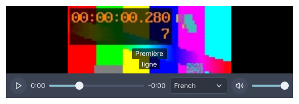

# Audio and video

<p class="gb-lede">Four widgets over one <code>MediaPlayer</code>: the picture, the controls, both together, and a compact player for sound.</p>

By the end of this chapter you can open a file or a URL in a player, show it with
its controls from markup or Java, switch tracks and subtitles, and know which
codecs a build decodes.

<div class="gb-shot">

<p>A <code>media-player</code> with a subtitle track chosen, from the module's golden images.</p>
</div>

## The module

The widgets are in `goldberry-media`. FFmpeg is driven from Java through the
Foreign Function and Memory API, with no libVLC and no JNI. The natives are
published as classifier jars of the same artifact, one per target:
`ffmpeg-linux-x64`, `ffmpeg-linux-aarch64`, `ffmpeg-windows-x64` and
`ffmpeg-macos-aarch64`. An application names the ones it ships, and FFmpeg's
source is published beside them as the `ffmpeg-sources` classifier.

Add the stylesheet beside the controls' own:

```java
var sheets = new ArrayList<>(Controls.stylesheets(theme));
sheets.add(MediaStyles.stylesheet());
```

The published natives decode royalty-free codecs only: VP8, VP9 and AV1 for
video, and Opus, Vorbis, FLAC, MP3 and PCM for audio. `MediaCapabilities.current()`
answers what a build decodes and demuxes, read from the loaded libraries.

### A player

A `MediaPlayer` is the application's. The widgets show and drive it, and never
own it.

```java
import dev.goldberry.media.MediaPlayer;
import dev.goldberry.media.io.Source;

var player = MediaPlayer.builder().build();
player.open(Source.of(Path.of("clip.webm")));
player.play();
```

`open` takes a `Source.of(path)` or a `Source.of(uri)`. Every call returns at
once: the engine runs on its own threads and reports back as a `PlayerStatus`,
one immutable value with the state, the position, the duration, the tracks, the
volume, the rate and the buffered ranges. `player.status()` reads the latest and
`player.onStatus(listener)` hears each change. The transport is `play`, `pause`,
`seek(position)` or `seek(position, SeekMode.KEYFRAME)`, `setVolume`,
`setMuted`, `setRate` from 0.25 to 4 with the pitch following, `step(count)`
for a picture at a time, and `close`. A seek on a source that cannot seek, or
a live one, is dropped and the stream plays on. `PlayerStatus.seekable()` says
which.

`setLooping(true)`, or `MediaPlayer.builder().looping(true)`, plays the source
over and over. The player never reaches `ENDED`, and there is no pause where the
source joins back onto its start. The engine reads the start again before the
end is heard. The sound and the pictures run on in time across the seam, and the
position is the time within the pass that is playing. A pass is as long as its
last picture. The sound is fitted to that length: trimmed where it runs over,
and padded with silence where it falls short. A source with no picture loops at
the end of its sound's last packet, so an Opus track's encoder padding, a few
milliseconds, is heard at the seam. A source that cannot seek, or a live one,
ends anyway.

`MediaProbe.probe(source)` says what a source holds without playing it. A video
track's `TrackParams.Video` has its `frameRate()`, a `FrameRate` such as `60/1`
or `30000/1001`, and the `Track` has its `frameCount()` where the container
records one. MP4 does. Matroska and WebM do not, so for them the count is
`frameRate.framesIn(duration)`.

In markup a player is a named object. The application registers it and a node
names it with `player=`:

```java
var named = Named.strict().bind("video.player", player);
var inflater = Widgets.inflater(named, icons, model);
```

A node with no player to resolve against does not inflate, so the samples below
are fragments and the showcase's `video.kdl` and `audio.kdl` are the complete
documents.

### Tracks, subtitles and the network

A source with two voices or two angles offers a track menu, and
`player.selectTrack(track)` switches over the same frame queue, so the old
picture stays up until the new track's picture covers the position.
Text subtitles are read in Java from a SubRip, WebVTT, ASS or MP4 text track, or
from a SubRip or WebVTT file through `player.loadSubtitles(source)`.
`hideSubtitles()` turns them off and `currentSubtitles()` is what shows at the
clock. The player does not read bitmap subtitles.

A URL is read through a cache and buffered to a high-water mark, which the seek
bar shades, and a live stream's ICY title is the player's `nowPlaying` line.
With no audio device, media plays silently.

### Bringing a codec

H.264, HEVC, AAC, AC-3 and E-AC-3 are not in the published natives. They play
through the operating system's own decoders, which are `DecoderProvider`s
found by `ServiceLoader` and consulted before FFmpeg's:

| Provider | Codecs | System |
|---|---|---|
| `videotoolbox`, `audiotoolbox` | H.264, HEVC; AAC, AC-3, E-AC-3 | macOS |
| `gstreamer-video`, `gstreamer-audio` | The same, with the decoders installed | Linux |
| `mediafoundation-video`, `mediafoundation-audio` | The same | Windows, off unless `-Dgoldberry.media.mediaFoundation=true` |

An application brings its own codec the same way: implement `DecoderProvider`
with `name`, `supports(request)` and `open(request)`, and declare
`provides dev.goldberry.media.codec.DecoderProvider with …` in its module. A
provider for a patented codec holds the licence for it.
`MediaPlayer.builder().decoderProviders(list)` lists providers by hand, and
`PlatformDecoders.providers()` is the system's set.

The probe names such a track's pixel format even so: the published natives
neither decode nor parse H.264 or HEVC, so the name is read from the parameter
sets in the track's `avcC` or `hvcC` record.

Hardware decoding is a rung of the built-in decoder: on by default on macOS and
Windows, switched with `setHardwareDecoding(HardwareDecoding.AUTO)` or `OFF`,
and applied from the next source opened.

## `media-player`

A `video-view` with `media-controls` laid over its foot: the picture, the
transport, the error, the stream's title and the subtitles in one box.

<div class="gb-tabs">

```kdl,ignore
media-player id="video-player" player="video.player" fit="contain"
```

```java
import dev.goldberry.media.view.MediaPlayerView;

new MediaPlayerView(player);
new MediaPlayerView(player, Fit.COVER, Attributes.NONE.id("video-player"));
```

</div>

The controls hide while the player plays and the pointer rests, 2.5 seconds
after it last moved, and come back when it moves. A click on the picture plays
or pauses. A failure is shown over the picture in `.media-error`, and an H.264
file says which codecs it could not play. Subtitles are lines over the foot of
the picture, above the controls while they show and lower while they hide. `F`
asks the window to fill its display, and a copy of the player covers the window
with the class `is-fullscreen`.

### Attributes

| Attribute | Type | Default | What it does |
|---|---|---|---|
| `player` | named `MediaPlayer` | required | The player to show and drive |
| `fit` | `contain`, `cover`, `fill`, `none` | `contain` | How a picture fills a box of another shape, as on `image` |
| `id` | string | none | The player's id |
| `class` | string | none | Classes on its box |

Children are refused.

### Styling

The CSS type is `media-player`, a column with `min-height` and the backdrop
`--gb-media-backdrop`. Inside it are the `video-view`, the `.media-overlay`
column pinned to the bottom, `media-controls` in that, `.media-error`,
`.media-now-playing`, `.media-subtitles` and `.media-subtitle`. The state is on
the root as `.is-idle`, `.is-opening`, `.is-buffering`, `.is-playing`,
`.is-paused`, `.is-ended` or `.is-error`, with `.is-scrubbing` while the seek
bar is held, `.is-pointer-idle` while the controls hide, and `.is-fullscreen` on
the full-window copy. The tokens are `--gb-media-*`, and `media.css` fades the
overlay on `.is-pointer-idle`.

### Keyboard

Once the player has focus: `Space` or `K` plays and pauses, `Left` and `Right`
seek five seconds, `Up` and `Down` change the volume by five percent, `M` mutes,
`L` loops the source and stops looping it, `Home` goes to the start, `,` and `.`
step a picture back and on, `<` and `>` slow down and speed up through 0.25 to
2, and `F` and `Escape` enter and leave fullscreen.

## `video-view`

A player's pictures and nothing else: the surface for an application that draws
its own controls or none.

<div class="gb-tabs">

```kdl,ignore
video-view player="trailer" fit="cover"
```

```java
import dev.goldberry.media.view.VideoView;

new VideoView(player);
new VideoView(player, Fit.COVER);
```

</div>

The view follows the player's status. A picture a paused seek lands on is shown
when it is ready, and while the player plays it draws a new picture every frame.
With `goldberry-gpu` on the module path the pictures go through a GPU layer, and
a shader converts them from their planes with the stream's matrix and range.
Without it, or where the layer cannot be placed, the view draws converted
pictures on the CPU.

### Attributes

| Attribute | Type | Default | What it does |
|---|---|---|---|
| `player` | named `MediaPlayer` | required | The player to show |
| `fit` | `contain`, `cover`, `fill`, `none` | `contain` | How the picture fills the box. The picture is centred |
| `id` | string | none | The view's id |
| `class` | string | none | Classes on its box |

Children are refused.

### Styling

The CSS type is `video-view`. It has no size of its own and grows into what it
is given, with `flex-grow: 1` and `--gb-media-backdrop` where the picture does
not reach.

### Keyboard

None of its own. Put a `media-controls` beside it.

## `audio-player`

Compact controls over a player: play and pause, the times, a seek bar, mute and
volume, with the stream's title above and an error below.

<div class="gb-tabs">

```kdl,ignore
audio-player id="audio-player" player="audio.player"
```

```java
import dev.goldberry.media.view.AudioPlayer;

new AudioPlayer(player);
```

</div>

The seek bar is left out for a source that cannot seek, and a `LIVE` label
stands in its place for a stream. While playing, the widget reads the position
four times a second.

### Attributes

| Attribute | Type | Default | What it does |
|---|---|---|---|
| `player` | named `MediaPlayer` | required | The player to show and drive |
| `id` | string | none | The player's id |
| `class` | string | none | Classes on its box |

Children are refused.

### Styling

The root carries the class `audio-player`, and its pieces `media-play`,
`media-time`, `media-seek`, `media-live`, `media-rate`, `media-mute`,
`media-volume`, `media-now-playing` and `media-error`. The state is on the root
as `is-playing`, `is-paused`, `is-buffering`, `is-ended` or `is-error`.

### Keyboard

As `media-controls`, without the picture keys.

## `media-controls`

The transport bar on its own, for an application that lays it out itself under a
`video-view` or drives a player it shows elsewhere.

<div class="gb-tabs">

```kdl,ignore
column {
    video-view player="trailer"
    media-controls player="trailer"
}
```

```java
import dev.goldberry.media.view.MediaControls;

new Column(List.of(new VideoView(player), new MediaControls(player)), Attributes.NONE);
```

</div>

Play and pause, the elapsed and remaining times, a seek bar that scrubs to
keyframes while dragged and lands exactly on release, mute, volume, the rate
when it is not 1, and the audio, video and subtitle menus where the source has a
choice. All of it is built from the ordinary controls, so it takes the theme and
the focus like any other.

### Attributes

| Attribute | Type | Default | What it does |
|---|---|---|---|
| `player` | named `MediaPlayer` | required | The player to drive |
| `id` | string | none | The bar's id |
| `class` | string | none | Classes on its box |

Children are refused.

### Styling

The CSS type is `media-controls`, a row with `--gb-media-gap`. Its pieces carry
`media-play`, `media-time`, `media-seek`, `media-live`, `media-rate`,
`media-loop`, `media-mute`, `media-volume`, `media-audio-track`,
`media-video-track`, `media-subtitles-menu` and `media-fullscreen`. The
`media-loop` button shows only while the player loops, and pressing it stops
the loop. The state is on the bar as
`is-playing`, `is-paused`, `is-buffering`, `is-ended` or `is-error`, and
`is-scrubbing` while the seek bar is held.

### Keyboard

The bar is a focus stop. `Space` or `K`, `Left` and `Right`, `Up` and `Down`,
`M`, `L`, `Home`, `,` and `.`, and `<` and `>`, as on `media-player`. A key bubbles
to the bar from a control inside it that does not want it.
