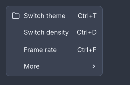

# Menus and the tray

<p class="gb-lede">A menu bar in the window, menus that open as platform windows of their own, context menus named on any widget, and a tray icon the desktop draws from the same menu value.</p>

A menu is a widget: a `menu` holds `item`s and `separator`s, and an `item`
holding `item`s is a submenu. Opening one is not a widget's job. A `menubar`
opens its own headings, and anything else goes through `Menus.open(host, …)`,
because opening needs a `Host` and a widget must not have one
([ADR-0106](../adr/0106-a-menu-is-a-widget-and-opening-one-is-not.md)).

## `menubar`

A horizontal bar of headings, each an `item` whose children are its menu.

```kdl
menubar id="app-menu" {
  item "File" {
    item press="app.new" accelerator="Ctrl+N" "New"
    item press="app.open" accelerator="Ctrl+O" "Open…"
    separator
    item press="app.quit" accelerator="Ctrl+Q" "Quit"
  }
  item "View" {
    item press="app.toggle-hud" accelerator="Ctrl+F" checked=#false "Frame rate"
    item "Theme" {
      item press="app.light" "Light"
      item press="app.dark" "Dark"
    }
  }
  item "Help" {
    item "Nothing here yet" disabled=#true
  }
}
```

```java
new MenuBar(
        new Item("File").submenu(
                new Item("New", actions::create).accelerator("Ctrl+N"),
                new Item("Open…", actions::open).accelerator("Ctrl+O"),
                new Separator(),
                new Item("Quit", window::quit).accelerator("Ctrl+Q")),
        new Item("View").submenu(
                new Item("Frame rate", window::toggleHud).accelerator("Ctrl+F").checked(hudShown),
                new Item("Theme").submenu(
                        new Item("Light", () -> actions.pick("light")),
                        new Item("Dark", () -> actions.pick("dark")))),
        new Item("Help").submenu(
                new Item("Nothing here yet").disabled(true)))
    .id("app-menu");
```

The bar owns its menus. It opens a heading's menu as a popup against the
heading, swaps to the neighbour when the pointer runs along the bar with a menu
down, and binds every accelerator its rows name while it is mounted
([ADR-0163](../adr/0163-a-menu-bar-owns-its-menus.md)). A menu bar is a widget
and not a property of the window, so a screen may have a second one.

**Attributes**

| Attribute | Type | Default | What it does |
|---|---|---|---|
| `id`, `class` | string | | The usual. |

The children are `item`s. One that has children is a heading. A child that is
not an `item` is placed in the row unchanged.

**Styling**

The CSS type is `menubar`. Each heading is a `menu-title`, which matches
`:hover`, `:focus-visible`, `:active` and `:disabled`, and carries the class
`open` while its menu is down. The menus themselves are `menu`.

**Keyboard**

| Key | Does |
|---|---|
| `F10`, or a tap on `Alt` | opens the first heading, or closes the bar when a menu is open |
| `Left`, `Right` | walk the headings, and swap menus while one is open |
| `Enter`, `Space`, `Down` | open the focused heading |
| `Escape` | closes one menu, then the bar |

A bare `Alt` is a gesture rather than a shortcut, which is why it has a
registration of its own
([ADR-0223](../adr/0223-a-tap-is-a-gesture-and-a-shortcut-is-a-value.md)).
There are no mnemonics.

**Read more**

- [ADR-0163: A menu bar owns its menus](../adr/0163-a-menu-bar-owns-its-menus.md)
- [ADR-0220: An accelerator is given back by whoever took it](../adr/0220-an-accelerator-is-given-back-by-whoever-took-it.md)
- [ADR-0233: Escape steps out of one menu](../adr/0233-escape-steps-out-of-one-menu.md)

## `menu`

A column of rows: the value a context menu, a tray and a heading all hold.

<div class="gb-shot"><p>Icons, accelerators, a separator and a submenu in one menu.</p></div>

```kdl
menu id="row-menu" {
  item press="app.rename" "Rename"
  item press="app.duplicate" "Duplicate"
  separator
  item press="app.delete" "Delete"
}
```

```java
var rowMenu = new Menu(
        new Item("Rename", actions::rename),
        new Item("Duplicate", actions::duplicate),
        new Separator(),
        new Item("Delete", actions::delete));

Menus.open(host, "more-button", rowMenu).ifPresent(open -> this.menu = open);
```

A document declares a menu. `Menus.open(host, anchorId, menu)` measures it,
places it under the node with that id, flips it above when it would run off the
bottom of the screen, and opens it in a window of its own, so it may hang past
the window's edge
([ADR-0104](../adr/0104-a-popup-is-measured-then-placed.md)). The answer is
empty when nothing with that id has been painted or the platform has no popup
windows ([ADR-0102](../adr/0102-a-popup-is-a-window-the-platform-may-refuse.md)).
Choosing a command closes the whole stack. A menu too tall for the screen
scrolls ([ADR-0118](../adr/0118-a-popup-that-does-not-fit-scrolls.md)).

**Attributes**

| Attribute | Type | Default | What it does |
|---|---|---|---|
| `id`, `class` | string | | The usual. |

The children are `item`s and `separator`s.

**Styling**

The CSS type is `menu`. A row that has an open submenu carries the class
`open`. When any row has an icon or is checkable, every row reserves an
`item-lead` column so the labels line up. A row that leads to a submenu ends in
an `item-chevron`. The row height is `--gb-menu-item-height`.

**Keyboard**

| Key | Does |
|---|---|
| `Up`, `Down` | move between rows |
| `Enter`, `Space` | run the row, or open its submenu at once |
| `Right` | opens the submenu, or on a plain row moves to the next heading of a bar |
| `Left` | closes a submenu, or moves to the previous heading of a bar |
| `Escape` | closes this menu and no more |

The pointer opens a submenu after 150 ms of resting on its row, so a pointer
crossing three rows on the way somewhere does not drop one out
([ADR-0112](../adr/0112-a-menu-follows-the-pointer-and-lights-for-the-keyboard.md)).

**Read more**

- [ADR-0106: A menu is a widget and opening one is not](../adr/0106-a-menu-is-a-widget-and-opening-one-is-not.md)
- [ADR-0113: A submenu is placed beside its menu](../adr/0113-a-submenu-is-placed-beside-its-menu.md)
- [ADR-0219: An item tells its menu what the keyboard did](../adr/0219-an-item-tells-its-menu-what-the-keyboard-did.md)

### `item`

One row: a label, an optional icon, an accelerator to show, a tick, and either
a command or a submenu.

```kdl
item icon="palette" press="app.toggle-theme" accelerator="Ctrl+T" checked=#true "Switch the light"
```

```java
new Item("Switch the light", actions::toggleTheme)
        .icon(paletteIcon)
        .accelerator("Ctrl+T")
        .checked(true);
```

**Attributes**

| Attribute | Type | Default | What it does |
|---|---|---|---|
| argument | string | `""` | The label. A row with neither a label nor an icon is refused. |
| `press` | action name | none | The command. |
| `icon` | icon name | none | An icon in the lead column. |
| `accelerator` | string | none | Text shown right-aligned, and bound while a `menubar` holds the row. |
| `checked` | boolean | absent | `#true` shows a tick, `#false` is a checkable row that is off, and no attribute is a row that is not checkable. |
| `disabled` | boolean | `#false` | Greys the row and refuses it. |
| `id`, `class` | string | | The usual. |

A nested `item` is a submenu. That is the only thing an item can contain, and
there is no `submenu` node. A row cannot be both a command and a heading.

In Java, `new Item(label, onPress)` is a command, `new Item(label)` has
nothing behind it yet, and `submenu(Widget...)`, `icon`, `accelerator`,
`checked(boolean)`, `checkable()` and `disabled(boolean)` set the rest.

**Styling**

The CSS type is `item`. It matches `:hover`, `:focus-visible`, `:active` and
`:disabled`, and carries the class `open` while its submenu is. Its parts are
`item-lead` and `item-chevron`. The accelerator text has no part of its own.

### `separator`

A rule between groups of rows.

```kdl
separator
```

```java
new Separator();
```

It takes only `id` and `class`. The CSS type is `separator`, a 1px line in
`--gb-border`.

## Accelerators

An accelerator is written as text, `Ctrl+S`, `Shift+Ctrl+Z`, `Primary+Q`. The
row shows the text as written. A `menubar` parses every accelerator under it
with `Shortcut.of` and binds it on the window while the bar is mounted, so the
key works with every menu shut. When the bar unmounts it gives back the keys
it took and no others
([ADR-0220](../adr/0220-an-accelerator-is-given-back-by-whoever-took-it.md)).

`Primary` names the desktop's own modifier, `Cmd` on macOS and `Ctrl`
elsewhere, so one document fits both
([ADR-0378](../adr/0378-the-desktops-own-modifier-has-a-name.md)). `Ctrl`,
`Control`, `Alt`, `Option`, `Meta`, `Cmd`, `Super` and `Win` are the other
spellings.

> [!WARNING]
> Only a `menubar` binds. A menu that is only ever opened, a context menu or a
> `Menus.open` call, shows its accelerators and registers none of them. Bind
> those with `host.shortcut(…)` yourself. A row that is disabled, has a
> submenu, or has no `press` is skipped.

## Context menus

Any widget names its context menu, and the application says what the name
means ([ADR-0108](../adr/0108-a-context-menu-is-a-name-on-a-widget.md)).

```kdl
panel context-menu="content" {
  text "Right-click anywhere in here."
}
```

```java
@Override public void start(Host host) {
    Menus.contextMenus(host, Map.of("content", contentMenu()));
}
```

A right-click walks up from the widget under the pointer to the first
ancestor with a `context-menu` and opens that menu at the pointer. The `Menu`
key, and `Shift+F10`, open the same menu at the focused widget instead
([ADR-0208](../adr/0208-a-context-menu-answers-the-keyboard.md)). A name the
application never registered is logged and ignored. A right-click on a list
row selects it first
([ADR-0224](../adr/0224-a-right-click-selects-what-it-is-over.md)).

In Java the attribute is `.contextMenu("content")` on any widget, or
`.itemMenu(item -> "row-menu")` on a `list`.

## The tray icon

A tray icon is a menu somebody else draws. The application hands the desktop a
tooltip, a picture and an ordinary `Menu`, and the desktop's shell themes it,
spaces it and clicks it
([ADR-0191](../adr/0191-a-tray-is-a-menu-somebody-else-draws.md)). There is no
markup node for it.

```java
private Optional<BackendTray> tray = Optional.empty();

@Override public void start(Host host) {
    tray = Trays.show(host, TrayIcon.of("Goldberry — showcase", new Menu(
                    new Item("Switch the light", actions::toggleTheme),
                    new Separator(),
                    new Item("Screens").submenu(
                            new Item("Basic", () -> actions.pickScreen("basic")),
                            new Item("Panels", () -> actions.pickScreen("panels"))),
                    new Separator(),
                    new Item("Quit", () -> host.window().close())))
            .icons(onLightShell, onDarkShell));
}

@Override public void stop() {
    tray.ifPresent(BackendTray::close);
}
```

| Call | What it does |
|---|---|
| `TrayIcon.of(tooltip, menu)` | A tray with the platform's default picture. |
| `.icon(PixelBuffer)` | One picture, in physical pixels, 32×32 or 64×64. |
| `.icons(forLightShell, forDarkShell)` | Two pictures, named for the panel each sits on. The tray follows the desktop's theme while it is up, and shows the light-shell one where the desktop says nothing. |
| `.tooltip(String)` | The hover text. |
| `Trays.show(host, tray)` | Puts it up. Empty when this session has no notification area. |
| `BackendTray.close()` | Takes it down. The tray outlives the process if you forget, so close it in `stop()`. |

Rows map as a desktop expects: a checkable `item` is a checkbox row, a nested
`item` is a submenu, a disabled one is disabled. Icons and accelerators on rows
are dropped with a warning, because the shell draws the rows and takes neither
([ADR-0501](../adr/0501-a-tray-icon-follows-the-desktops-theme-and-stops-when-it-closes.md)).
The menu cannot be changed in place. Close the tray and show a new one.

> [!NOTE]
> The tray is SDL3's. It has run for real on Linux under AppIndicator. The
> Windows and macOS paths are compiled and unverified
> ([ADR-0191](../adr/0191-a-tray-is-a-menu-somebody-else-draws.md)).

**Read more**

- [ADR-0191: A tray is a menu somebody else draws](../adr/0191-a-tray-is-a-menu-somebody-else-draws.md)
- [ADR-0501: A tray icon follows the desktop's theme and stops when it closes](../adr/0501-a-tray-icon-follows-the-desktops-theme-and-stops-when-it-closes.md)
