# Navigation

<p class="gb-lede">Three widgets that answer one question, where am I in a sequence: a trail of crumbs, a row of steps, and a wizard that puts steps over pages.</p>

All three share one model. There is an ordered list, a current index, and a set
of entries the application says are reachable. The widget draws the picture.
The application moves the index. None of them decides on its own where the
user may go next
([ADR-0344](https://github.com/DigitalSmile/goldberry/blob/master/book/src/adr/0344-a-list-of-steps-writes-where-each-one-stands.md)).

<div class="gb-shot">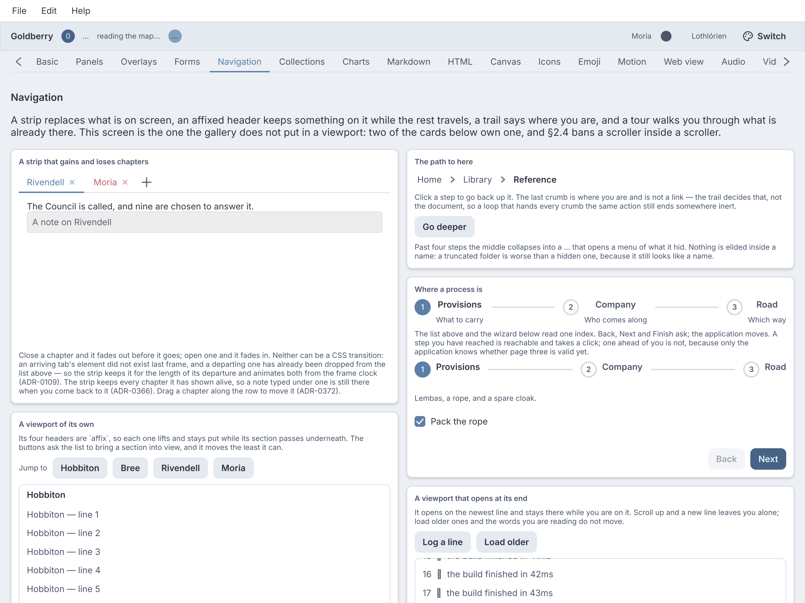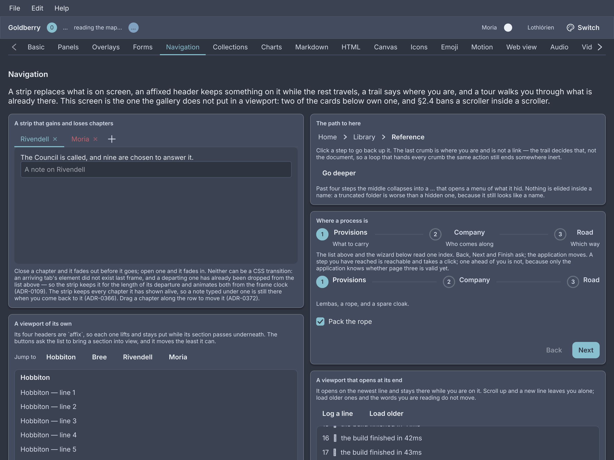<p>The Navigation screen of the showcase.</p></div>

## `breadcrumbs`

The path to here, as a row of crumbs with a chevron between each pair. The last
crumb is where you are and does not press.

<div class="gb-shot">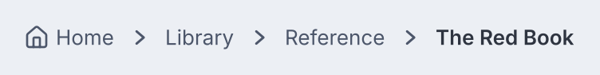<p>Three links and the current page.</p></div>

<div class="gb-tabs">

```kdl
breadcrumbs id="path" {
  crumb icon="home" press="app.go-home" "Home"
  crumb press="app.go-library" "Library"
  crumb press="app.go-shelf" "Reference"
  crumb "The Red Book"
}
```

```java
new Breadcrumbs(
        new Crumb("Home", actions::goHome).withIcon(homeIcon),
        new Crumb("Library", actions::goLibrary),
        new Crumb("Reference", actions::goShelf),
        new Crumb("The Red Book")
).id("path");
```

</div>

The trail decides which crumb is current. It is always the last one written, so
a document cannot mark one and a Java caller cannot either
([ADR-0306](https://github.com/DigitalSmile/goldberry/blob/master/book/src/adr/0306-the-last-crumb-is-where-you-are.md)). A trail longer
than `collapse-after` keeps its first crumb and its tail and folds the middle
into a `…` button. Pressing that button opens a menu of the hidden crumbs.

**Attributes**

| Attribute | Type | Default | What it does |
|---|---|---|---|
| `collapse-after` | number | `4` | How many crumbs show before the middle folds away. `0` or less never folds. `1` and `2` are raised to `3`, which is the fewest a folded trail can show. |
| `id`, `class` | string | | The usual. |

The constructor `new Breadcrumbs(Widget... children)` folds at four.
`collapseAfter(int)` changes it.

**Styling**

The CSS type is `breadcrumbs`. Its parts are `crumb`, `crumb-separator` and
`crumb-overflow`. A crumb matches `:hover` and `:focus-visible`. The current
crumb matches `:checked`, and that rule removes the hover wash and the pointer
cursor. There are no variant classes.

**Keyboard**

| Key | On | Does |
|---|---|---|
| `Space`, `Enter` | a crumb with a `press` | presses it |
| `Space`, `Enter`, `Down` | the `…` | opens the menu of hidden crumbs |

Only a crumb that has a `press` and is not current is a Tab stop.

**Read more**

- [ADR-0306: The last crumb is where you are](https://github.com/DigitalSmile/goldberry/blob/master/book/src/adr/0306-the-last-crumb-is-where-you-are.md)

### `crumb`

One entry in a trail: a label, an optional icon, and what pressing it does.

<div class="gb-shot">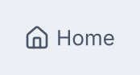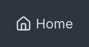<p>An icon and a label.</p></div>

<div class="gb-tabs">

```kdl
crumb icon="home" press="app.go-home" "Home"
```

```java
new Crumb("Home", actions::goHome).withIcon(homeIcon);
new Crumb("The Red Book");
```

</div>

**Attributes**

| Attribute | Type | Default | What it does |
|---|---|---|---|
| argument | string | required | The label. A crumb with no label is refused at inflation. |
| `icon` | icon name | none | An icon before the label, from the icon registry. |
| `press` | action name | none | What pressing the crumb does. A crumb without one is not a link. |
| `id`, `class` | string | | The usual. |

A crumb's children are ignored. Whether it is current is set by the trail, not
by an attribute.

## `steps`

A row of numbered discs that says how far along a process is. On its own it is
a picture. With `clickable`, a reachable step can be pressed.

<div class="gb-shot">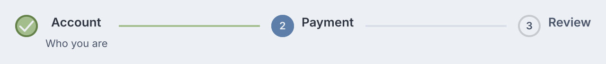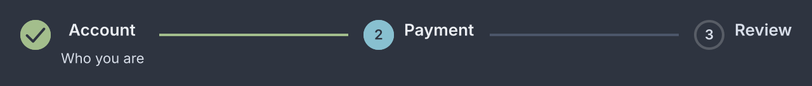<p>Done, current and upcoming.</p></div>

<div class="gb-tabs">

```kdl
steps current=1 clickable=#true change="app.go-step" {
  step reachable=#true "Account" description="Who you are"
  step "Payment"
  step "Review"
}
```

```java
new Steps(1,
        new Step("Account", "Who you are").reachable(true),
        new Step("Payment"),
        new Step("Review"))
    .clickable(actions::goStep);
```

</div>

Every step before `current` is done. The step at `current` is current. The
rest are upcoming, unless a step says `error`. The widget writes those four
words as classes and never decides where the user may go: `clickable` raises a
`change` with the index of a step the application marked `reachable`, and
refuses the rest
([ADR-0344](https://github.com/DigitalSmile/goldberry/blob/master/book/src/adr/0344-a-list-of-steps-writes-where-each-one-stands.md)).

**Attributes**

| Attribute | Type | Default | What it does |
|---|---|---|---|
| `current` | number | `0` | The index of the current step. |
| `bind` | path | none | A value to read the current index from instead. A bound number wins over `current`. |
| `direction` | `"horizontal"`, `"vertical"` | `"horizontal"` | Which way the row runs. |
| `clickable` | boolean | `#false` | Lets a reachable step be pressed. |
| `change` | action name | none | Called with the index of the pressed step, as a string. |
| `id`, `class` | string | | The usual. |

`new Steps(int current, Widget... children)` is horizontal and read-only.
`direction(Direction)`, `clickable(IntConsumer)` and `bound(Observable)` set
the rest.

**Styling**

The CSS type is `steps`, with the class `vertical` when the direction is. A
`step` carries one of the classes `done`, `current`, `upcoming`, `incomplete`
or `error`, and the current one also matches `:checked`. Its parts are `step-marker`,
`step-body`, `step-label` and `step-description`. Between steps sits a
`step-connector` holding a `step-connector-fill`, which scales from the step
before it when that step is done
([ADR-0356](https://github.com/DigitalSmile/goldberry/blob/master/book/src/adr/0356-a-connector-grows-from-where-you-were-and-an-entry-has-a-marker-slot.md)).
The marker is a 24px disc with a 2px ring: the accent when current, `--gb-success`
with a tick when done, `--gb-danger` with a cross on error, the ring alone
when upcoming. An incomplete step, one the list has passed that says it is not
done, keeps the ring and its number in full ink, so it reads as visited and
not ticked.

**Keyboard**

| Key | On | Does |
|---|---|---|
| `Space`, `Enter` | a reachable step in a clickable list | raises `change` with its index |

A step is a Tab stop only when the list handed it a press. The list itself
takes no arrow keys.

**Read more**

- [ADR-0344: A list of steps writes where each one stands](https://github.com/DigitalSmile/goldberry/blob/master/book/src/adr/0344-a-list-of-steps-writes-where-each-one-stands.md)
- [ADR-0356: A connector grows from where you were](https://github.com/DigitalSmile/goldberry/blob/master/book/src/adr/0356-a-connector-grows-from-where-you-were-and-an-entry-has-a-marker-slot.md)

### `step`

One step: a label, an optional description, and two flags the list reads.

<div class="gb-shot">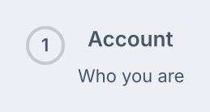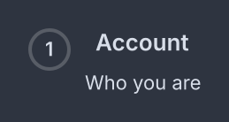<p>A reachable step with a description.</p></div>

<div class="gb-tabs">

```kdl
step reachable=#true "Account" description="Who you are"
```

```java
new Step("Account", "Who you are").reachable(true);
new Step("Verify").error(true);
new Step("Grafana", "Not signed in").complete(false);
```

</div>

**Attributes**

| Attribute | Type | Default | What it does |
|---|---|---|---|
| argument | string | required | The label. A step with no label is refused at inflation. |
| `description` | string | none | A caption under the label. |
| `error` | boolean | `#false` | Draws the step in `--gb-danger` with a cross, whatever its index. |
| `reachable` | boolean | `#false` | Lets a clickable list press this step. |
| `complete` | boolean | none | Whether the step is done. Unset, a step before the current one is done. `#false` there draws it `incomplete`, and `#true` after the current one draws it done. |
| `id`, `class` | string | | The usual. |

A step's state is not an attribute. `step current=#true` is ignored, because
the list derives it from `current`. `complete` is the one exception to the
position: only the application knows that a step the user went past was left
undone ([ADR-0531](https://github.com/DigitalSmile/goldberry/blob/master/book/src/adr/0531-a-step-may-say-it-is-not-done.md)).

## `wizard`

A `steps` indicator over one page at a time, with Back, Next and Finish under
it. It owns no validation, no policy and no data.

<div class="gb-shot">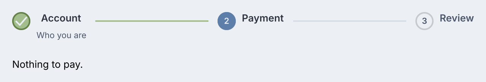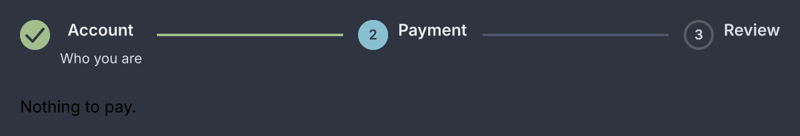<p>The second of three pages, chosen by the bound step.</p></div>

<div class="gb-tabs">

```kdl
wizard id="signup" bind="signup.step" back="signup.back" next="signup.next" finish="signup.finish" {
  page "Account" description="Who you are" {
    text-input placeholder="Name"
  }
  page "Payment" {
    text "Nothing to pay."
  }
  page "Review" {
    text "All set."
  }
}
```

```java
new Wizard(current,
        new WizardPage("Account", new TextInput().placeholder("Name")).describe("Who you are"),
        new WizardPage("Payment", new Text("Nothing to pay.")),
        new WizardPage("Review", new Text("All set.")))
    .onBack(() -> goTo(current - 1))
    .onNext(() -> goTo(current + 1))
    .onFinish(() -> goTo(0))
    .id("signup");
```

</div>

Back, Next and Finish only call their handlers. The application moves
`current`, by rebuilding with a new index or by setting the bound value, and a
wizard that will not advance is an application that did not move it
([ADR-0344](https://github.com/DigitalSmile/goldberry/blob/master/book/src/adr/0344-a-list-of-steps-writes-where-each-one-stands.md)). A
page the index has passed is done, unless it says `complete=#false`: then it
is drawn `incomplete`, visited and not done. A page marked `error` is drawn so
in the indicator. Only the current page's children are built, and when the page
changes the keyboard moves into the new content.

> [!NOTE]
> A button that has no handler is not shown. A wizard with no `back=` has no
> Back. Next shows on every page but the last, where Finish takes its place.

**Attributes**

| Attribute | Type | Default | What it does |
|---|---|---|---|
| `current` | number | `0` | The index of the page shown. Out of range is clamped. |
| `bind` | path | none | A value to read the index from. A bound number wins over `current`. |
| `back`, `next`, `finish` | action name | none | What each button does. The button exists only when its action is named. |
| `go-to` | action name | none | Makes the indicator clickable. Called with the index of a reachable page, as a string. |
| `back-label`, `next-label`, `finish-label` | string | `"Back"`, `"Next"`, `"Finish"` | The button labels. |
| `id`, `class` | string | | The usual. |

`new Wizard(int current, Widget... pages)` has no buttons. `onBack`, `onNext`,
`onFinish` and `goTo` add them, `labels(Labels)` renames them, and
`bound(Observable)` reads the index from a value. Children that are not a
`page` are ignored.

**Styling**

The CSS type is `wizard`. Its parts are the `steps` indicator, `wizard-content`
and `wizard-actions`. The buttons are ordinary `button`s, the affirmative one
with the class `primary`, and Back matches `:disabled` on the first page. A
theme that wants Windows order writes `wizard-actions { flex-direction:
row-reverse }`. When the wizard has an id, the buttons take `<id>-back`,
`<id>-next` and `<id>-finish`, and the content `<id>-content`. The current
page's classes land on `wizard-content`.

**Keyboard**

The wizard takes no keys of its own. The buttons take `Space` and `Enter`, and
the indicator takes what [`steps`](#steps) takes when `go-to` is wired.

**Read more**

- [ADR-0344: A list of steps writes where each one stands, and a wizard moves nothing](https://github.com/DigitalSmile/goldberry/blob/master/book/src/adr/0344-a-list-of-steps-writes-where-each-one-stands.md)

### `page`

One page of a wizard: a label for the indicator, and the content shown while it
is current.

<div class="gb-shot">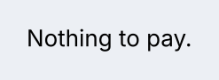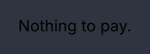<p>One page on its own.</p></div>

<div class="gb-tabs">

```kdl
page "Payment" description="How you pay" reachable=#true {
  text "Nothing to pay."
}
```

```java
new WizardPage("Payment", new Text("Nothing to pay."))
    .describe("How you pay")
    .reachable(true);
```

</div>

**Attributes**

| Attribute | Type | Default | What it does |
|---|---|---|---|
| argument | string | required | The label the indicator calls it by. |
| `description` | string | none | The caption under that label. |
| `error` | boolean | `#false` | Marks the page's step as an error. |
| `reachable` | boolean | `#false` | Lets a `go-to` indicator press this page's step. |
| `complete` | boolean | none | Whether the page is done, for a wizard whose pages may be passed undone. Unset, the position decides. |
| `id`, `class` | string | | The classes land on `wizard-content` while the page is shown. |

Any children are the page's content. A page has no CSS type of its own.
