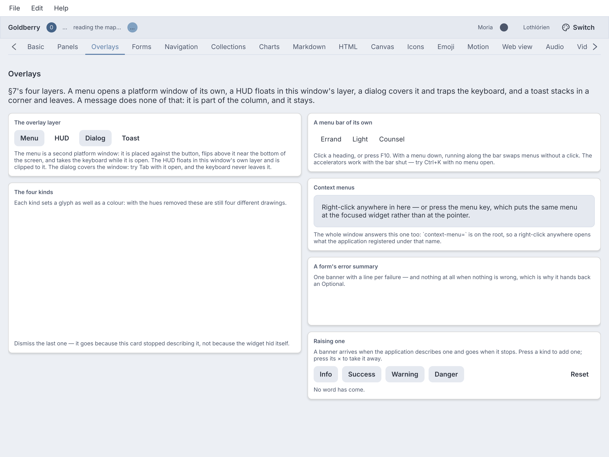
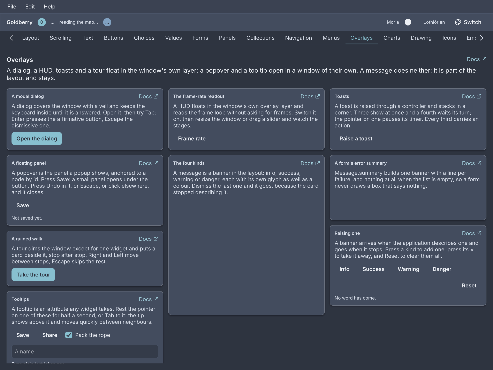
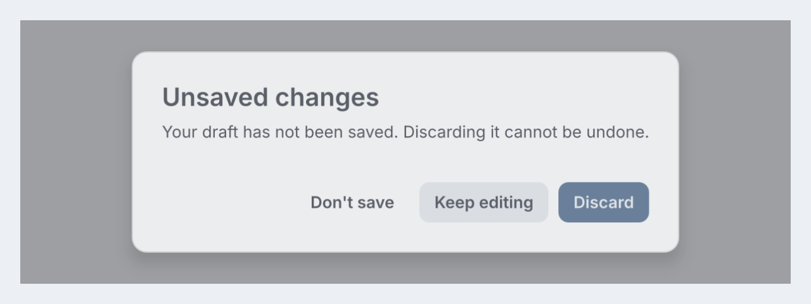
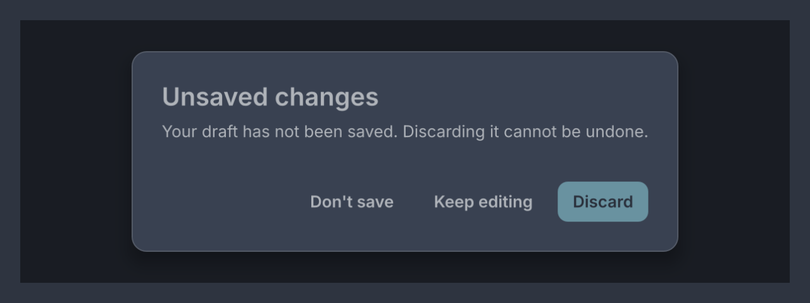
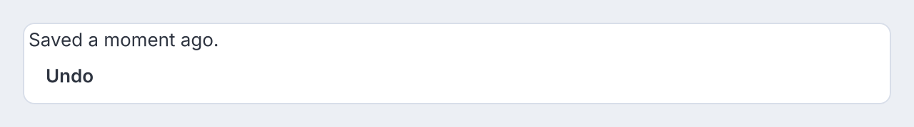
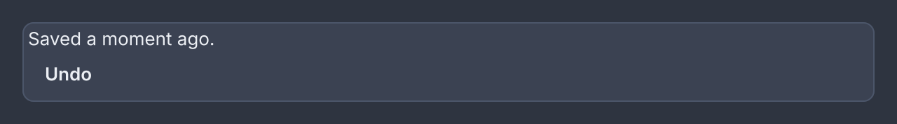
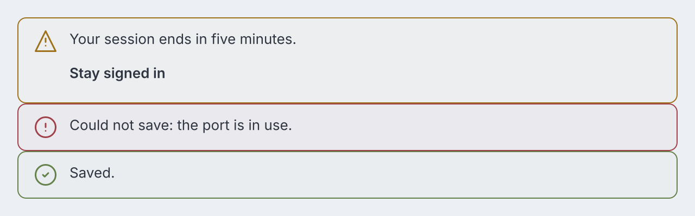
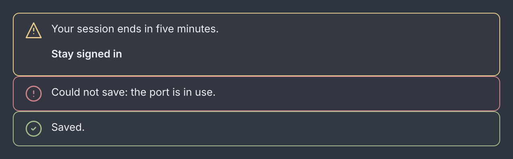
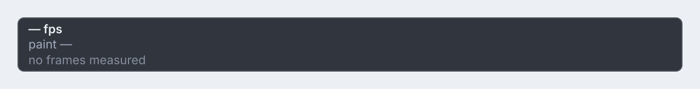
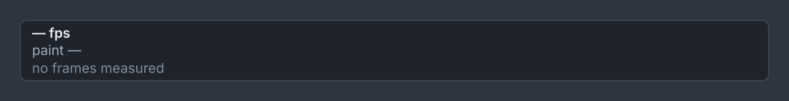

# Overlays

<p class="gb-lede">What opens over the window: a modal dialog, a floating panel, a banner in the layout, a frame-rate readout, toasts, a guided tour, and tooltips on any widget.</p>

<div class="gb-shot"><p>The Overlays screen of the showcase.</p></div>

There are two places something can go over a window, and every overlay uses
one of them.

**The overlay layer** is part of the window's own tree. Every window is rooted
at a `WindowRoot`, and an overlay is one of its children beside the
application's, so it is painted by the same frame and clipped to the window.
`host.overlay(widget, corner)` puts a widget in a corner and `host.fill(widget)`
covers the window. Both return an `Overlay` whose `remove()` takes it away at
once and whose `dismiss()` lets its widget leave the way it leaves first.
A dialog, a HUD, a toast stack and a tour live here.

**A platform popup** is a second window the platform draws, parented to this
one and free of its bounds. `host.popup(content, anchorId, placement)` measures
the content, places it against the node with that id, flips it when it would
leave the screen, and opens it. The answer is an `Optional<Popup>`, and empty
is an ordinary answer: the video driver may have no popup windows, or nothing
with that id has been painted. A menu, a select's list and a tooltip live here.

```java
host.popup(new Popover(new Text("Saved.")), "save-button", Placement.BELOW)
    .ifPresent(open -> this.hint = open);
```

`Placement.BELOW`, `ABOVE` and `AFTER` are the three sides, `.align(Align)`
chooses `START`, `CENTER` or `END` along the anchor, and `.gap(float)` the
distance. A popup is light-dismissed by default: a press in the owner window
or `Escape` closes it, and `popup.close()` does from Java.

## `dialog`

A modal: a veil over the window, a panel with a title and buttons, and a focus
trap that keeps the keyboard inside until it is answered.

<div class="gb-shot"><p>Three roles: neutral, dismissive and affirmative.</p></div>

<div class="gb-tabs">

```kdl
dialog id="unsaved" title="Unsaved changes" {
  text "Your draft has not been saved. Discarding it cannot be undone."
  action role="neutral" press="app.dont-save" "Don't save"
  action role="dismissive" press="app.stay" "Keep editing"
  action role="affirmative" press="app.discard" "Discard"
}
```

```java
private Overlay open;

private void askToDiscard() {
    open = Dialogs.show(host, new Dialog("Unsaved changes",
            new Text("Your draft has not been saved. Discarding it cannot be undone."),
            new DialogAction("Don't save", DialogAction.Role.NEUTRAL, this::dontSave),
            new DialogAction("Keep editing", DialogAction.Role.DISMISSIVE, this::stay),
            new DialogAction("Discard", DialogAction.Role.AFFIRMATIVE, this::discard))
        .id("unsaved"));
}

private void discard() {
    // The dialog has already faded and taken itself off the window.
    draft.discard();
}
```

</div>

A dialog is a widget, and showing one is not: `Dialogs.show(host, dialog)`
fills the window with it and hands back the `Overlay`. Every route out, a
button, `Escape`, a press on the veil or the ×, fades the panel first, calls
the handler when the fade is over, and then removes the overlay. A handler does
not have to call `remove()`, and one that does is harmless. When the
application decides the dialog is finished without the user, `open.dismiss()`
runs the same fade, presses nothing, and removes it at the end.
`open.remove()` takes it away at once, with no fade.

Showing a dialog in the same turn another is removed is safe: each overlay is
its own node, so the new dialog never inherits the old one's state.

**Height.** A dialog is never taller than the window less 24 at the top and
bottom. When its content would make it taller, the title and the button bar
keep their size and the body scrolls. The body's viewport is a Tab stop only
while it has something to scroll, so a short dialog's Tab order is its fields
and its buttons.

**The focus trap.** While a modal is mounted the focused node is inside it.
Focus lands on the first focusable thing in the panel, `Tab` cycles within it,
and a press on the veil counts as the dismissive action. When the overlay is
removed the keyboard goes back to the one node that had it before, with the
same keyboard-or-pointer flag it had then. The veil is the whole of the
pointer's modality, and modality is one flag on the panel.

**Attributes**

| Attribute | Type | Default | What it does |
|---|---|---|---|
| `title` | string | none | The title bar. Blank is the same as absent. |
| `dismiss` | action name | none | Puts a × at the end of the title bar. The × closes the dialog and then runs the action, and `Escape` and the veil do the same. In Java, `dialog.dismissible(handler)`. |
| `id`, `class` | string | | The usual. `Dialogs.show` gives an unnamed one the id `dialog`, and keeps a key set with `keyed(…)`. |

`action` children become the button bar, in role order. Every other child is
the body. A dialog with two affirmative or two dismissive actions is refused,
because `Enter` and `Escape` each press exactly one button.

The × is for a dialog whose content has a button bar of its own, a `wizard`
for one, where a dismissive action would be a second Cancel. It is opt-in: a
dialog that must be answered stays one by default.

**Styling**

The CSS type is `dialog`, the panel, inside a `dialog-scrim`. Its parts are
`dialog-title`, `dialog-body` and `dialog-actions`. A dialog with a × puts the
title and a `dialog-dismiss` in a `dialog-header` row. The body sits in a
`scroll` with the class `dialog-scroll`. The buttons are ordinary
`button`s: the affirmative one carries `primary`, a neutral one `ghost`, the
dismissive one neither. The bar puts the affirmative on the right. A theme
that wants Windows order writes `dialog-actions { flex-direction: row-reverse }`.
Padding 24, minimum width 320, maximum 80% of the window, and no taller than
the window less its margins.

**Keyboard**

| Key | Does |
|---|---|
| `Enter` | presses the affirmative action |
| `Escape` | presses the dismissive action, as a press on the veil does. In a dialog with a ×, it does what the × does |
| `Tab` | moves within the dialog and never leaves it |

A dialog with no dismissive action and no × cannot be dismissed by `Escape` or
the veil. The × is not a Tab stop, because `Escape` is the same way out.

### `action`

One button in a dialog's bar, with the role that decides which key presses it.

<div class="gb-tabs">

```kdl
action role="affirmative" press="app.discard" "Discard"
```

```java
new DialogAction("Discard", DialogAction.Role.AFFIRMATIVE, this::discard);
```

</div>

**Attributes**

| Attribute | Type | Default | What it does |
|---|---|---|---|
| argument | string | `""` | The label. |
| `role` | `"affirmative"`, `"dismissive"`, `"neutral"` | `"neutral"` | `Enter` presses the affirmative, `Escape` the dismissive, nothing presses a neutral. Any other word is refused. |
| `press` | action name | none | What the button does. |
| `id`, `class` | string | | The usual. Children are ignored. |

## `popover`

An anchored floating panel: the surface a popup shows, with the opening left
to `Host.popup`.

<div class="gb-shot"><p>A card with text and a ghost button.</p></div>

<div class="gb-tabs">

```kdl
popover {
  text "Saved a moment ago."
  button class="ghost" press="app.undo" "Undo"
}
```

```java
var popover = new Popover(
        new Text("Saved a moment ago."),
        new Button("Undo", actions::undo).styled("ghost")
);
host.popup(popover, "save-button", Placement.BELOW)
    .ifPresent(open -> this.hint = open);
```

</div>

The two halves are deliberately not one widget. `popover` is the panel and
nothing else. Where it goes, when it flips and when it goes away belong to the
popup, which serves a tooltip and a select equally.

**Attributes**

| Attribute | Type | Default | What it does |
|---|---|---|---|
| `id`, `class` | string | | The usual. Any children. |

**Styling**

The CSS type is `popover`. A `popover button` rule sizes buttons inside it.
There are no parts, pseudo-classes or variants.

**Keyboard**

None of its own. The popup it is shown in closes on `Escape` while light
dismiss is on.

## `message`

An inline banner about the region it sits in: a kind, an icon, text, optional
action links and an optional dismiss.

<div class="gb-shot"><p>Warning, danger with a dismiss, and success.</p></div>

<div class="gb-tabs">

```kdl
column {
  message kind="warning" "Your session ends in five minutes." {
    button class="ghost" press="app.extend" "Stay signed in"
  }
  message kind="danger" dismiss="app.clear" "Could not save: the port is in use."
  message kind="success" "Saved."
}
```

```java
new Column(
        new Message(Message.Kind.WARNING, "Your session ends in five minutes.")
                .actions(new Button("Stay signed in", actions::extend).styled("ghost")),
        new Message(Message.Kind.DANGER, "Could not save: the port is in use.")
                .dismiss(actions::clear),
        new Message(Message.Kind.SUCCESS, "Saved.")
);
```

</div>

A message is not a toast. A toast is transient and floats over the window. A
message is part of the layout and stays until the condition does. Its text can
be bound, and a null or blank value renders as nothing, which is how a form's
error summary appears and goes:

```kdl
message kind="danger" bind="form.error"
```

`Message.summary(List<String>)` builds one from a list of errors, or empty when
there are none.

**Attributes**

| Attribute | Type | Default | What it does |
|---|---|---|---|
| argument | string | `""` | The text. |
| `kind` | `"info"`, `"success"`, `"warning"`, `"danger"` | `"info"` | The icon and tint. Any other word is refused. |
| `bind` | path | none | A value to take the text from. Blank draws nothing. |
| `dismiss` | action name | none | Adds a × that calls this. Without it there is no ×. |
| `id`, `class` | string | | The usual. The children are the action links. |

**Styling**

The CSS type is `message`, with the class `success`, `warning` or `danger`.
The base rule is the info look. Its parts are `message-icon`, `message-body`
holding the text and `message-actions`, and `message-dismiss`, which matches
`:hover`, `:active` and `:focus-visible`. Padding 12/16, radius 8, a 1px border
and a 4% tint of the kind's colour.

**Keyboard**

The × is a Tab stop. `Enter` or `Space` on it dismisses.

## `hud`

The frame loop, on top of the window it is running: frames per second and
paint time by default, the whole breakdown on request.

<div class="gb-shot"><p>At rest, before a frame has been measured.</p></div>

<div class="gb-tabs">

```kdl
hud readings="fps paint"
```

```java
private Overlay hud;

private void toggleHud() {
    if (hud != null) {
        hud.remove();
        hud = null;
    } else {
        hud = host.overlay(Hud.stages(), Corner.BOTTOM_END);
    }
}
```

</div>

A HUD never asks for a frame. A readout that requested one so it could show a
fresh number would be measuring itself. It reads the window's statistics down the render context and updates when
something else paints.

**Attributes**

| Attribute | Type | Default | What it does |
|---|---|---|---|
| `readings` | words | `"fps paint"` | Space-separated readings, or the preset `stages` or `present`. |
| `id`, `class` | string | | The usual. Children are ignored. |

The readings are `fps`, `refresh`, `late`, `paint`, `build`, `style`, `layout`,
`raster`, `upload`, `acquire` and `submit`. `stages` is the first eight, which
is what `Hud.stages()` builds. `present` is the GPU canvas's set. A word that
is not one of them is refused.

**Styling**

The CSS type is `hud`. Each reading is a `hud-reading` carrying its name as a
class, `hud-reading.paint`, plus `near` or `over` when a time approaches or
passes the frame budget, and a `hud-caption` follows.

## Toasts

A toast is a queue, and the stack is the widget. There is no `toast` node: a
`Toast` is a record, text with an optional action and a timeout, raised
through a controller from wherever it happens.

<div class="gb-shot"><p>A stack of three. The newest is nearest the corner.</p></div>

```java
private final ToastController toasts = new ToastController();

@Override public void start(Host host) {
    Toasts.at(host, toasts, Corner.BOTTOM_END);
}

private void sent() {
    toasts.show(new Toast("Message sent.").action("Undo", actions::recall));
}
```

`Toasts.at` is called once. It puts one stack in the window's corner and
returns the `Overlay`. After that the application holds the controller and
never mentions the stack again.

| Call | What it does |
|---|---|
| `new Toast(text)` | A toast that stays five seconds. |
| `.action(label, runnable)` | A button after the words. Pressing it runs the handler and starts the exit. |
| `.timeout(Duration)` | How long it stays. `Duration.ZERO` never goes on its own. |
| `controller.show(toast)`, `show(text)` | Raises it, or queues it when three are showing. |
| `controller.clear()` | Removes every toast. |
| `Toasts.of(context)` | The controller from inside a widget's build. |

Three show at once by default. A fourth waits its turn and comes forward while
the oldest fades out. The timer pauses while the pointer is on a toast and
resumes from where it was. A click on the plate dismisses it. When one leaves,
the older ones slide to close the hole, and at a top corner the newest is
nearest the top.

**Styling**

The stack is a `toaster`, with its corner as a class, `toaster.bottom-end`.
Each toast is a `toast` holding `toast-text` and, with an action, a
`button.ghost`. Width 360, padding 12/16, radius 8.

## Tours

A guided sequence of stops over real widgets. The window dims except for the
target, and a card beside it says what it is.

```java
Tours.start(host, List.of(
        new Stop("demo-tabs", "A strip of your own", "Chapters that can be closed."),
        new Stop("jump-bar", "Jump to a chapter", "These bring a section into view."),
        new Stop("gallery", "The gallery strip", "Every screen, and a Ctrl+digit for the first ten.")
));
```

A `Stop` names a target by id, with a title and a body. `Tours.start(host,
stops)` fills the window with the tour and returns the `Overlay`, or `null`
for an empty list. `Tours.start(host, stops, onEnd)` is told when it ends.
Each stop reads the target's painted rectangle on every build, scrolls it into
view first, and waits for the frame before placing the card. A stop whose
target is not on screen is logged and skipped. `Stop.within(ScrollController)`
names the scroll to use when the enclosing one is not the right one.

**Styling**

The CSS type is `tour`. Its parts are `tour-veil`, four `tour-band`s around
the cut-out, `tour-ring` and `tour-card`, which holds texts classed
`tour-title`, `tour-body` and `tour-count`, and buttons classed `tour-skip`,
`tour-back` and `tour-next`. The card is radius 12, padding 16, at most 320
wide, and the cut-out is inset 4 with radius 8. The veil's cut-out travels
between stops.

**Keyboard**

| Key | Does |
|---|---|
| `Right` | next stop |
| `Left` | previous stop |
| `Escape` | skips the whole tour |

## Tooltips

A tooltip is an attribute, not a widget. Any node takes `tooltip="…"`,
including one from an application's own module, and the text rides on its
`Attributes`.

<div class="gb-tabs">

```kdl
button press="app.open-menu" tooltip="A platform popup, free of this window's bounds" "Menu"
```

```java
new Button("Menu", window::openMenu).tooltip("A platform popup, free of this window's bounds");
```

</div>

It shows after 500 ms of hover, or when keyboard focus arrives, placed above
the node and centred, and moves between neighbours after 100 ms. The tokens
`--gb-tooltip-delay` and `--gb-tooltip-delay-move` change the two delays. It is
never focusable and never light-dismissed: it closes when the pointer leaves or
focus moves, and not on a press. Plain text only.

**Styling**

The plate is the CSS type `tooltip`: padding 8/12, radius 4, `caption`, at most
320 wide, on `--gb-hud-bg`.
