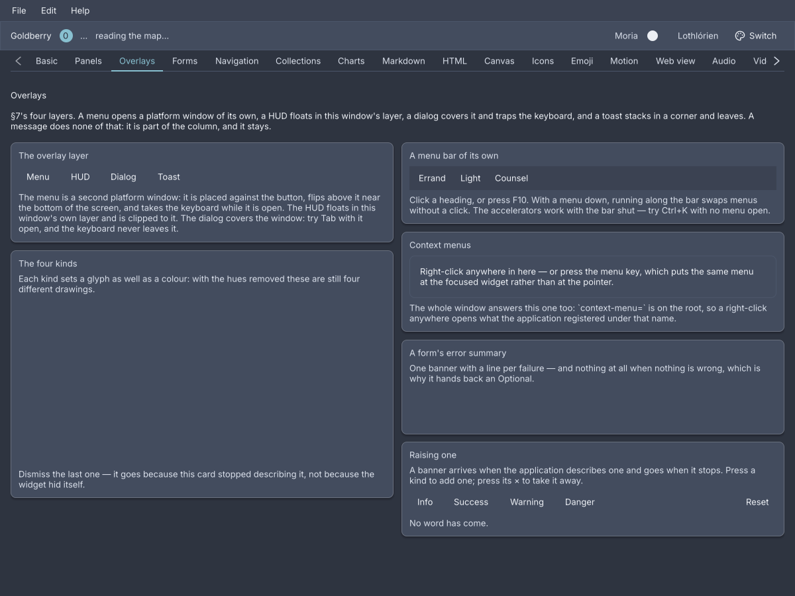
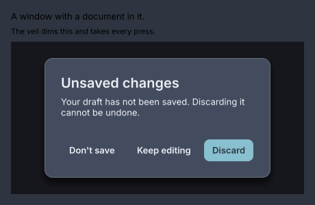
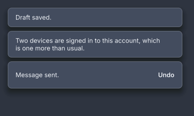

# Overlays

<p class="gb-lede">What opens over the window: a modal dialog, a floating panel, a banner in the layout, a frame-rate readout, toasts, a guided tour, and tooltips on any widget.</p>

<div class="gb-shot"><p>The Overlays screen of the showcase, Nord dark.</p></div>

There are two places something can go over a window, and every overlay uses
one of them.

**The overlay layer** is part of the window's own tree. Every window is rooted
at a `WindowRoot`, and an overlay is one of its children beside the
application's, so it is painted by the same frame and clipped to the window
([ADR-0100](../adr/0100-a-window-has-a-layer-above-its-application.md)).
`host.overlay(widget, corner)` puts a widget in a corner and `host.fill(widget)`
covers the window. Both return an `Overlay` whose `remove()` takes it away.
A dialog, a HUD, a toast stack and a tour live here.

**A platform popup** is a second window the platform draws, parented to this
one and free of its bounds
([ADR-0103](../adr/0103-a-popup-is-a-second-tree-in-a-second-window.md)).
`host.popup(content, anchorId, placement)` measures the content, places it
against the node with that id, flips it when it would leave the screen, and
opens it ([ADR-0104](../adr/0104-a-popup-is-measured-then-placed.md)). The
answer is an `Optional<Popup>`, and empty is an ordinary answer: the video
driver may have no popup windows, or nothing with that id has been painted yet
([ADR-0102](../adr/0102-a-popup-is-a-window-the-platform-may-refuse.md)). A
menu, a select's list and a tooltip live here.

```java
host.popup(new Popover(new Text("Saved.")), "save-button", Placement.BELOW)
    .ifPresent(open -> this.hint = open);
```

`Placement.BELOW`, `ABOVE` and `AFTER` are the three sides, `.align(Align)`
chooses `START`, `CENTER` or `END` along the anchor, and `.gap(float)` the
distance. A popup is light-dismissed by default: a press in the owner window
or `Escape` closes it, and `popup.close()` does from Java.

## `dialog`

A modal: a veil over the window, a panel with a title and buttons, and a focus
trap that keeps the keyboard inside until it is answered.

<div class="gb-shot"><p>Three roles: a neutral action, the dismissive one and the affirmative one on the right.</p></div>

```kdl
dialog id="unsaved" title="Unsaved changes" {
  text "Your draft has not been saved. Discarding it cannot be undone."
  action role="neutral" press="app.dont-save" "Don't save"
  action role="dismissive" press="app.stay" "Keep editing"
  action role="affirmative" press="app.discard" "Discard"
}
```

```java
private Overlay open;

private void askToDiscard() {
    open = Dialogs.show(host, new Dialog("Unsaved changes",
            new Text("Your draft has not been saved. Discarding it cannot be undone."),
            new DialogAction("Don't save", DialogAction.Role.NEUTRAL, this::dontSave),
            new DialogAction("Keep editing", DialogAction.Role.DISMISSIVE, this::stay),
            new DialogAction("Discard", DialogAction.Role.AFFIRMATIVE, this::discard))
        .id("unsaved"));
}

private void discard() {
    open.remove();
}
```

A dialog is a widget, and showing one is not: `Dialogs.show(host, dialog)`
fills the window with it and hands back the `Overlay`
([ADR-0176](../adr/0176-a-dialog-is-a-widget-and-showing-one-is-not.md)).
Removing it is the application's, because only the application knows the
question was answered. Every route out fades the panel first and calls the
handler when the fade is over.

**The focus trap.** While a modal is mounted the focused node is inside it.
Focus lands on the first focusable thing in the panel, `Tab` cycles within it,
and a press on the veil counts as the dismissive action. When the overlay is
removed the keyboard goes back to the one node that had it before, with the
same keyboard-or-pointer flag it had then
([ADR-0180](../adr/0180-the-keyboard-goes-back-where-it-was.md)). The veil is
the whole of the pointer's modality, and modality is one flag on the panel
([ADR-0232](../adr/0232-modality-is-one-flag-and-not-a-scrim.md)).

**Attributes**

| Attribute | Type | Default | What it does |
|---|---|---|---|
| `title` | string | none | The title bar. Blank is the same as absent. |
| `id`, `class` | string | | The usual. `Dialogs.show` gives an untitled one the id `dialog`. |

`action` children become the button bar, in role order. Every other child is
the body. A dialog with two affirmative or two dismissive actions is refused,
because `Enter` and `Escape` each press exactly one button.

**Styling**

The CSS type is `dialog`, the panel, inside a `dialog-scrim`. Its parts are
`dialog-title`, `dialog-body` and `dialog-actions`. The buttons are ordinary
`button`s: the affirmative one carries `primary`, a neutral one `ghost`, the
dismissive one neither. The bar puts the affirmative on the right; a theme
that wants Windows order writes `dialog-actions { flex-direction: row-reverse }`.
Padding 24, minimum width 320, maximum 80% of the window.

**Keyboard**

| Key | Does |
|---|---|
| `Enter` | presses the affirmative action |
| `Escape` | presses the dismissive action, as a press on the veil does |
| `Tab` | moves within the dialog and never leaves it |

A dialog with no dismissive action cannot be dismissed by `Escape` or the veil.

**Read more**

- [ADR-0176: A dialog is a widget and showing one is not](../adr/0176-a-dialog-is-a-widget-and-showing-one-is-not.md)
- [ADR-0180: The keyboard goes back where it was](../adr/0180-the-keyboard-goes-back-where-it-was.md)
- [ADR-0232: Modality is one flag and not a scrim](../adr/0232-modality-is-one-flag-and-not-a-scrim.md)

### `action`

One button in a dialog's bar, with the role that decides which key presses it.

```kdl
action role="affirmative" press="app.discard" "Discard"
```

```java
new DialogAction("Discard", DialogAction.Role.AFFIRMATIVE, this::discard);
```

**Attributes**

| Attribute | Type | Default | What it does |
|---|---|---|---|
| argument | string | `""` | The label. |
| `role` | `"affirmative"`, `"dismissive"`, `"neutral"` | `"neutral"` | `Enter` presses the affirmative, `Escape` the dismissive, nothing presses a neutral. Any other word is refused. |
| `press` | action name | none | What the button does. |
| `id`, `class` | string | | The usual. Children are ignored. |

## `popover`

An anchored floating panel: the surface a popup shows, with the opening left
to `Host.popup`.

```kdl
popover {
  text "Saved a moment ago."
  button class="ghost" press="app.undo" "Undo"
}
```

```java
host.popup(new Popover(
            new Text("Saved a moment ago."),
            new Button("Undo", actions::undo).styled("ghost")),
        "save-button", Placement.BELOW)
    .ifPresent(open -> this.hint = open);
```

The two halves are deliberately not one widget. `popover` is the panel and
nothing else; where it goes, when it flips and when it goes away belong to the
popup, which serves a tooltip and a select equally
([ADR-0104](../adr/0104-a-popup-is-measured-then-placed.md)).

**Attributes**

| Attribute | Type | Default | What it does |
|---|---|---|---|
| `id`, `class` | string | | The usual. Any children. |

**Styling**

The CSS type is `popover`. A `popover button` rule sizes buttons inside it.
There are no parts, pseudo-classes or variants.

**Keyboard**

None of its own. The popup it is shown in closes on `Escape` while light
dismiss is on.

## `message`

An inline banner about the region it sits in: a kind, an icon, text, optional
action links and an optional dismiss.

```kdl
column {
  message kind="warning" "Your session ends in five minutes." {
    button class="ghost" press="app.extend" "Stay signed in"
  }
  message kind="danger" dismiss="app.clear" "Could not save: the port is in use."
  message kind="success" "Saved."
}
```

```java
new Column(
        new Message(Message.Kind.WARNING, "Your session ends in five minutes.")
                .actions(new Button("Stay signed in", actions::extend).styled("ghost")),
        new Message(Message.Kind.DANGER, "Could not save: the port is in use.")
                .dismiss(actions::clear),
        new Message(Message.Kind.SUCCESS, "Saved."));
```

A message is not a toast. A toast is transient and floats over the window; a
message is part of the layout and stays until the condition does. Its text can
be bound, and a null or blank value renders as nothing, which is how a form's
error summary appears and goes:

```kdl
message kind="danger" bind="form.error"
```

`Message.summary(List<String>)` builds one from a list of errors, or empty when
there are none.

**Attributes**

| Attribute | Type | Default | What it does |
|---|---|---|---|
| argument | string | `""` | The text. |
| `kind` | `"info"`, `"success"`, `"warning"`, `"danger"` | `"info"` | The icon and tint. Any other word is refused. |
| `bind` | path | none | A value to take the text from. Blank draws nothing. |
| `dismiss` | action name | none | Adds a × that calls this. Without it there is no ×. |
| `id`, `class` | string | | The usual. The children are the action links. |

**Styling**

The CSS type is `message`, with the class `success`, `warning` or `danger`;
the base rule is the info look. Its parts are `message-icon`, `message-body`
holding the text and `message-actions`, and `message-dismiss`, which matches
`:hover`, `:active` and `:focus-visible`. Padding 12/16, radius 8, a 1px border
and a 4% tint of the kind's colour.

**Keyboard**

The × is a Tab stop. `Enter` or `Space` on it dismisses.

## `hud`

The frame loop, on top of the window it is running: frames per second and
paint time by default, the whole breakdown on request.

```kdl
hud readings="fps paint"
```

```java
private Overlay hud;

private void toggleHud() {
    if (hud != null) {
        hud.remove();
        hud = null;
    } else {
        hud = host.overlay(Hud.stages(), Corner.BOTTOM_END);
    }
}
```

A HUD never asks for a frame. A readout that requested one so it could show a
fresh number would be measuring itself
([ADR-0101](../adr/0101-a-diagnostic-must-not-be-the-thing-it-measures.md)).
It reads the window's statistics down the render context and updates when
something else paints.

**Attributes**

| Attribute | Type | Default | What it does |
|---|---|---|---|
| `readings` | words | `"fps paint"` | Space-separated readings, or the preset `stages` or `present`. |
| `id`, `class` | string | | The usual. Children are ignored. |

The readings are `fps`, `refresh`, `late`, `paint`, `build`, `style`, `layout`,
`raster`, `upload`, `acquire` and `submit`. `stages` is the first eight, which
is what `Hud.stages()` builds. `present` is the GPU canvas's set. A word that
is not one of them is refused.

**Styling**

The CSS type is `hud`. Each reading is a `hud-reading` carrying its name as a
class, `hud-reading.paint`, plus `near` or `over` when a time approaches or
passes the frame budget, and a `hud-caption` follows.

**Read more**

- [ADR-0100: A window has a layer above its application](../adr/0100-a-window-has-a-layer-above-its-application.md)
- [ADR-0101: A diagnostic must not be the thing it measures](../adr/0101-a-diagnostic-must-not-be-the-thing-it-measures.md)

## Toasts

A toast is a queue, and the stack is the widget. There is no `toast` node: a
`Toast` is a record, text with an optional action and a timeout, raised
through a controller from wherever it happens
([ADR-0177](../adr/0177-a-toast-is-a-queue-and-the-stack-is-the-widget.md)).

<div class="gb-shot"><p>A stack of three. The newest is nearest the corner.</p></div>

```java
private final ToastController toasts = new ToastController();

@Override public void start(Host host) {
    Toasts.at(host, toasts, Corner.BOTTOM_END);
}

private void sent() {
    toasts.show(new Toast("Message sent.").action("Undo", actions::recall));
}
```

`Toasts.at` is called once. It puts one stack in the window's corner and
returns the `Overlay`. After that the application holds the controller and
never mentions the stack again.

| Call | What it does |
|---|---|
| `new Toast(text)` | A toast that stays five seconds. |
| `.action(label, runnable)` | A button after the words. Pressing it runs the handler and starts the exit. |
| `.timeout(Duration)` | How long it stays. `Duration.ZERO` never goes on its own. |
| `controller.show(toast)`, `show(text)` | Raises it, or queues it when three are showing. |
| `controller.clear()` | Removes every toast. |
| `Toasts.of(context)` | The controller from inside a widget's build. |

Three show at once by default. A fourth waits its turn and comes forward while
the oldest is still fading. The timer pauses while the pointer is on a toast
and resumes from where it was. A click on the plate dismisses it. When one
leaves, the older ones slide to close the hole, and at a top corner the newest
is nearest the top
([ADR-0178](../adr/0178-a-stack-closes-its-own-hole.md)).

**Styling**

The stack is a `toaster`, with its corner as a class, `toaster.bottom-end`.
Each toast is a `toast` holding `toast-text` and, with an action, a
`button.ghost`. Width 360, padding 12/16, radius 8.

**Read more**

- [ADR-0177: A toast is a queue and the stack is the widget](../adr/0177-a-toast-is-a-queue-and-the-stack-is-the-widget.md)
- [ADR-0178: A stack closes its own hole](../adr/0178-a-stack-closes-its-own-hole.md)

## Tours

A guided sequence of stops over real widgets. The window dims except for the
target, and a card beside it says what it is.

```java
Tours.start(host, List.of(
        new Stop("demo-tabs", "A strip of your own", "Chapters that can be closed."),
        new Stop("jump-bar", "Jump to a chapter", "These bring a section into view."),
        new Stop("gallery", "The gallery strip", "Every screen, and a Ctrl+digit for the first ten.")));
```

A `Stop` names a target by id, with a title and a body. `Tours.start(host,
stops)` fills the window with the tour and returns the `Overlay`, or `null`
for an empty list. `Tours.start(host, stops, onEnd)` is told when it ends.
Each stop reads the target's painted rectangle on every build, scrolls it into
view first, and waits for the frame before placing the card
([ADR-0121](../adr/0121-a-tour-is-a-veil-and-a-sequence.md)). A stop whose
target is not on screen is logged and skipped. `Stop.within(ScrollController)`
names the scroll to use when the enclosing one is not the right one.

**Styling**

The CSS type is `tour`. Its parts are `tour-veil`, four `tour-band`s around
the cut-out, `tour-ring` and `tour-card`, which holds texts classed
`tour-title`, `tour-body` and `tour-count`, and buttons classed `tour-skip`,
`tour-back` and `tour-next`. The card is radius 12, padding 16, at most 320
wide, and the cut-out is inset 4 with radius 8. The veil's cut-out travels
between stops ([ADR-0269](../adr/0269-a-tour-arrives-and-its-cut-out-travels.md)).

**Keyboard**

| Key | Does |
|---|---|
| `Right` | next stop |
| `Left` | previous stop |
| `Escape` | skips the whole tour |

**Read more**

- [ADR-0121: A tour is a veil and a sequence](../adr/0121-a-tour-is-a-veil-and-a-sequence.md)
- [ADR-0268: A tour card says how tall it came out](../adr/0268-a-tour-card-says-how-tall-it-came-out.md)
- [ADR-0269: A tour arrives and its cut-out travels](../adr/0269-a-tour-arrives-and-its-cut-out-travels.md)

## Tooltips

A tooltip is an attribute, not a widget. Any node takes `tooltip="…"`,
including one from an application's own module, and the text rides on its
`Attributes` ([ADR-0105](../adr/0105-a-tooltip-is-an-attribute-not-a-widget.md)).

```kdl
button press="app.open-menu" tooltip="A platform popup, free of this window's bounds" "Menu"
```

```java
new Button("Menu", window::openMenu).tooltip("A platform popup, free of this window's bounds");
```

It shows after 500 ms of hover, or when keyboard focus arrives, placed above
the node and centred, and moves between neighbours after 100 ms
([ADR-0308](../adr/0308-a-tooltip-follows-the-focus-ring.md)). The tokens
`--gb-tooltip-delay` and `--gb-tooltip-delay-move` change the two delays. It is
never focusable and never light-dismissed: it closes when the pointer leaves or
focus moves, and not on a press. Plain text only.

**Styling**

The plate is the CSS type `tooltip`: padding 8/12, radius 4, `caption`, at most
320 wide, on `--gb-hud-bg`
([ADR-0380](../adr/0380-the-tooltip-row-is-what-ships.md)).

**Read more**

- [ADR-0105: A tooltip is an attribute, not a widget](../adr/0105-a-tooltip-is-an-attribute-not-a-widget.md)
- [ADR-0308: A tooltip follows the focus ring](../adr/0308-a-tooltip-follows-the-focus-ring.md)
