# Panels

<p class="gb-lede">The containers a window is made of: surfaces at three elevations, a titled frame, sections that fold, a strip of slides, placeholders, a labelled number, tabs, and a timeline.</p>

A container holds children and draws a surface around them. None of these
holds a value, so a screen of panels needs no `bind=` and no Java at all. The
two that keep state, `collapse` and `carousel`, keep it themselves and can be
told what it is instead. Every rule below is `controls.css`'s, and an
application styles the layout around them, not the widgets.

<div class="gb-shot">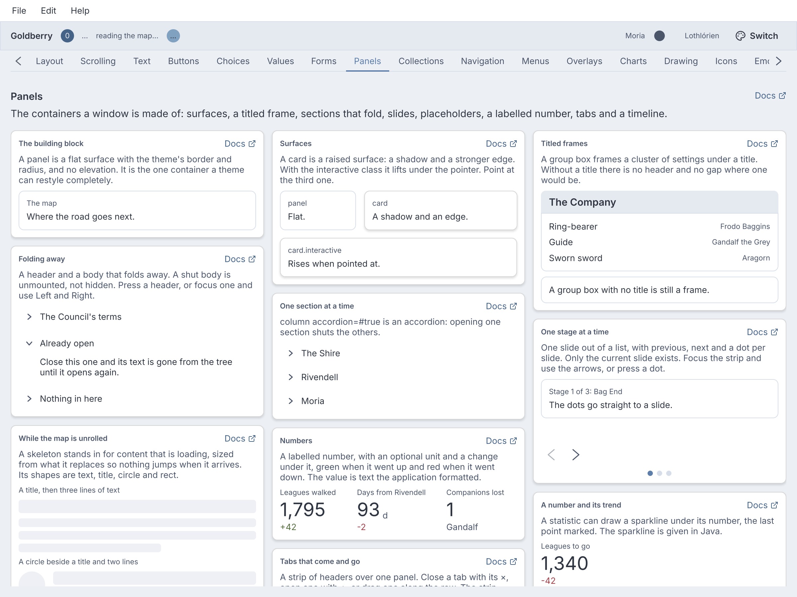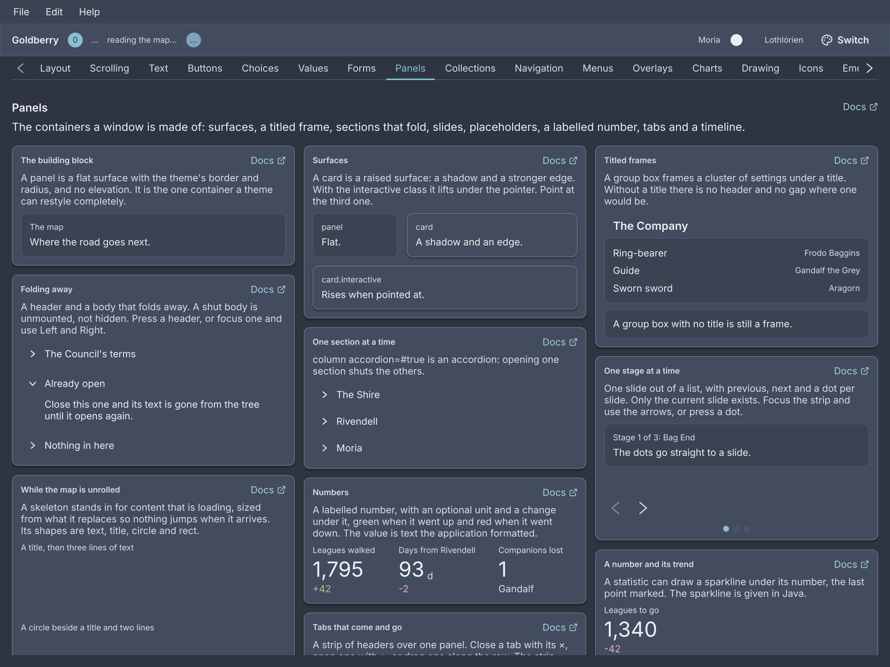<p>The Panels screen of the showcase.</p></div>

## `panel`

The building block: a flat surface with the theme's border and radius, and no
elevation.

<div class="gb-shot">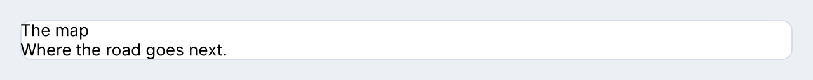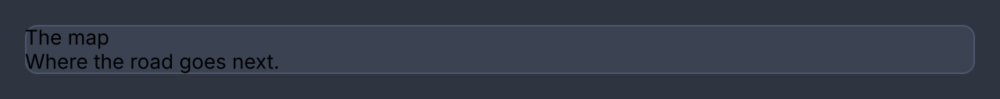<p>A surface with two lines of text.</p></div>

<div class="gb-tabs">

```kdl
panel class="side" {
  text "The map"
  text "Where the road goes next."
}
```

```java
new Panel(
        new Text("The map"),
        new Text("Where the road goes next.")
).styled("side");
```

</div>

**Attributes**

| Attribute | Type | Default | What it does |
|---|---|---|---|
| `id`, `class` | string | | The usual. Any children. |

**Styling**

The CSS type is `panel`: a column, `--gb-surface`, a 1px `--gb-border`, radius
8. No parts, no pseudo-classes, no variants. It is the one container a theme
can restyle completely.

## `card`

A raised surface: a shadow and a stronger edge, level 1 of the design system's
ladder, lifting to level 2 under the pointer when asked.

<div class="gb-shot">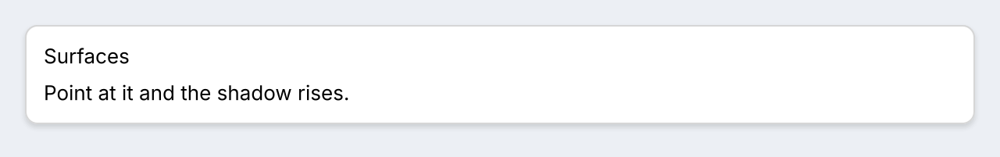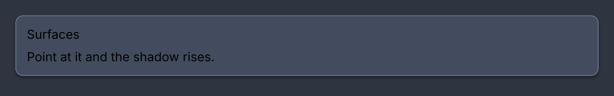<p>An interactive card at rest.</p></div>

<div class="gb-tabs">

```kdl
card class="interactive" {
  text class="card-title" "Surfaces"
  text "Point at it and the shadow rises."
}
```

```java
new Card(
        new Text("Surfaces").styled("card-title"),
        new Text("Point at it and the shadow rises.")
).styled("interactive");
```

</div>

The edge stays even though there is a shadow, because a card on another card
casts onto the same colour and only the rim tells them apart. The shadow is
`--gb-elevation-1`, which each theme ships.

**Attributes**

| Attribute | Type | Default | What it does |
|---|---|---|---|
| `id`, `class` | string | | The usual. Any children. |

**Styling**

The CSS type is `card`: `--gb-surface-raised`, a 1px `--gb-border-strong`,
radius 8, padding 12, gap 8. The variant class `interactive` adds a hover
elevation: `card.interactive:hover` takes the accent edge and
`--gb-elevation-2`, with the blur, offset and alpha moving together. It is
opt-in, because a card that lit up would promise it does something.

## `group-box`

A titled frame for a cluster of settings. The frame goes round both the title
and the content.

<div class="gb-shot">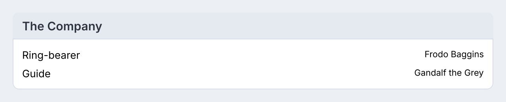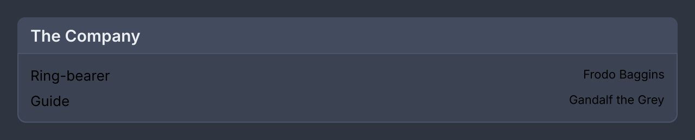<p>A title and two rows.</p></div>

<div class="gb-tabs">

```kdl
group-box title="The Company" {
  row { text "Ring-bearer"; spacer; text class="caption" "Frodo Baggins" }
  row { text "Guide"; spacer; text class="caption" "Gandalf the Grey" }
}
```

```java
new GroupBox("The Company",
        new Row(new Text("Ring-bearer"), new Spacer(), new Text("Frodo Baggins").styled("caption")),
        new Row(new Text("Guide"), new Spacer(), new Text("Gandalf the Grey").styled("caption")));
```

</div>

**Attributes**

| Attribute | Type | Default | What it does |
|---|---|---|---|
| `title` | string | none | The header row. Without it there is no header and no gap where one would be. |
| `id`, `class` | string | | The usual. Any children. |

The title is a property and not the argument, because the argument position is
where a container's children start and `group-box "Appearance" { … }` would
read as content.

**Styling**

The CSS type is `group-box`. Its parts are `group-box-title`, a tinted header
ruled off from the body with `--gb-surface-2` and `--gb-font-heading`, and
`group-box-body`. The title part is absent when there is no title. A legend
cut through the border is not available.

## `collapse`

A header and a body that folds away. The body is unmounted while closed, not
hidden, so a shut section holds no subscriptions for content nobody can see.

<div class="gb-shot">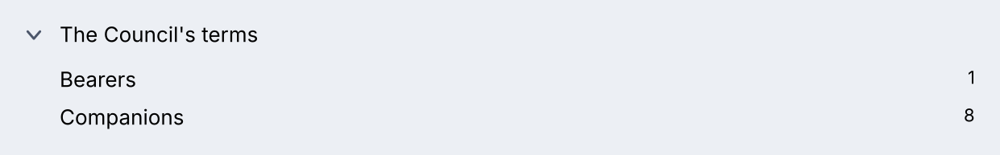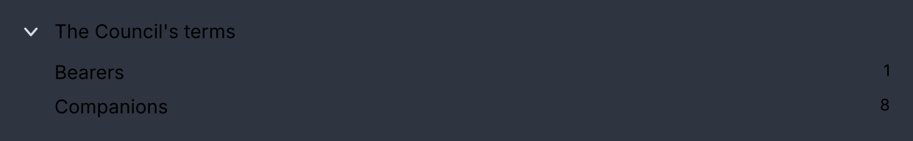<p>Open, with its chevron turned.</p></div>

<div class="gb-tabs">

```kdl
collapse title="The Council's terms" open=#true {
  row { text "Bearers"; spacer; text class="caption" "1" }
  row { text "Companions"; spacer; text class="caption" "8" }
}
```

```java
new Collapse("The Council's terms",
        new Row(new Text("Bearers"), new Spacer(), new Text("1").styled("caption")),
        new Row(new Text("Companions"), new Spacer(), new Text("8").styled("caption")));
```

</div>

A collapse keeps whether it is open. Name a `toggle` action and it stops
keeping it: the header then raises `"true"` or `"false"` and the section is as
open as `open` says. The Java form is
`new Collapse(title, open, onToggle, children...)`.

**An accordion is a column.** `column accordion=#true` inflates to an
`Accordion` that re-issues each `collapse` child so only one is open at a time.
A section the application already controls is left alone, and from markup an
accordion starts with every section shut.

<div class="gb-tabs">

```kdl
column accordion=#true {
  collapse title="The Shire" { text "Second breakfast kept." }
  collapse title="Rivendell" { text "Council held." }
  collapse title="Moria" { text "Doors: Mellon." }
}
```

```java
new Accordion(
        new Collapse("The Shire", new Text("Second breakfast kept.")),
        new Collapse("Rivendell", new Text("Council held.")),
        new Collapse("Moria", new Text("Doors: Mellon."))
);
```

</div>

**Attributes**

| Attribute | Type | Default | What it does |
|---|---|---|---|
| `title` | string | `""` | The header's text. |
| `open` | boolean | `#false` | The initial state, or the state itself once `toggle` is named. |
| `toggle` | action name | none | Called with `"true"` or `"false"` when the header is pressed. Naming it makes the section controlled. |
| `id`, `class` | string | | The usual. The children are the body. |

**Styling**

The CSS type is `collapse`, with the class `open` while it is. Its parts are
`collapse-header`, which matches `:hover`, `:focus-visible` and `:checked`
while open, `collapse-chevron`, which rotates 90° through `.open`, and
`collapse-body`. The header is 40px, 36 at compact density. The body does not
animate, because height is not on the motion whitelist and the body is not
there while closed.

**Keyboard**

The header is the one Tab stop.

| Key | Does |
|---|---|
| `Enter`, `Space` | toggles |
| `Right` | opens |
| `Left` | closes |

## `carousel`

One slide visible out of a list, with previous and next and a dot per slide.
Only the current slide exists; the others are dropped when you leave them.

<div class="gb-shot">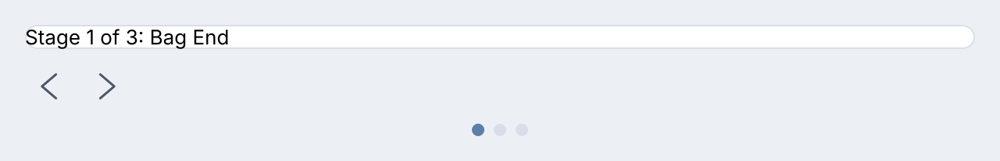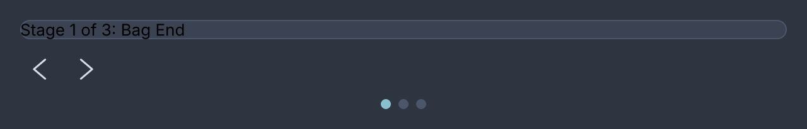<p>The first of three slides.</p></div>

<div class="gb-tabs">

```kdl
carousel loop=#true interval=5000 {
  panel class="slide" { text "Stage 1 of 3: Bag End" }
  panel class="slide" { text "Stage 2 of 3: Rivendell" }
  panel class="slide" { text "Stage 3 of 3: Moria" }
}
```

```java
var slides = List.of(
        new Panel(new Text("Stage 1 of 3: Bag End")).styled("slide"),
        new Panel(new Text("Stage 2 of 3: Rivendell")).styled("slide"),
        new Panel(new Text("Stage 3 of 3: Moria")).styled("slide")
);
new Carousel(0, null, true, Duration.ofSeconds(5), slides, Attributes.NONE);
```

</div>

`new Carousel(Widget... slides)` is the short form: no loop, no rotation. Name
a `change` action and the carousel becomes controlled, showing the slide
`index` names and raising the index it would like next.

Nothing advances on its own unless `interval` is set. When it is, rotation
has three brakes: it pauses while the pointer is over the strip, while the
keyboard is anywhere inside it, and entirely under reduced motion. Without
`loop` it also stops at the last slide.

**Attributes**

| Attribute | Type | Default | What it does |
|---|---|---|---|
| `index` | number | `0` | The slide shown, clamped into range. |
| `loop` | boolean | `#false` | Whether next on the last slide goes to the first. |
| `interval` | number, ms | `0` | How often to advance on its own. `0` is never. |
| `change` | action name | none | Called with the wanted index. Naming it makes the carousel controlled. |
| `id`, `class` | string | | The usual. Each child is one slide. |

**Styling**

The CSS type is `carousel`, with the class `rotating` while an interval runs.
Its parts are `carousel-viewport`, `carousel-controls` holding two
`carousel-step` buttons with the classes `previous` and `next`, and
`carousel-dots` of `carousel-dot`, shown only with more than one slide. A step
matches `:hover`, `:active`, `:focus-visible` and `:disabled` at an end of a
non-looping strip. The current dot matches `:checked`. The steps are
`button.ghost.circle`'s shape, the dots 8px.

**Keyboard**

The strip is one Tab stop when it has two or more slides.

| Key | Does |
|---|---|
| `Left`, `Right` | previous and next slide |
| `Home`, `End` | the first and last slide |
| `Enter`, `Space` | on a focused step button, presses it |

## `skeleton`

The placeholder a widget shows while its data loads, sized from the typography
token it stands in for so the layout does not jump when the content arrives.

<div class="gb-shot">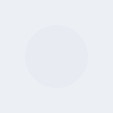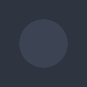<p>Circle, title and two lines of text.</p></div>

<div class="gb-tabs">

```kdl
row {
  skeleton shape="circle"
  column {
    skeleton shape="title"
    skeleton shape="text" lines=2
  }
}
```

```java
new Row(
        new Skeleton(Skeleton.Shape.CIRCLE),
        new Column(
                new Skeleton(Skeleton.Shape.TITLE),
                new Skeleton(Skeleton.Shape.TEXT, 2, Attributes.NONE)
        )
);
```

</div>

A shimmer is a loop, and the design system allows one decoration to loop. It is
an opacity pulse between 0.45 and 1.0 over a second, held at its dimmest under
reduced motion.

**Attributes**

| Attribute | Type | Default | What it does |
|---|---|---|---|
| `shape` | `"text"`, `"title"`, `"circle"`, `"rect"` | `"text"` | What it stands in for. Any other word is refused. |
| `lines` | number | `3` | How many bars a `text` skeleton draws. Fewer than one is refused. |
| `id`, `class` | string | | The usual. Children are ignored. |

`new Skeleton()` is three lines of text.

**Styling**

The CSS type is `skeleton`, and both it and each `skeleton-bar` carry the class
`shape-text`, `shape-title`, `shape-circle` or `shape-rect`. The last bar of a
multi-line text skeleton also carries `last` and is 60% wide. Radius 4, or full
for a circle.

## `statistic`

A labelled number: a value in the display size, a caption over it, and an
optional unit, delta and sparkline.

<div class="gb-shot">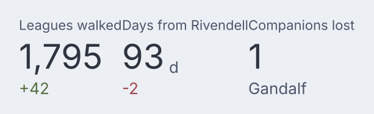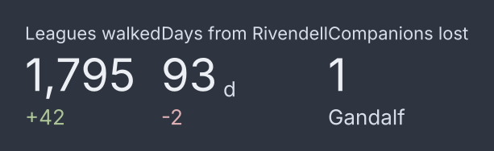<p>A label, a value, a unit and a delta.</p></div>

<div class="gb-tabs">

```kdl
row {
  statistic label="Leagues walked" value="1,795" delta="+42" direction="up"
  statistic label="Days from Rivendell" value="93" unit="d" delta="-2" direction="down"
  statistic label="Companions lost" value="1" delta="Gandalf"
}
```

```java
new Row(
        new Statistic("Leagues walked", "1,795").delta("+42", Statistic.Direction.UP),
        new Statistic("Days from Rivendell", "93").unit("d").delta("-2", Statistic.Direction.DOWN),
        new Statistic("Companions lost", "1").delta("Gandalf", Statistic.Direction.NONE)
);
```

</div>

The value is a string. Formatting is the application's, because a number
formatted inside the toolkit makes a golden image that depends on the
machine's locale.

**Attributes**

| Attribute | Type | Default | What it does |
|---|---|---|---|
| `label` | string | required | The caption. |
| `value` | string | required | The number, as text. |
| `unit` | string | none | Drawn after the value, smaller. |
| `delta` | string | none | A change, drawn under the value. |
| `direction` | `"up"`, `"down"`, `"none"` | `"none"` | Colours the delta `--gb-success` or `--gb-danger`. |
| `id`, `class` | string | | The usual. Children are ignored. |

A sparkline is Java only: `.sparkline(Sparkline)` takes the
[`sparkline`](charts.md) widget and draws it 64×24 under the number.

**Styling**

The CSS type is `statistic`. Its parts are `statistic-label`,
`statistic-value` holding `statistic-unit`, and `statistic-delta`, which
carries the class `up` or `down`.

## `tabs`

A strip of headers over one panel: pick a tab and its content is built, leave
it and the content is dropped, unless the strip is told to keep it.

<div class="gb-shot">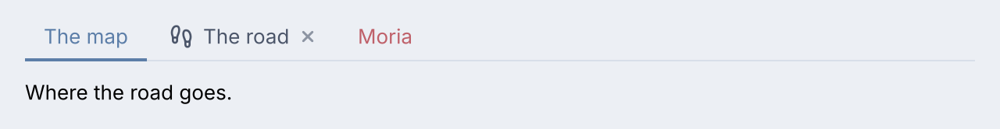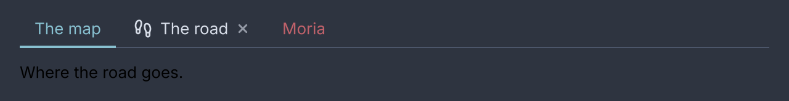<p>Three tabs, one closable, one coloured.</p></div>

<div class="gb-tabs">

```kdl
tabs value="map" change="app.pick-tab" close="app.close-tab" new="app.new-tab" {
  tab value="map" "The map" {
    text "Where the road goes."
  }
  tab value="road" icon="footprints" closable=#true "The road" {
    text "How far it is."
  }
  tab value="moria" colour="#bf616a" "Moria" {
    text "Avoid."
  }
}
```

```java
new Tabs("map",
        new Tab("map", "The map", new Text("Where the road goes.")),
        new Tab("road", "The road", new Text("How far it is.")).icon(footprints).closable(true),
        new Tab("moria", "Moria", new Text("Avoid.")).colour(0xFFBF616A))
    .onChange(actions::pickTab)
    .onClose(actions::closeTab)
    .onNew(actions::newTab);
```

</div>

The strip is a model, a header and a panel. Which tab is selected is `value`,
or the bound value, and the strip reports what the user wants through
`change`, `close` and `new`. Adding and removing tabs needs no API: rebuild
with a different list. A header row too wide for the strip pages from its
ends. `keep-alive` hides a left tab's content instead of dropping it, for an
editor whose state is costly to rebuild. Reordering by drag is Java only,
through `onReorder(BiConsumer<String, Integer>)`.

**Attributes**

| Attribute | Type | Default | What it does |
|---|---|---|---|
| `value` | string | none | The selected tab's value, when nothing is bound. |
| `bind` | path | none | A value to read the selection from instead. |
| `change` | action name | none | Called with the value of the tab the user picked. |
| `close` | action name | none | Called with the value of the tab whose × was pressed. |
| `new` | action name | none | Adds a `+` button after the tabs and calls this when it is pressed. |
| `keep-alive` | boolean | `#false` | Keeps a left tab's content mounted and hidden. |
| `id`, `class` | string | | The usual. |

`new Tabs(String value, Widget... tabs)` is the Java form, with `onChange`,
`onClose`, `onNew`, `keepAlive`, `onReorder` and `bound` after it. Children
that are not `tab`s are placed in the header row.

**Styling**

The CSS type is `tabs`. The header is a `tab-list` holding a `tab-rule`, a
`scroll.tab-viewport` of `tab`s, and while they overflow a `tab-pager` at each
end with the class `start` or `end`. Each `tab` matches `:hover`, `:checked`
and `:focus-visible`, and holds a `tab-indicator` that matches `:checked` and
travels between tabs, a `tab-close` on a closable one, and the strip ends in
`tab-new` when `new` is wired. The content is `tab-panel`, and under
`keep-alive` each kept tab is a `tab-page`. A tab is 36px with a 2px accent
indicator.

**Keyboard**

The strip is one Tab stop.

| Key | Does |
|---|---|
| `Left`, `Right` | move between the tab headers and the `+` button, without selecting |
| `Enter`, `Space` | select the focused tab, or press `+` |
| `Delete` | closes the focused tab, when it is closable |
| `Tab` | leaves the strip for its content |

### `tab`

One tab: the value its strip reports, a label, and the content shown while it
is selected.

<div class="gb-shot">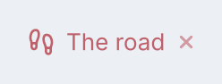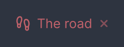<p>A closable tab with an icon and a colour.</p></div>

<div class="gb-tabs">

```kdl
tab value="road" icon="footprints" colour="#bf616a" closable=#true "The road" {
  text "How far it is."
}
```

```java
new Tab("road", "The road", new Text("How far it is."))
        .icon(footprints)
        .colour(0xFFBF616A)
        .closable(true);
```

</div>

**Attributes**

| Attribute | Type | Default | What it does |
|---|---|---|---|
| `value` | string | required | What the strip matches on and reports. Missing is refused. |
| argument | string | `""` | The label. A tab with neither a label nor an icon is refused. |
| `icon` | icon name | none | An icon before the label. |
| `colour`, `color` | CSS colour | the theme's | The indicator's colour, written as a stylesheet writes one. |
| `closable` | boolean | `#false` | Adds a × and lets `Delete` close it. |
| `id`, `class` | string | | The usual. The children are the content. |

> [!WARNING]
> Two tabs with the same `value` are one tab: the later replaces the earlier
> one's content and nothing reports it.

## `timeline`

An ordered list of entries along an axis, each with a marker, a label, an
optional time and optional body.

<div class="gb-shot">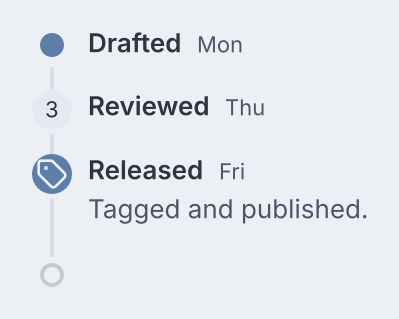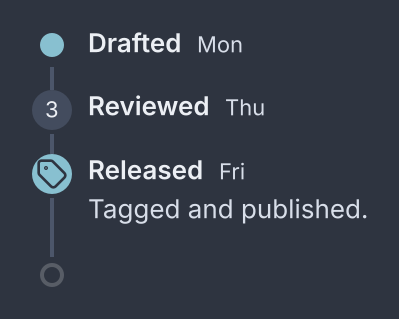<p>A dot, a badge and an icon as markers, and a pending end.</p></div>

<div class="gb-tabs">

```kdl
timeline pending=#true {
  entry time="Mon" "Drafted"
  entry time="Thu" "Reviewed" {
    marker { badge "3" }
  }
  entry time="Fri" icon="tag" "Released" {
    text "Tagged and published."
  }
}
```

```java
new Timeline(
        new Entry("Drafted").at("Mon"),
        new Entry("Reviewed").at("Thu").withMarker(new Badge("3")),
        new Entry("Released", new Text("Tagged and published.")).at("Fri").withIcon(tag)
).pending(true);
```

</div>

The line goes on: `pending` draws a trailing unfilled marker after the last
entry for what happens next, which is what tells a timeline from a list with
dots.

**Attributes**

| Attribute | Type | Default | What it does |
|---|---|---|---|
| `direction` | `"vertical"`, `"horizontal"` | `"vertical"` | Which way the axis runs. |
| `align` | `"start"`, `"alternate"` | `"start"` | Every entry on one side, or alternating sides. |
| `pending` | boolean | `#false` | A trailing empty marker. |
| `id`, `class` | string | | The usual. `entry` children sit on the axis, anything else passes through. |

An unknown `direction` or `align` falls back to the default without complaint.

**Styling**

The CSS type is `timeline`, with the classes `horizontal` and `alternate`. Each
`entry` carries `end` on the alternate side and `pending` on the trailing
marker. An entry is a `timeline-rail`, holding a `timeline-marker-cell` with
the `timeline-marker` and a `timeline-line`, beside a `timeline-side` holding
`timeline-body`, `timeline-head`, `timeline-label`, `timeline-time` and
`timeline-content`. The marker carries `icon`, `widget` or `pending`. Marker
12px, axis 2px in `--gb-border`, rail 20 wide.

### `entry`

One event: a label, an optional time, and a marker that is a dot, an icon, or
any widget.

<div class="gb-shot">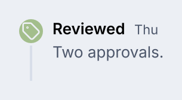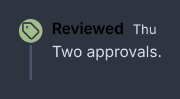<p>An entry with an icon, a colour and a body.</p></div>

<div class="gb-tabs">

```kdl
entry time="Thu" icon="tag" colour="#a3be8c" "Reviewed" {
  text "Two approvals."
}
```

```java
new Entry("Reviewed", new Text("Two approvals."))
        .at("Thu")
        .withIcon(tag)
        .colour(0xFFA3BE8C);
```

</div>

**Attributes**

| Attribute | Type | Default | What it does |
|---|---|---|---|
| argument | string | required | The label. |
| `time` | string | none | The timestamp after the label, in `caption`. |
| `icon` | icon name | none | Drawn in a 20px disc as the marker. |
| `colour`, `color` | CSS colour | the theme's | The marker's colour. |
| `id`, `class` | string | | The usual. One `marker` child is the marker; every other child is the body. |

Two `marker` children are refused.

### `marker`

The thing drawn on the axis instead of a dot: exactly one widget.

<div class="gb-tabs">

```kdl
marker { badge "v2" }
```

```java
new EntryMarker(new Badge("v2"));
```

</div>

It takes exactly one child and no attributes of its own. The child is drawn
under `timeline-marker.widget`. In Java, `Entry.withMarker(Widget)` is the
usual route.
