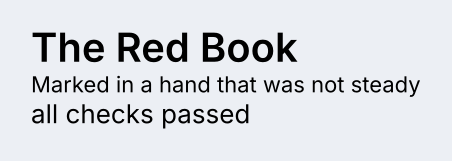
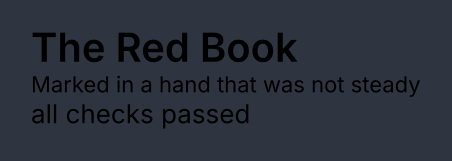
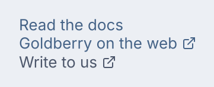
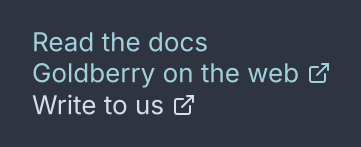

# Text and links

<p class="gb-lede">A run of text that wraps where layout puts it, and a word that goes somewhere when pressed.</p>

By the end of this chapter you can put a label on screen at any rank of the type
scale, bind it to a value, and make a word open a screen or a web page.

## `text`

A `text` is one run of text. It wraps at the width layout gives it and nothing
else about it is decided in Java.

<div class="gb-shot"><p>A title, a caption and a bound value.</p></div>

<div class="gb-tabs">

```kdl
column {
  text style="title" "The Red Book"
  text class="caption" "Marked in a hand that was not steady"
  text bind="app.status" "checking…"
}
```

```java
import dev.goldberry.widgets.text.Text;
import dev.goldberry.widgets.text.TextRank;

new Column(
        new Text("The Red Book").style(TextRank.TITLE),
        new Text("Marked in a hand that was not steady").styled("caption"),
        Text.of("checking…", Models.observable(app, "app.status"))
);
```

</div>

The argument is what the text says. With `bind=`, the argument is the fallback
shown until the bound value answers, and a `null` value draws as nothing rather
than as the word `null`. The value is read at render, so a change that lands
between a build and a frame is in that frame.

### Attributes

| Attribute | Type | Default | What it does |
|---|---|---|---|
| argument | string | `""` | the text, or the fallback when `bind=` is set |
| `bind` | path | none | the value to follow, read-only |
| `style` | rank name | none | one of the seven ranks below, added as a class; a name that is not one is refused |
| `class` | string | none | CSS classes, space-separated |
| `id` | string | none | the node's id, which is also its reconciliation key |
| `tooltip` | string | none | text shown on hover |
| `context-menu` | string | none | the name of a menu a right-click opens |
| `name` | string | none | the accessible name |

`style=` and `class=` are two spellings of one thing. `text style="title"` and
`text class="title"` both put the class `title` on the node, and a rule written
`text.title` matches either. The difference is that `style=` is checked when the
document inflates ([ADR-0381](https://github.com/DigitalSmile/goldberry/blob/master/book/src/adr/0381-a-rank-has-two-spellings-and-one-meaning.md)).

### The type scale

The ranks are classes in `controls.css`. They inherit, so a class on a container
reaches every label under it.

| Class | Face | Size / line |
|---|---|---|
| `display` | Inter 600 | 28 / 34 |
| `title` | Inter 600 | 20 / 26 |
| `heading` | Inter 600 | 15 / 20 |
| `body` | Inter 400 | 13 / 18 |
| `body-strong` | Inter 600 | 13 / 18 |
| `caption` | Inter 400 | 11 / 14 |
| `mono` | JetBrains Mono 400 | 13 / 18 |

The sizes are the theme's tokens, `--gb-font-title` and so on, so a large-text
theme moves every rank at once. The showcase's `rank-display` and `card-title`
classes are its own stylesheet's and not the toolkit's.

### Wrapping and cutting

A `text` is a measured leaf: layout proposes a width, the paragraph wraps at it,
and the height that comes back sizes the box. The paragraph is shaped once and
re-wrapped by arithmetic
([ADR-0036](https://github.com/DigitalSmile/goldberry/blob/master/book/src/adr/0036-the-paragraph-is-shaped-once-and-wrapped-many-times.md)).

To keep a label on one line, the stylesheet says so:

```css
text.name { white-space: nowrap; text-overflow: ellipsis }
```

`nowrap` stops the wrap and `ellipsis` marks the cut
([ADR-0255](https://github.com/DigitalSmile/goldberry/blob/master/book/src/adr/0255-a-label-that-does-not-fit-is-cut-not-wrapped.md)).
`text-align` places the lines inside the box.

Static text cannot be selected or copied. A `text-input` with
`read-only=#true` shows text a user can select, in
[Fields and forms](forms.md#text-input).

Inline runs are not built. There is no `span` node, so a sentence with two
styles is two `text` nodes in a `row`.

An emoji in a line is routed to the colour face and drawn in layers, and the
face is a module an application opts into. See
[Text](../guide/text.md) and
[ADR-0393](https://github.com/DigitalSmile/goldberry/blob/master/book/src/adr/0393-an-emoji-is-routed-by-the-text-and-drawn-in-layers.md).

### Styling

- CSS type `text`.
- No parts.
- No pseudo-classes of its own. It is not focusable and takes no hover.
- Classes: the seven ranks above, and whatever the document writes.

A `text` sets no colour. `color` inherits from the nearest ancestor that sets
one, which is a `card`, a `panel` or the window
([ADR-0066](https://github.com/DigitalSmile/goldberry/blob/master/book/src/adr/0066-a-weight-is-a-face-and-color-inherits.md)).

### Keyboard

None. A `text` is not a Tab stop.

### Read more

- [ADR-0381: a rank has two spellings and one meaning](https://github.com/DigitalSmile/goldberry/blob/master/book/src/adr/0381-a-rank-has-two-spellings-and-one-meaning.md)
- [ADR-0062: bind is a path and nothing else](https://github.com/DigitalSmile/goldberry/blob/master/book/src/adr/0062-bind-is-a-path-and-nothing-else.md)
- [ADR-0036: the paragraph is shaped once and wrapped many times](https://github.com/DigitalSmile/goldberry/blob/master/book/src/adr/0036-the-paragraph-is-shaped-once-and-wrapped-many-times.md)
- [ADR-0255: a label that does not fit is cut, not wrapped](https://github.com/DigitalSmile/goldberry/blob/master/book/src/adr/0255-a-label-that-does-not-fit-is-cut-not-wrapped.md)
- [ADR-0267: a text scale scales the text and not the layout](https://github.com/DigitalSmile/goldberry/blob/master/book/src/adr/0267-a-text-scale-scales-the-text-and-not-the-layout.md)

## `link`

A `link` is a word that does something: it runs an action, opens a URL through
the desktop, or both.

<div class="gb-shot"><p>An action link, an external link and a visited one.</p></div>

<div class="gb-tabs">

```kdl
column {
  link action="app.show-docs" "Read the docs"
  link href="https://goldberry.dev" "Goldberry on the web"
  link href="mailto:hello@example.org" visited=#true "Write to us"
}
```

```java
import dev.goldberry.widgets.text.Link;

new Column(
        new Link("Read the docs", actions::showDocs),
        Link.external("Goldberry on the web", "https://goldberry.dev"),
        Link.external("Write to us", "mailto:hello@example.org").visited(true)
);
```

</div>

`action=` is in-app navigation. `href=` is handed to the desktop's own handler
for its scheme through `Host.openExternal`, and the link logs a warning when
the platform refuses it. A link with both runs the action and then opens the
target. A link with neither is a word in the link ink that takes no focus.

An external link draws the toolkit's 12 px `external-link` icon after the word.
That icon is the one icon the toolkit builds itself, and the link's state owns
it ([ADR-0346](https://github.com/DigitalSmile/goldberry/blob/master/book/src/adr/0346-a-link-is-a-word-and-the-desktop-opens-the-rest.md)).

### Attributes

| Attribute | Type | Default | What it does |
|---|---|---|---|
| argument | string | required | the word; an empty label is refused |
| `action` | action name | none | what an in-app link runs |
| `href` | string | none | what an external link opens |
| `visited` | boolean | `#false` | adds the `visited` class; the toolkit keeps no history, so this is the application's to set |
| `class`, `id`, `tooltip`, `context-menu`, `name` | | | as on every widget |

### Styling

- CSS type `link`. The record builds a node of this type. There are no parts.
- Pseudo-classes: `:hover` underlines, `:focus-visible` takes the standard ring.
- Classes: `visited` takes `--gb-text-muted`; `external` is set when `href=` is present.

The underline is `text-decoration: underline` in `controls.css`, drawn at the
face's own position and thickness
([ADR-0321](https://github.com/DigitalSmile/goldberry/blob/master/book/src/adr/0321-a-rule-under-text-belongs-to-the-face.md)). The ink is
`--gb-button-link-text`, a token measured for 4.5:1 on every surface, and not
the accent.

A `link` is block-level: a row of a word and sometimes an icon, on a line of its
own. It is not `button.link`, which is a button that reads as text and sits in a
toolbar. See [Buttons, badges and chips](buttons.md#button).

### Keyboard

| Key | Does |
|---|---|
| `Tab` | reaches it, when it has an action or an `href` |
| `Enter` | follows it |

`Space` does not activate a link, which is every browser's rule. A link with
nothing behind it is not a Tab stop.

### Read more

- [ADR-0346: a link is a word, and the desktop opens the rest](https://github.com/DigitalSmile/goldberry/blob/master/book/src/adr/0346-a-link-is-a-word-and-the-desktop-opens-the-rest.md)
- [ADR-0321: a rule under text belongs to the face](https://github.com/DigitalSmile/goldberry/blob/master/book/src/adr/0321-a-rule-under-text-belongs-to-the-face.md)
- [ADR-0293: a button that reads as a link](https://github.com/DigitalSmile/goldberry/blob/master/book/src/adr/0293-a-button-that-reads-as-a-link.md)
