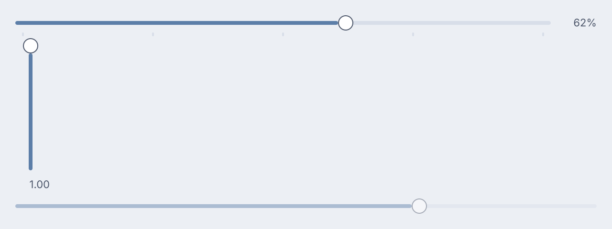
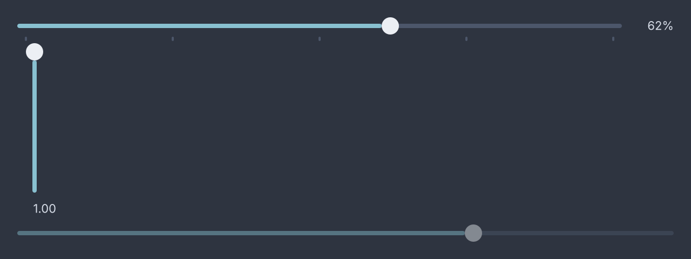
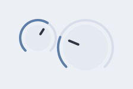
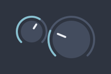
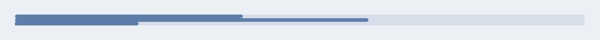
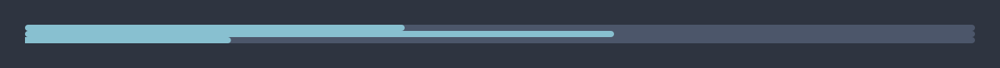
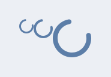
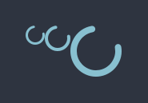

# Values and progress

<p class="gb-lede">Two controls whose value is a number, and two that report one back.</p>

By the end of this chapter you can bind a slider or a knob to a numeric value,
snap it to steps, label it, give a fader a decibel taper, and show progress
that is known or unknown.

A slider and a knob are controlled like every other control. Dragging raises
`change` with the value asked for, the application sets the property, and the
thumb moves when the bound value does
([ADR-0063](https://github.com/DigitalSmile/goldberry/blob/master/book/src/adr/0063-data-flows-down-events-flow-up.md)). The bound value
is any `Number`. Anything else leaves the written `value` standing.

## `slider`

A `slider` is a thumb on a track whose position is a number between `min` and
`max`.

<div class="gb-shot"><p>Horizontal, vertical, and disabled.</p></div>

<div class="gb-tabs">

```kdl
column {
  slider min=0 max=100 step=5 ticks=5 format="%.0f%%" bind="audio.gain" change="audio.set-gain"
  slider class="vertical" scale="db" max=1 format="%.2f" bind="audio.gain" change="audio.set-gain" commit="audio.seek"
  slider min=0 max=100 value=70 disabled=#true
}
```

```java
import dev.goldberry.widgets.controls.slider.Slider;
import dev.goldberry.widgets.controls.Scale;

new Column(
        Slider.of(0, 100, 5, Models.observable(audio, "audio.gain"), actions::setGain)
            .ticks(5)
            .format("%.0f%%"),
        Slider.of(0, 1, 0, Models.observable(audio, "audio.gain"), actions::setGain)
            .scale(Scale.decibels())
            .format("%.2f")
            .onCommit(actions::seek)
            .styled("vertical"),
        new Slider(0, 100, 70, 0, null).disabled(true)
);
```

</div>

The control snaps and clamps so no application has to. Steps count from `min`,
an arrow offers the next reachable value, and both ends are always reachable
even when the range is not a whole number of steps.

`format=` is a `String.format` pattern over a `double`, checked when the slider
is built. `format="%d"` is refused at inflation rather than on the first frame
with a value to draw.

`scale="db"` places a linear gain at a position that is linear in decibels,
with the floor at −60 dB. Half gain sits 90% of the way up and the bottom of
the travel is silence exactly
([ADR-0080](https://github.com/DigitalSmile/goldberry/blob/master/book/src/adr/0080-a-value-is-measured-along-a-part.md)). It needs
`min >= 0` and `max > 0`.

`commit=` is told the settled value when a press or drag is released and after
each key step, for work that should not run per drag step, such as a media
seek ([ADR-0464](https://github.com/DigitalSmile/goldberry/blob/master/book/src/adr/0464-a-slider-says-when-a-gesture-ends.md)). In Java,
`spans(List<Slider.Span>)` marks stretches of the range in the groove, such as
a seek bar's buffered ranges
([ADR-0466](https://github.com/DigitalSmile/goldberry/blob/master/book/src/adr/0466-a-slider-marks-spans-of-its-range.md)). A document
cannot write them.

### Attributes

| Attribute | Type | Default | What it does |
|---|---|---|---|
| `min` | number | `0` | the low end |
| `max` | number | `1` | the high end; must be above `min` |
| `value` | number | `min` | the written value |
| `step` | number | `0` | the grid, counted from `min`; `0` is continuous |
| `ticks` | integer | `0` | tick marks along the travel, the ends included; `1` is refused |
| `format` | pattern | none | draws a value label from this `String.format` pattern |
| `scale` | `linear`, `db` | `linear` | how a value maps to a position |
| `bind` | path | none | a `Number` to follow |
| `change` | action name | none | told the value asked for, on every step of a drag |
| `commit` | action name | none | told the value when the gesture ends |
| `disabled` | boolean | `#false` | out of the Tab order, no gesture |
| `class`, `id`, `tooltip`, `context-menu`, `name` | | | as on every widget |

### Styling

- CSS type `slider`. The class `vertical` makes it a fader.
- Parts: `slider-track`, `slider-groove`, `slider-fill`, `slider-rest`, `slider-span`, `slider-thumb`, `slider-ticks`, `slider-tick`, `slider-value`.
- Pseudo-classes: `:hover` and `:active` on `slider-thumb`; `:focus-visible` and `:disabled` on the control.

The thumb lands `f` of the way along the track because `slider-fill` grows by
`f` and `slider-rest` by `1 - f`. Nothing in Java learns the track's width
([ADR-0079](https://github.com/DigitalSmile/goldberry/blob/master/book/src/adr/0079-a-continuous-value-is-placed-by-ratio.md)). The value
is measured along `slider-track` and not along the control, which is what
keeps a labelled slider honest at its far end.

Track 4, thumb 16 with a full radius and a 1 px edge, a hit target of at least
32 across. The ticks sit in a row of height 0 so two sliders in one list, one
with a scale and one without, sit at the same height.

### Keyboard

| Key | Does |
|---|---|
| `Tab` | reaches it, unless disabled |
| `Left`, `Down` | one step down |
| `Right`, `Up` | one step up |
| `PgDn`, `PgUp` | ten steps, or a tenth of the range when `step` is 0 |
| `Home`, `End` | `min`, `max` |

Every key step raises `change` and then `commit`. A key with a modifier is
left alone.

### Read more

- [ADR-0079: a continuous value is placed by ratio](https://github.com/DigitalSmile/goldberry/blob/master/book/src/adr/0079-a-continuous-value-is-placed-by-ratio.md)
- [ADR-0080: a value is measured along a part](https://github.com/DigitalSmile/goldberry/blob/master/book/src/adr/0080-a-value-is-measured-along-a-part.md)
- [ADR-0430: a slider maps the pointer over its travel](https://github.com/DigitalSmile/goldberry/blob/master/book/src/adr/0430-a-slider-maps-the-pointer-over-its-travel.md)
- [ADR-0464: a slider says when a gesture ends](https://github.com/DigitalSmile/goldberry/blob/master/book/src/adr/0464-a-slider-says-when-a-gesture-ends.md)
- [ADR-0466: a slider marks spans of its range](https://github.com/DigitalSmile/goldberry/blob/master/book/src/adr/0466-a-slider-marks-spans-of-its-range.md)

## `knob`

A `knob` is a rotary control: a dial with a pointer, an arc that fills as the
value rises, and a vertical drag as its gesture.

<div class="gb-shot"><p>A detented knob and a large circular one.</p></div>

<div class="gb-tabs">

```kdl
row {
  knob min=0 max=100 step=5 detents=5 bind="audio.gain" change="audio.set-gain"
  knob class="large" drag="circular" bind="audio.pan" change="audio.set-pan"
}
```

```java
import dev.goldberry.widgets.controls.knob.Knob;

new Row(
        Knob.of(0, 100, 5, Models.observable(audio, "audio.gain"), actions::setGain).detents(5),
        Knob.of(0, 1, 0, Models.observable(audio, "audio.pan"), actions::setPan)
            .circular(true)
            .styled("large")
);
```

</div>

Dragging up turns it up: 200 px of drag is the whole range, and `Shift` makes
the drag ten times finer. The gesture is a rate from where the press started,
so the value does not jump to the pointer
([ADR-0089](https://github.com/DigitalSmile/goldberry/blob/master/book/src/adr/0089-a-knobs-gesture-is-a-rate.md)). A click on the ring
positions the value at that angle. A click on the dial grabs it and does not
jump. The wheel steps it, down the document is down.

`drag="circular"` turns the knob round its dial instead, following the angle
of the pointer, and refuses to jump across the gap at the bottom
([ADR-0369](https://github.com/DigitalSmile/goldberry/blob/master/book/src/adr/0369-a-knob-turns-round-its-dial-from-its-own-value.md)).

Detents are positions the value is pulled to when a drag comes within a
quarter of their spacing. Five detents over 0 to 100 are 0, 25, 50, 75 and 100.

### Attributes

| Attribute | Type | Default | What it does |
|---|---|---|---|
| `min` | number | `0` | the low end |
| `max` | number | `1` | the high end; must be above `min` |
| `value` | number | `min` | the written value |
| `step` | number | `0` | the grid; `0` is continuous |
| `detents` | integer | `0` | positions a drag is pulled to, the ends included; `1` is refused |
| `drag` | `circular` | none | turn round the dial instead of up and down |
| `bind` | path | none | a `Number` to follow |
| `change` | action name | none | told the value asked for |
| `disabled` | boolean | `#false` | out of the Tab order, no gesture |
| `class`, `id`, `tooltip`, `context-menu`, `name` | | | as on every widget |

There is no `commit=` on a knob.

### Styling

- CSS type `knob`. The class `large` makes it 48 instead of 32.
- Parts: `knob-track`, the full arc in the muted ink; `knob-arc`, the filled part; `knob-dial`, the disc with the pointer.
- Pseudo-classes: `:hover` and `:active` on `knob-dial`; `:focus-visible` and `:disabled` on the control.

The arc is 270 degrees starting at 7:30. The dial is inset 5 from the ring and
the pointer is a 2 px stroke in the dial's own colour token. The arc and the
pointer are strokes, so they take `color` like every other mark.

### Keyboard

| Key | Does |
|---|---|
| `Tab` | reaches it, unless disabled |
| `Left`, `Down` | one step down |
| `Right`, `Up` | one step up |
| `PgDn`, `PgUp` | ten steps, or a tenth of the range when `step` is 0 |
| `Home`, `End` | `min`, `max` |

The keys are always consumed, even at an end, so a knob at its maximum still
owns `Right` and focus does not leave it.

### Read more

- [ADR-0089: a knob's gesture is a rate](https://github.com/DigitalSmile/goldberry/blob/master/book/src/adr/0089-a-knobs-gesture-is-a-rate.md)
- [ADR-0369: a knob turns round its dial from its own value](https://github.com/DigitalSmile/goldberry/blob/master/book/src/adr/0369-a-knob-turns-round-its-dial-from-its-own-value.md)
- [ADR-0078: a focus scope has an axis](https://github.com/DigitalSmile/goldberry/blob/master/book/src/adr/0078-a-focus-scope-has-an-axis.md)

## `progress`

A `progress` bar reports a value out of a maximum, or that something is
happening and nobody can say how much is left.

<div class="gb-shot"><p>A value, a bound value, and indeterminate.</p></div>

<div class="gb-tabs">

```kdl
column {
  progress value=0.4
  progress max=100 bind="download.received"
  progress indeterminate=#true
}
```

```java
import dev.goldberry.widgets.controls.progressbar.Progress;

new Column(
        new Progress(0.4),
        Progress.of(100, Models.observable(download, "download.received")),
        Progress.sweeping()
);
```

</div>

A determinate bar's fill is a plain width, the value divided by `max` and
clamped to the track. An indeterminate bar sweeps by a `transform`, turns at
the ends rather than running off them, and keeps the frame loop awake while it
is on screen. Two indeterminate bars in one window are in step by
construction, because the phase is read from the clock and nothing is stored
([ADR-0081](https://github.com/DigitalSmile/goldberry/blob/master/book/src/adr/0081-a-perpetual-loop-has-no-state.md)).

### Attributes

| Attribute | Type | Default | What it does |
|---|---|---|---|
| `value` | number | `0` | the written value |
| `max` | number | `1` | what a full bar is; must be positive |
| `indeterminate` | boolean | `#false` | sweep instead of fill |
| `bind` | path | none | a `Number` to follow |
| `class`, `id`, `tooltip`, `context-menu`, `name` | | | as on every widget |

### Styling

- CSS type `progress`.
- Parts: `progress-fill`.
- Pseudo-classes: `:indeterminate`.

```css
progress-fill                        { background: var(--gb-progress-fill-bg) }
progress:indeterminate progress-fill { background: var(--gb-accent) }
```

Track height 4, full radius, `overflow: hidden` on the track so the sweep is
cut at both edges ([ADR-0418](https://github.com/DigitalSmile/goldberry/blob/master/book/src/adr/0418-the-indeterminate-bar-runs-off-both-edges.md)).
A value change moves the fill's width instantly and transitions its colour,
because `width` is not on the motion whitelist. Under reduced motion the sweep
holds still at a third of the track.

### Keyboard

None. A progress bar takes nothing back.

### Read more

- [ADR-0081: a perpetual loop has no state](https://github.com/DigitalSmile/goldberry/blob/master/book/src/adr/0081-a-perpetual-loop-has-no-state.md)
- [ADR-0418: the indeterminate bar runs off both edges](https://github.com/DigitalSmile/goldberry/blob/master/book/src/adr/0418-the-indeterminate-bar-runs-off-both-edges.md)

## `spinner`

A `spinner` is a ring that turns, for a wait with no measure.

<div class="gb-shot"><p>Three sizes.</p></div>

<div class="gb-tabs">

```kdl
row {
  spinner size="small"
  spinner
  spinner size="large"
}
```

```java
import dev.goldberry.widgets.controls.spinner.Spinner;
import dev.goldberry.widgets.controls.spinner.SpinnerSize;

new Row(
        new Spinner(SpinnerSize.SMALL),
        new Spinner(),
        new Spinner(SpinnerSize.LARGE)
);
```

</div>

Small sits beside a line of text or inside a busy control, medium is the
default, and large stands on its own for a region that is not ready. A full
turn takes 900 ms and the phase is the clock's, so every spinner in a window
turns together.

### Attributes

| Attribute | Type | Default | What it does |
|---|---|---|---|
| `size` | `small`, `medium`, `large` | `medium` | 12, 16 or 32 px; another word is refused |
| `class`, `id`, `tooltip`, `context-menu`, `name` | | | as on every widget |

### Styling

- CSS type `spinner`.
- No parts. The ring is a mark the widget paints.
- No pseudo-classes.
- Classes: `small`, `medium`, `large`, which the size puts on the node.

The diameter is the stylesheet's and the stroke is the widget's. `size=` puts
a class on the node, `controls.css` gives that class a width, and the widget
weights the stroke from the width the cascade resolved, so `#busy { width:
48px }` gets a stroke to match
([ADR-0447](https://github.com/DigitalSmile/goldberry/blob/master/book/src/adr/0447-a-spinner-has-a-size-because-a-ring-has-a-stroke.md)).
The ring takes `color`. Under reduced motion it stops.

### Keyboard

None.

### Read more

- [ADR-0447: a spinner has a size because a ring has a stroke](https://github.com/DigitalSmile/goldberry/blob/master/book/src/adr/0447-a-spinner-has-a-size-because-a-ring-has-a-stroke.md)
- [ADR-0081: a perpetual loop has no state](https://github.com/DigitalSmile/goldberry/blob/master/book/src/adr/0081-a-perpetual-loop-has-no-state.md)
