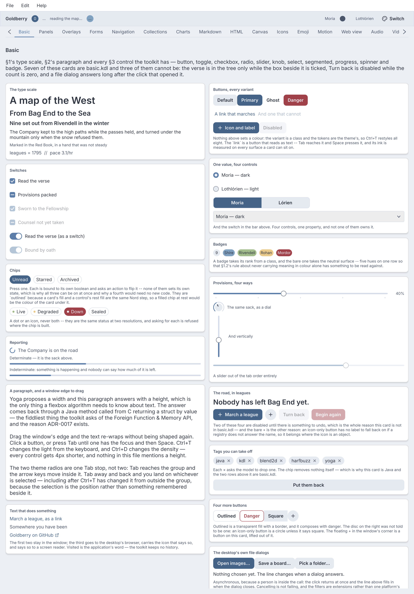
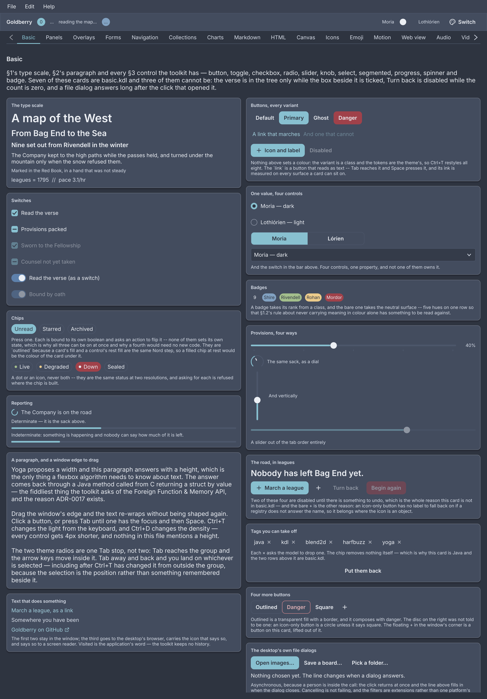

# Goldberry

<p class="gb-lede">A fast and modern UI toolkit for Java 25. A window is three lines, a screen is a KDL file that reloads while it runs, and the same application ships as a jar on any JDK or as one native binary with GraalVM.</p>

Goldberry is a declarative desktop UI toolkit written in pure Java over a small
set of native C libraries, bound through the Foreign Function & Memory API.
There is no JNI, no bundled web engine and no wrapping of platform widgets.
Widgets are immutable records with a pure `build()`, or the same tree as KDL
markup. They are styled with a real CSS subset and laid out by Yoga's flexbox.
Frames are rasterized on the CPU by Blend2D, and presented through the GPU when
the optional GPU module is present. Linux, Windows and macOS are peer platforms
behind one SDL3 backend.

<div class="gb-shot">

<p>The showcase's Basic screen. Every control is drawn by the toolkit to the design system's metrics.</p>
</div>

## Where to start

<div class="gb-cards">
<a class="gb-card" href="overview/concept.html"><strong>Overview</strong><span>What Goldberry is, how it is built, and what it does not do yet.</span></a>
<a class="gb-card" href="getting-started/requirements.html"><strong>Getting started</strong><span>Requirements, the dependencies, a first window on the JVM, and the same window as a native binary.</span></a>
<a class="gb-card" href="layout/index.html"><strong>Layout</strong><span>Flexbox from Yoga. Rows, columns, stacks, scrolling, split panes and masonry, each with an example.</span></a>
<a class="gb-card" href="components/index.html"><strong>Components</strong><span>Every widget in the catalogue: markup, Java, attributes, styling and keyboard.</span></a>
<a class="gb-card" href="performance/index.html"><strong>Performance</strong><span>What start-up and a frame cost, what the toolkit does to keep them cheap, and how to measure.</span></a>
<a class="gb-card" href="applications.html"><strong>Developer guide</strong><span>Models and binding, markup, styling, input, windows, testing, diagnostics, native image, and contributing.</span></a>
</div>

## The shape of an application

A model is plain Java. A screen is markup that names the model's values and
actions. A stylesheet gives the screen its look. The application class joins the
three and owns the window.

```java
@Model
public final class Settings {
    @Bind("app.gain") private Number gain = 40;

    @Actions
    public record Commands(Settings values) {
        @Action("app.set-gain") public void setGain(double gain) { values.gain = gain; }
    }
}
```

```kdl
column id="settings" {
  text class="heading" "Volume"
  slider min=0 max=100 step=5 bind="app.gain" change="app.set-gain"
}
```

```java
public final class Hello implements Application {

    private final Settings settings = new Settings();
    private final Settings.Commands actions = new Settings.Commands(settings);

    @Override public List<Object> models() { return List.of(settings, actions); }

    @Override public Widget root() {
        return Widgets.inflater(actions, settings)
                .inflate(KdlParser.resource(Hello.class, "settings.kdl").getFirst());
    }

    @Override public List<Stylesheet> stylesheets() {
        return Controls.stylesheets(Theme.NORD_DARK);
    }

    public static void main(String[] args) {
        Goldberry.launch(new Hello(), args);
    }
}
```

Moving the slider calls `setGain`. Assigning the field notifies the slider and
asks the window for a frame. Nothing in the application repaints, subscribes or
registers a listener. [Building an application](applications.md) explains each
part.

## Status

Goldberry is pre-release. The version line is `2026.1`, every push to `master`
publishes a snapshot to Maven Central's snapshot repository, and no release
tag has been cut yet. The catalogue has 79 markup names, the GPU lane is built
in part, and three content modules exist: Markdown and HTML, emoji, and media.
[Status](status.md) records what is built, milestone by milestone, and
[TODO](TODO.md) what is not.

> [!IMPORTANT]
> There is no screen-reader support on any platform, and none is scheduled
> ([ADR-0440](https://github.com/DigitalSmile/goldberry/blob/master/book/src/adr/0440-the-accessibility-bridge-is-on-hold-and-the-semantics-tree-stays.md)).
> The rest of the accessibility baseline is built: keyboard reachability, a
> focus ring, WCAG AA contrast, hit targets, reduced motion and text scale.
> [Limitations](overview/limitations.md) lists the rest.

## About this book

The six parts before the reference are the guide. The
[decision log](https://github.com/DigitalSmile/goldberry/tree/master/book/src/adr) on GitHub is the project's memory: one record per
significant choice, with the forces, the alternatives and the costs. The guide
links a record wherever it states a rule, so *why* is always one click away.
Every page has an *edit this page* link to its source on GitHub.
