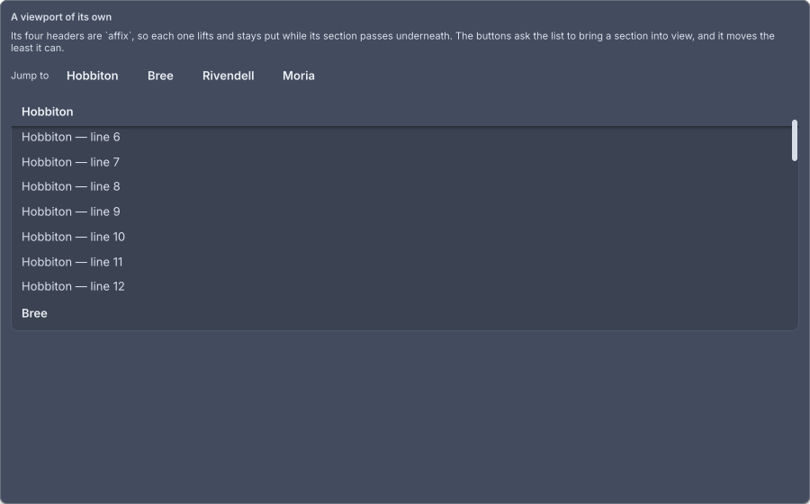

# Affix

<p class="gb-lede">A child pinned to an edge of the nearest scroll once it would have scrolled past, leaving a same-sized hole behind so nothing below it jumps.</p>

By the end of this chapter you can give a long list sticky section headers that hand over to each other, pin a table's header on two axes, and bring a pinned section back into view.

## `affix`

An `affix` keeps its child where the layout put it until that place leaves the viewport, then holds the child at the viewport's edge.

```kdl
scroll id="chapters" {
    column {
        affix id="section-hobbiton" class="section" edge="top" {
            panel class="section-header" { text "Hobbiton" }
        }
        text class="scroll-row" "Hobbiton, line 1"
        text class="scroll-row" "Hobbiton, line 2"
        affix id="section-bree" class="section" edge="top" {
            panel class="section-header" { text "Bree" }
        }
        text class="scroll-row" "Bree, line 1"
    }
}
```

```java
var hobbiton = new Affix(
        List.of(new Panel(new Text("Hobbiton"))),
        Edge.TOP, 0,
        Attributes.NONE.id("section-hobbiton").classes("section")
);
```

`new Affix(Widget...)` pins to the top with no offset. `new Affix(children, edge, offset, attributes)` is the usual form, and `alsoPinnedTo(Edge)` adds an edge on the other axis. `Edge` is `dev.goldberry.widgets.core.affix.Edge`.

<div class="gb-shot">

<p>The showcase's viewport, seven lines in. The first header has lifted and the rows slide under it.</p>
</div>

### It leaves a hole

The widget is two nodes. An outer `affix` stays exactly where the layout put it, and an inner `affix-content` slides. That is the difference from `position: fixed`, and it is also what stops the widget oscillating. The router tells the affix where it is once a frame, and a node that moved itself in response would be told a new position and move again forever. The outer node's position is a function of the layout alone, so the inner node sliding under it changes nothing that is reported.

The CSS subset has no `position: sticky`. This is a widget precisely so the subset does not have to grow a layout mode. Two boxes and a translate are the whole of it.

### It stays inside its container

An affix never travels past the far side of the nearest ancestor with a box. A section's header leaves with its section and the next header takes over, which is CSS's rule for `sticky` and needs no code: one column per section, each holding an affix and its rows. An affix directly in the scrolled column has the whole document as its container and pins until the end. A `table` wraps its head in an affix, so on a scrolling page the column names pin while the table is in view and leave with it.

### Two axes

`edge="top left"` pins to one edge on each axis, for a header that is sticky at the top and held against the left of a table that scrolls sideways. Each axis is its own subtraction, so neither wins over the other. Two edges on the same axis are refused: in Java it is an `IllegalArgumentException`, and in markup the second word is ignored.

### Revealing one

Pointing `scrollIntoView` at a pinned affix from the outside scrolls nowhere, because its content is already at the viewport's edge and anything measuring it concludes it is in view. What travels with the document is the hole, and only the affix can hand that out. `revealedBy(listener)` gives it a callback that receives the hole's rectangle and the viewport's once a frame, which is exactly the pair `ScrollController.reveal` takes. The showcase's "Jump to" buttons do this: a press records which section is wanted, that section's affix is built with the callback, and the callback hands the controller the two rectangles only a laid-out frame knows.

```java
rows.add(section.equals(wanted) ? affix.revealedBy(this::revealed) : affix);

private void revealed(LogicalRect self, LogicalRect clip) {
    list.reveal(self, clip);
    setState(() -> wanted = null);
}
```

### Attributes

| Attribute | Type | Default | What it does |
|---|---|---|---|
| `edge` | string | `top` | `top`, `bottom`, `left` or `right`. Two words, one per axis, pin on both. An unknown word is `top` |
| `offset` | number | `0` | How far from that edge to sit, in logical pixels |
| `id` | string | none | The node's id, which lands on the `affix` node |
| `class` | string | none | Classes separated by spaces |

### Styling

| Node | What it is | In `controls.css` |
|---|---|---|
| `affix` | The hole, which never moves | `flex-shrink: 0` |
| `affix-content` | The box that slides | `flex-shrink: 0` |

`:affixed` matches the `affix` node the moment its content lifts, and not before. No selector can say "this node is currently over another one", which is why it is a pseudo-class rather than a class an author writes. `controls.css` uses it to give a pinned child a surface and an elevation, and the transition on the shadow is how it arrives as the child lifts.

```css
affix:affixed > affix-content {
  background: var(--gb-surface);
  box-shadow: var(--gb-elevation-1);
  transition: box-shadow var(--gb-motion-fast);
}
```

The showcase keeps its headers transparent at rest and gives them `--gb-surface-2` only while pinned, so a header at rest does not draw a band across the list.

```css
.section:affixed > affix-content > section-header {
  background: var(--gb-surface-2);
}
```

There are no variant classes of its own.

### Read more

- [ADR-0119 A widget may be told where it is](https://github.com/DigitalSmile/goldberry/blob/master/book/src/adr/0119-a-widget-may-be-told-where-it-is.md)
- [ADR-0123 A pinned box paints after its siblings](https://github.com/DigitalSmile/goldberry/blob/master/book/src/adr/0123-a-pinned-box-paints-after-its-siblings.md)
- [ADR-0124 A pinned `affix` is revealed by its hole](https://github.com/DigitalSmile/goldberry/blob/master/book/src/adr/0124-a-pinned-affix-is-revealed-by-its-hole.md)
- [ADR-0360 An affix stays inside its container](https://github.com/DigitalSmile/goldberry/blob/master/book/src/adr/0360-an-affix-stays-inside-its-container.md)
- [ADR-0371 An affix pins to one edge per axis](https://github.com/DigitalSmile/goldberry/blob/master/book/src/adr/0371-an-affix-pins-to-one-edge-per-axis.md)
