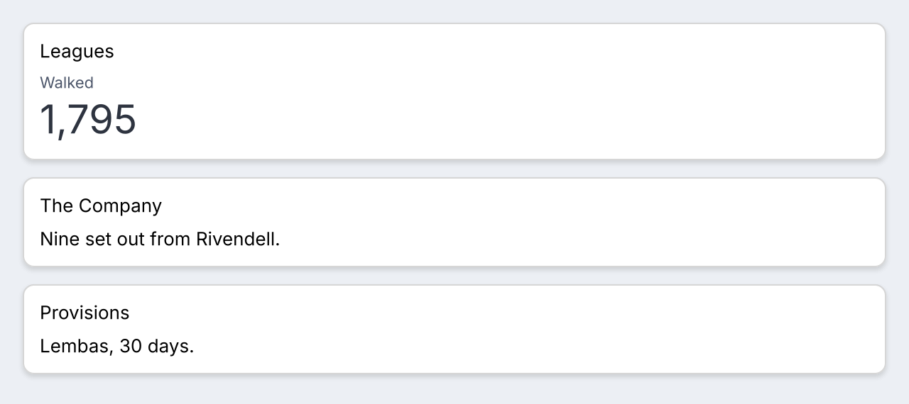
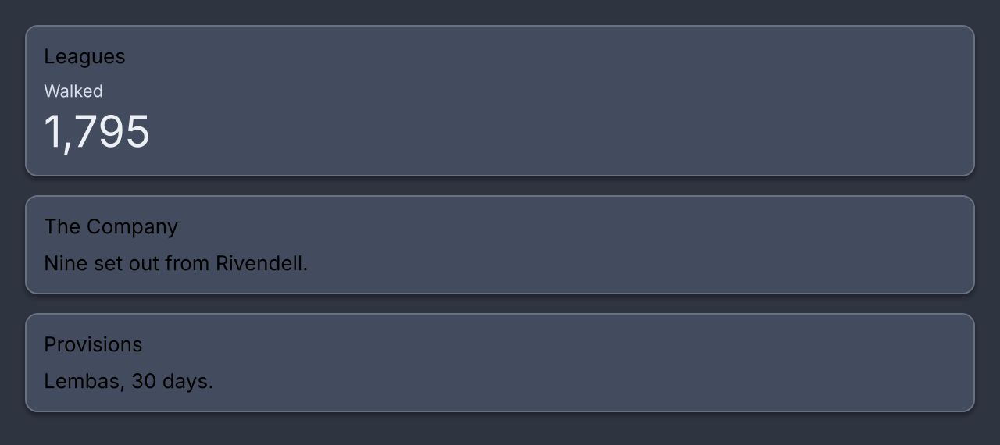

# Masonry

<p class="gb-lede">Cards of unequal height packed into columns, each card under whichever column is shortest.</p>

By the end of this chapter you can build a wall of cards that survives a window being dragged narrower, choose between a fixed count and a minimum width, and know why the wall settles a frame late.

## `masonry`

A `masonry` deals its children into columns and places each one under the column that is currently shortest.

<div class="gb-shot"><p>Cards in as many columns as fit.</p></div>

<div class="gb-tabs">

```kdl
masonry id="wall" min-column-width=320 {
    card { text class="card-title" "Leagues"; statistic label="Walked" value="1,795" }
    card { text class="card-title" "The Company"; text "Nine set out from Rivendell." }
    card { text class="card-title" "Provisions"; text "Lembas, 30 days." }
}
```

```java
var wall = new Masonry(List.of(leagues, company, provisions))
        .withAttributes(Attributes.NONE.id("wall"));
```

</div>

`new Masonry(List<Widget>)` is responsive at 320 points. `new Masonry(List<Widget>, int columns, Attributes)` is a fixed count. `columns(int)` and `minColumnWidth(int)` switch a masonry from one mode to the other, dropping the setting it had.

This is the one container the catalogue cannot write in flexbox. A wrapping row aligns its lines, and a column per column cannot balance them, because balancing needs every item's height and those are not known until they are laid out.

### How it places

It reads last frame. Every cell reports what it came out as through `Measured`, the state banks the height, and the next frame puts each card under the column that is shortest. The first frame has no measurements, so a responsive wall is one column and the second frame is right. That is one frame of settling nobody sees.

Reading last frame is allowed here because moving a card between columns does not change its height. The columns are the same width, so the number being reported is stable under the thing it causes. That is also why `columns` is a count and not a list of widths.

A responsive wall counts its columns from its own width, banked the same way. With `n` columns needing `n` minimums and `n - 1` gaps, the count is the largest `n` for which `n` times the minimum plus `n - 1` gaps fits, and at least one. A column count changes the wall's height and not its width, so that number is stable too.

Reading order is down each column, not across. The third card is not necessarily beside the second. Where order matters, a form or a ranked list, the answer is a `column`.

A masonry never virtualizes. Which column an item is in depends on every item before it, so there is no arithmetic from an index to a position. A long wall is affordable because a `scroll` does not paint what is off screen, which is in [Scroll](scroll.md#what-a-frame-pays).

### Attributes

| Attribute | Type | Default | What it does |
|---|---|---|---|
| `columns` | number | unset | A fixed count. Two columns at 1200 are two columns at 720, half as wide and twice as tall |
| `min-column-width` | number | `320` when neither is written | As many columns as fit at this width, at least one |
| `id` | string | none | The node's id, which lands on the `masonry` node |
| `class` | string | none | Classes separated by spaces |

The two are exclusive. A masonry given both is an `IllegalArgumentException` at construction, and so is `columns=0`. Neither is clamped, because a layout that silently disagrees with the document is found by looking at a picture and a document that throws is found by running anything.

> [!IMPORTANT]
> Put a wall where something gives it a width. A `masonry-column` is `flex-basis: 0`, so a masonry in a box that sizes to its content comes out zero wide with its cards hanging out of it, in either mode.

### The showcase's walls

Every screen in the showcase is a masonry, because a card is as tall as its contents and no two cards are the same height. Laid out in equal rows the short ones would sit in acres of empty surface. Most walls give a width rather than a count: no column is narrower than 360, so a screen is three columns at 1280 and one at 720. The Collections and Navigation screens keep a count of two, because a table and a strip of steps need the room. A screen written in Java hands `Masonry.UNSET` for the mode it did not choose.

### Styling

| Node | What it is | In `controls.css` |
|---|---|---|
| `masonry` | The wall | `flex-direction: row; align-items: flex-start; gap: 12px` |
| `masonry-column` | One column | `flex-direction: column; gap: 12px; flex-basis: 0; flex-grow: 1` |
| `masonry-cell` | One card's box, which exists to report a height | `flex-direction: column` |

The gap on both axes is the stylesheet's: the wall's `gap` is between columns and the column's `gap` is between cards. The responsive count reads the wall's resolved `gap`. There are no pseudo-classes and no variant classes of its own. The showcase's `.wall` adds `flex-shrink: 0`.

```css
#wall { gap: 16px; }
#wall masonry-column { gap: 16px; }
```
