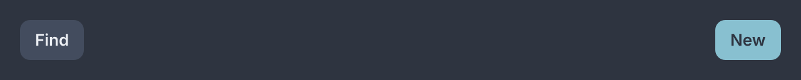
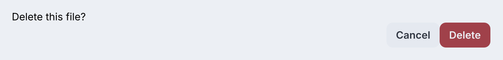
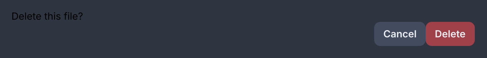

# Row and column

<p class="gb-lede">The two containers almost every tree is made of. A row lays its children out left to right, a column top to bottom, and the stylesheet decides everything else.</p>

By the end of this chapter you can nest the two to build any arrangement flexbox describes, and you know which numbers belong in CSS rather than in the tree.

## `row`

A `row` lays its children out along the horizontal axis.

<div class="gb-shot"><p>Two buttons with a spacer between.</p></div>

<div class="gb-tabs">

```kdl
row id="toolbar" {
    button press="find" "Find"
    spacer
    button class="primary" press="create" "New"
}
```

```java
var toolbar = new Row(
        new Button("Find", this::find),
        new Spacer(),
        new Button("New", this::create).styled("primary")
).withAttributes(Attributes.NONE.id("toolbar"));
```

</div>

`new Row(Widget...)` takes the children. `new Row(List<Widget>, Attributes)` takes them with an id and classes, and `withAttributes` adds those to a row built the short way.

The showcase writes a settings line as a row with a spacer in the middle, which puts the label at one end and the value at the other.

```kdl
row class="setting" {
    text "Guide"
    spacer
    text class="caption" "Gandalf the Grey"
}
```

### Attributes

| Attribute | Type | Default | What it does |
|---|---|---|---|
| `id` | string | none | The node's id, for `#toolbar` in a stylesheet and in tests |
| `class` | string | none | Classes separated by spaces, for `.setting` in a stylesheet |
| `tooltip` | string | none | Text shown when the pointer rests on the row |
| `context-menu` | string | none | The id of a `menu` opened by a secondary click |
| `name` | string | none | The accessible name |

The last three are the same on every layout widget in this part, and the tables after this one list only `id` and `class`.

> [!WARNING]
> `row gap=8` parses and does nothing. The inflater refuses an unknown node name and not an unknown attribute, and `gap` is a stylesheet property. Write `#toolbar { gap: 8px }` instead.

### Styling

The CSS type is `row`. It has no parts and no pseudo-classes of its own.

`controls.css` ships no rule for it, so a bare row has no gap, no padding and no colour. Everything is the stylesheet's except the direction: `render` applies `flex-direction: row` after the computed style, so a rule that says `flex-direction: column` on a row is ignored.

```css
#toolbar {
  gap: 8px;
  padding: 4px 8px;
  align-items: center;
}
```

There are no variant classes. The classes a row carries are the ones a document gives it.

### Read more

- [ADR-0279 Flexbox is the toolkit's vocabulary, not Yoga's](https://github.com/DigitalSmile/goldberry/blob/master/book/src/adr/0279-flexbox-is-the-toolkits-vocabulary-not-yogas.md)
- [ADR-0247 `start` is CSS, and `flex-start` is Yoga](https://github.com/DigitalSmile/goldberry/blob/master/book/src/adr/0247-start-is-css-and-flex-start-is-yoga.md)
- [ADR-0076 A glyph does not negotiate](https://github.com/DigitalSmile/goldberry/blob/master/book/src/adr/0076-a-glyph-does-not-negotiate.md)

## `column`

A `column` lays its children out along the vertical axis.

<div class="gb-shot"><p>Text over a row of buttons.</p></div>

<div class="gb-tabs">

```kdl
column id="confirm" {
    text "Delete this file?"
    row {
        spacer
        button press="dismiss" "Cancel"
        button class="danger" press="delete" "Delete"
    }
}
```

```java
var confirm = new Column(
        new Text("Delete this file?"),
        new Row(
                new Spacer(),
                new Button("Cancel", this::dismiss),
                new Button("Delete", this::delete).styled("danger")
        )
).withAttributes(Attributes.NONE.id("confirm"));
```

</div>

`new Column(Widget...)` and `new Column(List<Widget>, Attributes)` are the two constructors, exactly as on `row`.

### Attributes

| Attribute | Type | Default | What it does |
|---|---|---|---|
| `id` | string | none | The node's id |
| `class` | string | none | Classes separated by spaces |
| `accordion` | boolean | `#false` | Builds an accordion instead: one `collapse` child open at a time |

`accordion=#true` inflates to a different widget. The accordion reports `column` as its CSS type and adds an `accordion` class, so a stylesheet still sees a column and an ordinary column carries no state for a feature it does not use. The `collapse` children it manages are in [Panels](../components/panels.md).

```kdl
column accordion=#true id="chapters" {
    collapse title="The Shire" { text "Second breakfast" }
    collapse title="Rivendell" { text "The Council" }
}
```

### Styling

The CSS type is `column`. No parts and no pseudo-classes of its own, and no rule in `controls.css`. The direction is applied after the computed style, as on `row`.

```css
#confirm {
  gap: 12px;
  padding: 16px;
  align-items: stretch;
}
```

### Read more

- [ADR-0279 Flexbox is the toolkit's vocabulary, not Yoga's](https://github.com/DigitalSmile/goldberry/blob/master/book/src/adr/0279-flexbox-is-the-toolkits-vocabulary-not-yogas.md)
- [ADR-0166 A raised thing is told apart by its edge](https://github.com/DigitalSmile/goldberry/blob/master/book/src/adr/0166-a-raised-thing-is-told-apart-by-its-edge.md)
