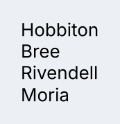
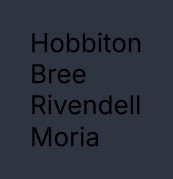
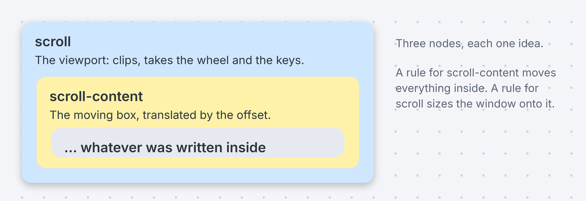
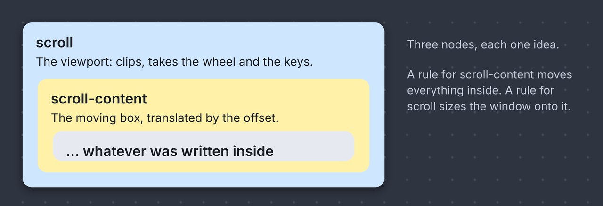

# Scroll

<p class="gb-lede">A viewport that shows part of something taller than itself, with overlay scrollbars, a wheel, a keyboard, and a position that survives rebuilds.</p>

By the end of this chapter you can put a long column in a viewport, choose which axis it moves on, scroll it from Java, open a log at its end, and know what a long document costs a frame.

## `scroll`

A `scroll` clips its content, moves it by an offset, and keeps that offset on its element so a rebuild does not lose it.

<div class="gb-shot"><p>A vertical viewport over a column.</p></div>

<div class="gb-tabs">

```kdl
scroll id="chapters" axis="vertical" {
    column {
        text "Hobbiton"
        text "Bree"
        text "Rivendell"
        text "Moria"
    }
}
```

```java
var chapters = new Scroll(
        new Column(
                new Text("Hobbiton"),
                new Text("Bree"),
                new Text("Rivendell"),
                new Text("Moria")
        )
).withAttributes(Attributes.NONE.id("chapters"));
```

</div>

`new Scroll(Widget...)` is vertical. `new Scroll(List<Widget>, ScrollAxis, Attributes)` chooses the axis. Several children are wrapped in one moving box, so they stack as they would in a `column`.

The viewport is three nodes, and each is one idea.

<div class="gb-shot"><p>The three nodes of a viewport, each one idea.</p></div>

A `scroll` has `flex-grow: 1` from `controls.css`, so in a column it fills what is left. In a box that sizes to its content it needs a height from the stylesheet, which is why the showcase's `.scroll-demo` is `height: 260px`.

### Attributes

| Attribute | Type | Default | What it does |
|---|---|---|---|
| `axis` | string | `vertical` | `vertical`, `horizontal` or `both`. `x` and `xy` are accepted spellings, and an unknown word is vertical |
| `anchor` | string | `start` | `start` opens at the top. `end` opens at the end and stays there while the viewport is already there. `bottom` is accepted for `end` |
| `preserve-on-prepend` | boolean | the anchor's | Whether content inserted above the viewport moves the offset by the height added, so what is on screen stays still. On for `end` and off for `start` unless written |
| `id` | string | none | The node's id, which lands on the `scroll` node |
| `class` | string | none | Classes separated by spaces |

Three things are Java only, because each is a value a document cannot hold. `height(double)` caps the viewport in logical pixels, which is how a menu is kept no taller than the display. `controlledBy(ScrollController)` hands it a handle something outside the viewport keeps. `anchor(ScrollAnchor)` and `preserveOnPrepend(boolean)` are the two attributes above as methods.

```java
var log = new Scroll(List.of(lines), ScrollAxis.VERTICAL, Attributes.NONE)
        .anchor(ScrollAnchor.END)
        .controlledBy(controller);
```

### Scrollbars

The default bar is an overlay. A 6 px thumb floats on the content, the track is transparent, and nothing costs the content any width. When the pointer is over the viewport the thumb widens to 10 px and the track takes `--gb-surface-2`. The bar fades out after 800 ms without movement and takes 160 ms to go. While it is being dragged the thumb takes `--gb-accent`.

A click on the track pages by a whole viewport towards the side the click landed on. The thumb's length is the viewport's share of the content, floored at 24 px so a very long document still has something to grab.

The other arrangement is a classic reserved gutter: 12 px of layout beside the content, a track that is always there, and a thumb that neither widens nor fades. It is `Scrollbars.ALWAYS`, a token stylesheet added after the theme and the density, so a component that reads the tokens survives the gutter appearing as a narrower box rather than as text under a bar.

```java
var sheets = Controls.stylesheets(Theme.NORD_DARK, Density.REGULAR, Scrollbars.ALWAYS);
```

Edges are hard. There is no overscroll bounce.

### The wheel

A wheel event arrives in lines, and a line is `--gb-scroll-line`, 20 px in `controls.css`. One notch of the wheel is three lines, which is what every other application on the machine does. A trackpad reports fractions of a notch and gets the same multiplier, so the same gesture covers the same ground it would anywhere else. An author who sets `--gb-scroll-line` on one `scroll` changes how far that viewport moves per line and nothing else.

A wheel is consumed only when it moved something. At the top of a list a further turn bubbles, and the viewport around it takes it. A disabled control between the pointer and the viewport does not stop it. A nested scroller on the same axis works, but the design system bans the arrangement and the viewport logs it once.

### Keyboard

A `scroll` is a Tab stop. The keys act when it has focus and are consumed only when they moved something.

From Java, `.tabStopOnlyWhenScrollable()` makes it a Tab stop only while its content overflows. That is for a viewport that wraps content of its own, such as a dialog's body: one that fits adds nothing to the Tab order, and one that overflows can still be scrolled from the keyboard.

| Key | Moves |
|---|---|
| Up, Down, Left, Right | One line, `--gb-scroll-line` |
| Page Up, Page Down | The viewport's height less 24 px, so one line of the old page is still on screen |
| Home | To the start |
| End | To the end |

### Scrolling from Java

A `ScrollController` is a handle the application keeps and the viewport attaches to. It is created outside the viewport on purpose: whoever needs to scroll it is somewhere else, and a controller the state created would have a new identity on every rebuild.

```java
private final ScrollController list = new ScrollController();

list.scrollBy(0, 240);
list.onChange(() -> status.set(list.position().offsetY() + ""));
```

`reveal(self, clip)` brings a rectangle into view with the least movement that does it. The rectangles come from a widget that implements `Located`, which the router tells where it is and what clips it, once a frame and only on a change. A programmatic scroll glides over `--gb-motion-overlay`, and a wheel, a key or a drag takes over at once.

### A timeline

A chat, a log or a console wants three things of a viewport. It should open on the newest line. It should stay there while the reader is already there, and not move them when they are reading history. And when older lines are paged in above, the line they are reading should stay still. `anchor="end"` is the first two and `preserve-on-prepend` is the third.

```kdl
scroll id="console" anchor="end" preserve-on-prepend=#true {
    column {
        text "[12:00:01] Started"
        text "[12:00:04] Listening on 8080"
    }
}
```

Preserving the offset means recognising a row that was on screen a frame ago, so the rows need keys. A list matched by position has no such row.

### What a frame pays

The painter skips a subtree whose ink cannot land inside the clip in force, so a viewport costs what is visible and not what is in it. The culling is by the subtree's ink rather than the box's own rectangle, so a child drawn outside its parent is still painted. A wheel moves the offset by a transform on one box, and re-describing a node with the same type, id and classes keeps its cached style, so a notch no longer re-styles what it scrolls past.

A `scroll` does not virtualize. A `list` and a `table` build only the rows in their window, and that is in [Collections](../components/collections.md). A `masonry` cannot virtualize at all, and the cull is what makes a long wall affordable.

### Styling

The CSS type is `scroll`, and it is the viewport. The record itself styles nothing, so a document's `id` and `class` land on the viewport node.

| Node | What it is | In `controls.css` |
|---|---|---|
| `scroll` | The viewport | `flex-grow: 1; overflow: hidden` |
| `scroll-content` | The moving box | `flex-shrink: 0`, pinned in code so no rule can undo it |
| `scrollbar` | One axis's bar, `.vertical` or `.horizontal` | `position: absolute`, track `--gb-scrollbar-track` |
| `scroll-thumb` | The thumb, `.vertical` or `.horizontal` | `--gb-text-muted`, full radius, `.dragging` takes `--gb-accent` |

`scroll:hover` widens the thumbs and shows the track. The catalogue's own viewports carry a class each, `menu-viewport`, `select-viewport` and `tab-viewport`, and the first two set `flex-grow: 0` because their height is the opener's.

The tokens, with the overlay default and the `Scrollbars.ALWAYS` value:

| Token | Overlay | Always |
|---|---|---|
| `--gb-scroll-line` | `20px` | `20px` |
| `--gb-scrollbar-gutter` | `0px` | `12px` |
| `--gb-scrollbar-size` | `10px` | `12px` |
| `--gb-scrollbar-track` | `transparent` | `var(--gb-surface-2)` |
| `--gb-scroll-thumb-size` | `6px` | `8px` |
| `--gb-scroll-thumb-hover-size` | `10px` | `8px` |

### Read more

- [ADR-0116 A scroll view is a clip, an offset and two extents](https://github.com/DigitalSmile/goldberry/blob/master/book/src/adr/0116-a-scroll-view-is-a-clip-an-offset-and-two-extents.md)
- [ADR-0117 A widget may be told what it measured](https://github.com/DigitalSmile/goldberry/blob/master/book/src/adr/0117-a-widget-may-be-told-what-it-measured.md)
- [ADR-0118 A popup that does not fit scrolls](https://github.com/DigitalSmile/goldberry/blob/master/book/src/adr/0118-a-popup-that-does-not-fit-scrolls.md)
- [ADR-0119 A widget may be told where it is](https://github.com/DigitalSmile/goldberry/blob/master/book/src/adr/0119-a-widget-may-be-told-where-it-is.md)
- [ADR-0120 A widget scrolls itself into view](https://github.com/DigitalSmile/goldberry/blob/master/book/src/adr/0120-a-widget-scrolls-itself-into-view.md)
- [ADR-0056 The wheel is lines, and the sign is ours](https://github.com/DigitalSmile/goldberry/blob/master/book/src/adr/0056-the-wheel-is-lines-and-the-sign-is-ours.md)
- [ADR-0115 A wheel reports a fraction and a detent](https://github.com/DigitalSmile/goldberry/blob/master/book/src/adr/0115-a-wheel-reports-a-fraction-and-a-detent.md)
- [ADR-0314 A notch is three lines, and down is down](https://github.com/DigitalSmile/goldberry/blob/master/book/src/adr/0314-a-notch-is-three-lines-and-down-is-down.md)
- [ADR-0236 A wheel is consumed by whatever it moved](https://github.com/DigitalSmile/goldberry/blob/master/book/src/adr/0236-a-wheel-is-consumed-by-whatever-it-moved.md)
- [ADR-0238 A wheel chains past a dead control](https://github.com/DigitalSmile/goldberry/blob/master/book/src/adr/0238-a-wheel-chains-past-a-dead-control.md)
- [ADR-0251 A widget may read a token, and a nested scroller is named](https://github.com/DigitalSmile/goldberry/blob/master/book/src/adr/0251-a-widget-may-read-a-token-and-a-nested-scroller-is-named.md)
- [ADR-0313 A frame pays for what is on screen](https://github.com/DigitalSmile/goldberry/blob/master/book/src/adr/0313-a-frame-pays-for-what-is-on-screen.md)
- [ADR-0315 A rebuild is not a restyle](https://github.com/DigitalSmile/goldberry/blob/master/book/src/adr/0315-a-rebuild-is-not-a-restyle.md)
- [ADR-0363 A programmatic scroll glides, and the offset is already there](https://github.com/DigitalSmile/goldberry/blob/master/book/src/adr/0363-a-programmatic-scroll-glides-and-the-offset-is-already-there.md)
- [ADR-0364 Always-shown scroll bars are a token sheet](https://github.com/DigitalSmile/goldberry/blob/master/book/src/adr/0364-always-shown-scroll-bars-are-a-token-sheet.md)
- [ADR-0392 A timeline opens at its end and keeps the reader's line](https://github.com/DigitalSmile/goldberry/blob/master/book/src/adr/0392-a-timeline-opens-at-its-end-and-keeps-the-readers-line.md)
