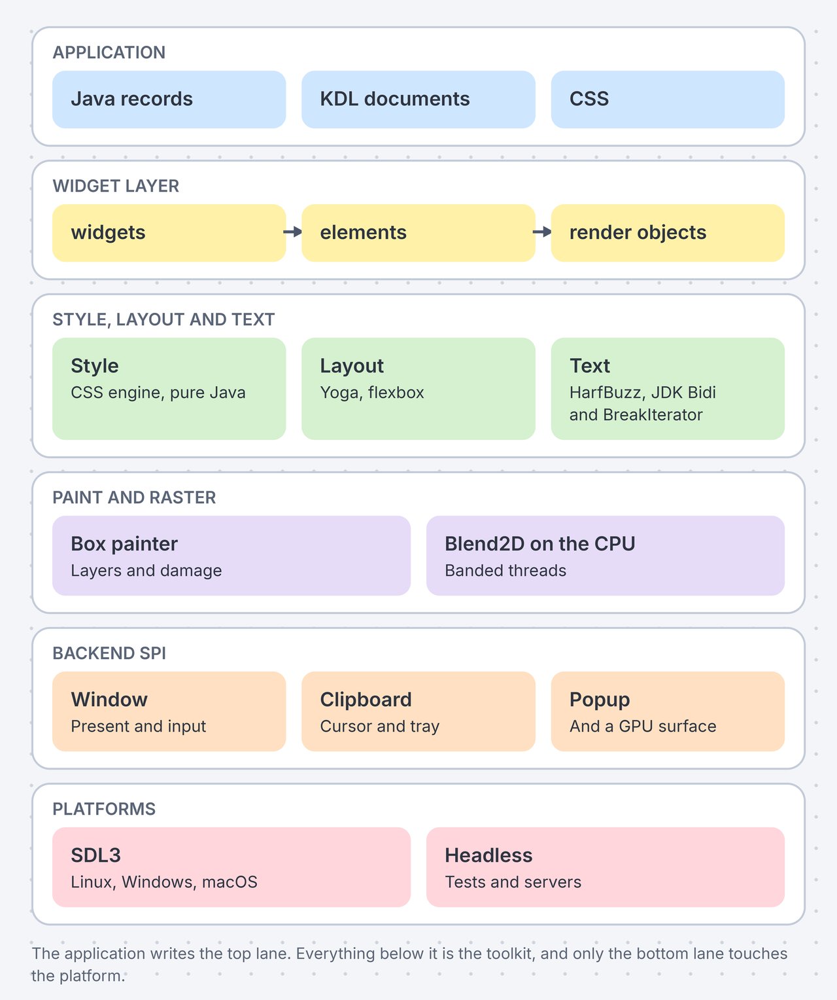
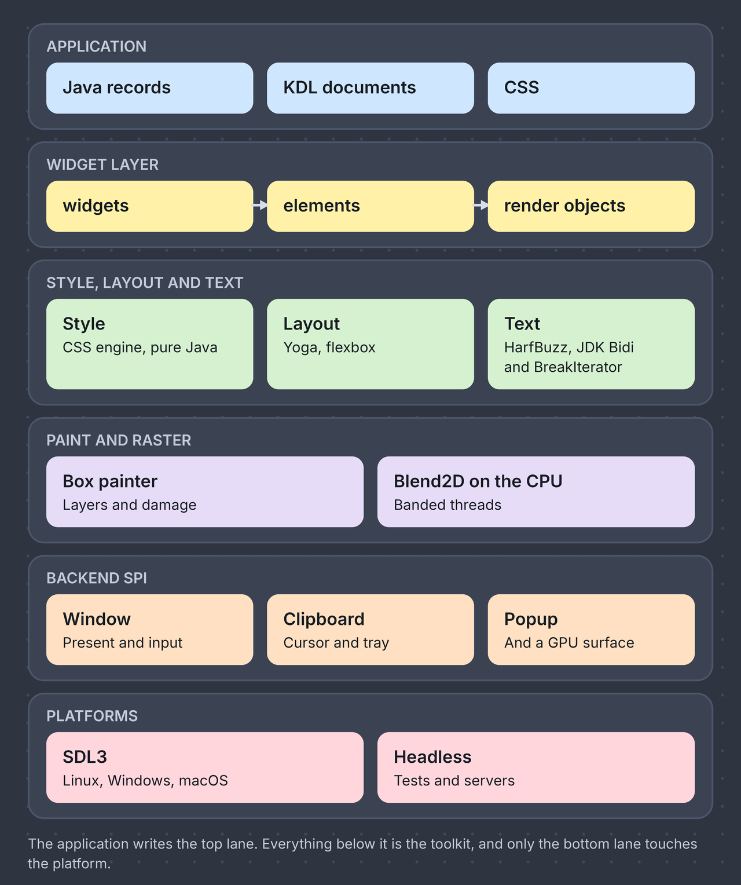
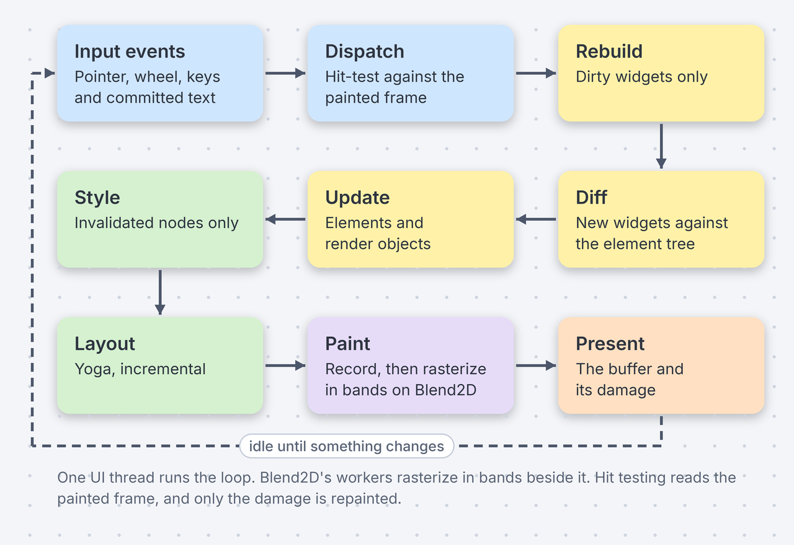
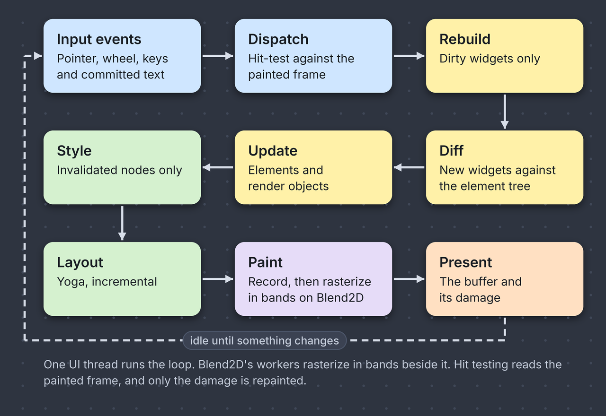

# Architecture

Five layers, three trees and one native boundary. This page is the map an application developer needs. The design document in the repository has the rest.

The whole design is in
[`docs/ARCHITECTURE.md`](https://github.com/DigitalSmile/goldberry/blob/master/docs/ARCHITECTURE.md),
with the design system and the per-widget contracts beside it. This page is
the summary.

## The layers

The layers. The application writes the top lane and only the bottom lane touches the platform.

The application writes the top row. Everything below it is the toolkit, and
only the bottom row touches the platform.

## The three trees

The widget layer follows Flutter's model:

| Tree | Owned by | Lifetime | Holds |
|---|---|---|---|
| Widgets | the application | one build | an immutable description: a record with a pure `build()` |
| Elements | the toolkit | across rebuilds | state, the subscription a `bind=` made, who is hovered, focused or pressed |
| Render objects | the toolkit | across frames | a Yoga node, the box last applied to it, where it was painted |

A rebuild produces a new widget tree. The element tree is reconciled against
it by type and key, so a parent re-describing its child does not lose the
child's state. The render tree is reconciled against the boxes the elements
produce, and every Yoga setter is guarded by a comparison, so a frame in which
nothing changed costs a few microseconds.

## The frame loop

One UI thread runs the loop. Blend2D's workers rasterize in bands beside it.

One frame, in order. Each stage touches only what changed.

Three properties of the loop shape what an application sees:

- **It is idle when nothing moves.** A frame is asked for by a value that
  changed, a `setState`, a transition in flight, or a widget that says it is
  animating. Nothing polls.
- **Hit testing reads the painted frame.** A pointer event is about what the
  user can see, so dispatch runs against the snapshot taken while painting
  rather than a fresh layout.
- **Only the damage is repainted**, where the backend promises the buffer it
  lends back still holds the last frame.

[Performance](../performance/index.md) has the numbers for each stage.

## The native boundary

Every C function the toolkit calls is bound by hand in one module,
`dev.goldberry.natives`, and no raw `MemorySegment` leaves it. A bound function
is a holder class whose method handle is a compile-time constant, which is what
makes a call cheap on the JVM and in a native image alike.
A layout probe checks every struct layout and constant against the compiled
library at run time, on every platform, so a `long` that is 32 bits on Windows
is caught before it is read.

The libraries are statically linked into one `libgoldberry` per platform by a
CMake superbuild. Four artifacts exist: `linux-x64`, `linux-aarch64`,
`macos-aarch64` and `windows-x64`.

`goldberry-media` is the one exception. FFmpeg is LGPL and must stay a set of
replaceable shared libraries, so the media module binds it itself, under the
same rules.

## The backend SPI

The SPI is the only platform-facing interface. Two implementations exist and
the list is closed: `sdl3` for every desktop, and `headless`, which renders to
memory for tests and servers.

| The SPI answers | How |
|---|---|
| a window | logical pixels in, physical raster out, per-monitor fractional scale |
| present | the platform lends a surface and Blend2D draws straight into it |
| input | pointer, wheel in lines, keys and committed text as separate events |
| a popup | a second window with an owner, which a video driver may refuse |
| the clipboard | text as a value, everything else as an offer by MIME type |
| the desktop's theme | light, dark, or the desktop does not say |
| a tray icon, file dialogs, a GPU surface | optional, and absent where the platform has none |

## Binding and weaving

A model is a class with `@Bind` fields and `@Action` methods. Two mechanisms
make an assignment observable, and they are interchangeable:

| | On the JVM | In a native image |
|---|---|---|
| mechanism | reflection over the annotations at run time | the compiled class rewritten at build time |
| build step | none | the weaver, one Gradle plugin or one Maven execution |
| a change notifies | at the next sweep | inside the assignment |

The same model, the same paths and the same refusals both ways.
[Model weaving](../weaving.md) explains the mechanism and
[Native image](../native.md) what an image needs.

## The modules

| Module | Artifact | What it holds |
|---|---|---|
| `:common` | `goldberry-common` | logging and the start-up timeline, the lowest module |
| `:natives` | `goldberry-natives` and four classifier jars | the FFM bindings and `libgoldberry` |
| `:core` | `goldberry-core` | the engines and the contracts: the three trees, style, layout, text, icons, paint, the backend SPI |
| `:widgets` | `goldberry-widgets` | the widget catalogue, charts included |
| `:html` | `goldberry-html` | optional: Markdown and HTML as widgets |
| `:emoji` | `goldberry-emoji` | optional: the Noto Color Emoji face |
| `:media` | `goldberry-media` and `ffmpeg-<target>` classifiers | optional: audio and video |
| `:gpu` | `goldberry-gpu` | optional: `canvas3d` and GPU composition |
| `:toolkit` | `goldberry` | the umbrella an application depends on |
| `:bom` | `goldberry-bom` | the version table |

`:assets`, `:weaver` and `:example` are build-time tools and the showcase. They
are not published. The module graph is enforced by JPMS and the modules
`:common ← :natives ← :core ← :widgets` are the spine.
[Repository layout](../contributing/repository.md) has the packages.

## Read next

<a class="gb-card" href="limitations.html"><strong>Limitations</strong>What the architecture leaves out, and why.</a>
<a class="gb-card" href="../applications.html"><strong>Building an application</strong>The four kinds of class an application is made of.</a>
<a class="gb-card" href="https://github.com/DigitalSmile/goldberry/tree/master/book/src/adr"><strong>Decision log</strong>Every choice above, with its alternatives and its costs.</a>

